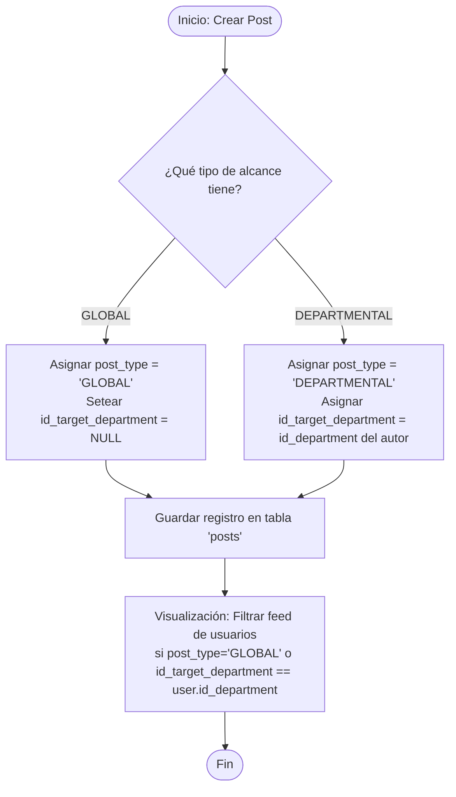
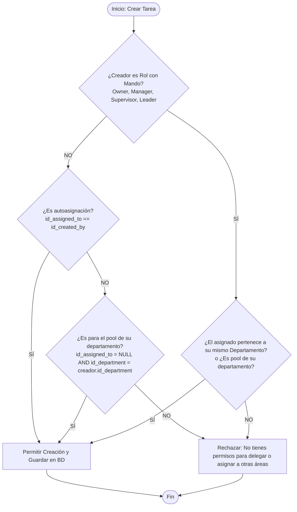

# KOONOL APP

## Esta documentación detalla las reglas de negocio, historias de usuario (con criterios de aceptación) y diagramas de flujo en formato Mermaid

## 🔑 Estructura de Roles y Departamentos (Matriz de Acceso)

Para controlar el flujo de información, visualización en Frontend y seguridad en Backend, se define la siguiente estructura:

### 1. Departamentos Contemplados

- Producción
- I+D (Investigación y Desarrollo)
- Calidad
- Mejora Continua
- Almacén
- Logística
- Datos
- TI (Tecnologías de la Información)
- Compras
- Ventas
- RH (Recursos Humanos)
- Administración

### 2. Jerarquía de Roles

- **`GOD` / `SYSTEM_DEVELOPER`**: Acceso total e irrestricto en base de datos y backend (creador de la aplicación).
- **`ADMIN`**: Administrador del sistema a nivel funcional (gestión de usuarios, catálogos e integraciones).
- **`COMPANY_OWNER`**: Dueño(s) de la empresa. Acceso global a reportes y procesos, sin vinculación obligatoria a la plantilla de nómina/empleados.
- **`MANAGER`**: Gerente de un área/departamento en específico.
- **`SUPERVISOR`**: Supervisor de área.
- **`LEADER`**: Líder de equipo o de turno.
- **`USER`**: Personal operativo/colaborador estándar.

---

## 💼 Reglas de Negocio (RN)

| Código    | Módulo        | Descripción                                                                                                                                                                                                                           |
| :-------- | :------------ | :------------------------------------------------------------------------------------------------------------------------------------------------------------------------------------------------------------------------------------ |
| **RN-01** | Core / RH     | Todo registro en `users` cuyo rol sea diferente de `GOD`, `ADMIN` o `COMPANY_OWNER` debe requerir obligatoriamente un `id_employee` único y válido. Si posee uno de los tres roles exceptuados, `id_employee` puede ser `NULL`.       |
| **RN-02** | Productividad | Las consultas (`SELECT`) a la tabla `personal_notes` deben filtrarse estrictamente por el `id_user` de la sesión activa en el Backend. No existe jerarquía de roles que permita visualizar notas de terceros.                         |
| **RN-03** | Productividad | Un usuario con rol `USER` solo puede crear tareas para sí mismo (`id_assigned_to` igual a `id_created_by`) o tareas abiertas sin asignar dirigidas a un departamento (`id_department` provisto, `id_assigned_to` en `NULL`).          |
| **RN-04** | Productividad | Para asignar una tarea a un tercero de forma directa, el creador debe poseer un rol con mando (`COMPANY_OWNER`, `MANAGER`, `SUPERVISOR`, `LEADER`) y el usuario asignado debe pertenecer obligatoriamente a su mismo `id_department`. |
| **RN-05** | Social / Muro | Si una publicación (`post`) es de tipo `DEPARTMENTAL`, el Backend guardará de forma obligatoria el `id_department` del creador en el campo `id_target_department`.                                                                    |

---

## 👥 Historias de Usuario (User Stories)

### Módulo: Core & Accesos

#### **HU-01: Control de Acceso y Renderizado Dinámico**

---

### Módulo: Social (Muro)

#### **HU-02: Publicación de Comunicados (Global vs Departamental)**

- **Como** Colaborador de la empresa,
- **Quiero** publicar un comunicado seleccionando el alcance de la difusión,
- **Para** transmitir información relevante de manera masiva o segmentada según el área de interés.
- **Criterios de Aceptación:**
  - **C.A. 2.1:** Si el usuario selecciona tipo `GLOBAL`, el campo `id_target_department` debe persistirse como `NULL`, permitiendo que cualquier usuario de la intranet vea el post en su feed principal.
  - **C.A. 2.2:** Si el usuario selecciona `DEPARTMENTAL`, el backend debe forzar que el post sea visible únicamente para los usuarios que compartan el mismo `id_department` que el creador.
  - **C.A. 2.3:** El formulario de creación de post debe permitir adjuntar múltiples documentos o referencias de archivos que se guardarán estructurados en el campo `docs` (tipo `jsonb`).

---

### Módulo: Productividad

#### **HU-03: Gestión de Notas y Recordatorios Personales**

- **Como** Usuario de la intranet,
- **Quiero** registrar y configurar alarmas en notas personales,
- **Para** llevar un control privado de mis actividades sin interferir en los flujos operativos de mis compañeros.
- **Criterios de Aceptación:**
  - **C.A. 3.1:** El usuario puede marcar una nota como favorita (`favorite` = `true`) o archivarla (`status` = `'ARCHIVADA'`).
  - **C.A. 3.2:** Si `is_reminder` es verdadero (`true`), el sistema requerirá obligatoriamente una fecha y hora futura en `reminder_at`.
  - **C.A. 3.3:** El borrado de notas debe ser un "Soft Delete" (actualizando el campo `deleted_at`) para evitar pérdidas accidentales.

#### **HU-04: Creación y Delegación de Tareas Estructuradas**

- **Como** Colaborador del sistema,
- **Quiero** crear una tarea para mí, para un compañero (si tengo permisos) o enviarla al tablero general de un departamento específico,
- **Para** asegurar el seguimiento y la trazabilidad de los compromisos de trabajo.
- **Criterios de Aceptación:**
  - **C.A. 4.1:** Si el creador tiene un rol de jerarquía básica (`USER`), el sistema solo permitirá asignarse la tarea a sí mismo o crearla en estado abierto para su propio departamento.
  - **C.A. 4.2:** Si el creador tiene rol `>= LEADER`, podrá asignar la tarea directamente a cualquier usuario que pertenezca a su mismo departamento.
  - **C.A. 4.3:** El estado inicial de la tarea será siempre `'PENDIENTE'`. Un usuario asignado podrá transicionar el estado a `'EN_PROCESO'` y finalmente a `'COMPLETADA'`.

---

## 🔄 Diagramas de Flujo (Mermaid)

### 1. Flujo de Publicación de Comunicados (Muro)

A continuación se detalla cómo el backend determina el alcance y visibilidad de un nuevo post.

### 2. Lógica de Asignación y Permisos de Tareas (`tasks`)

Muestra el control de seguridad que aplica el backend al momento de crearse una tarea en la plataforma.

