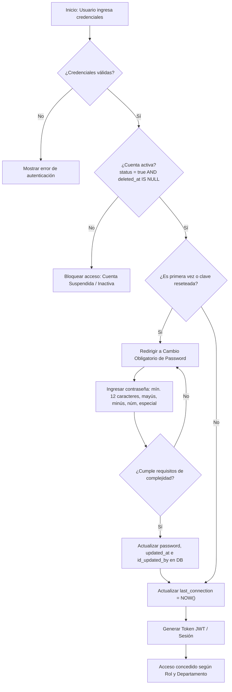
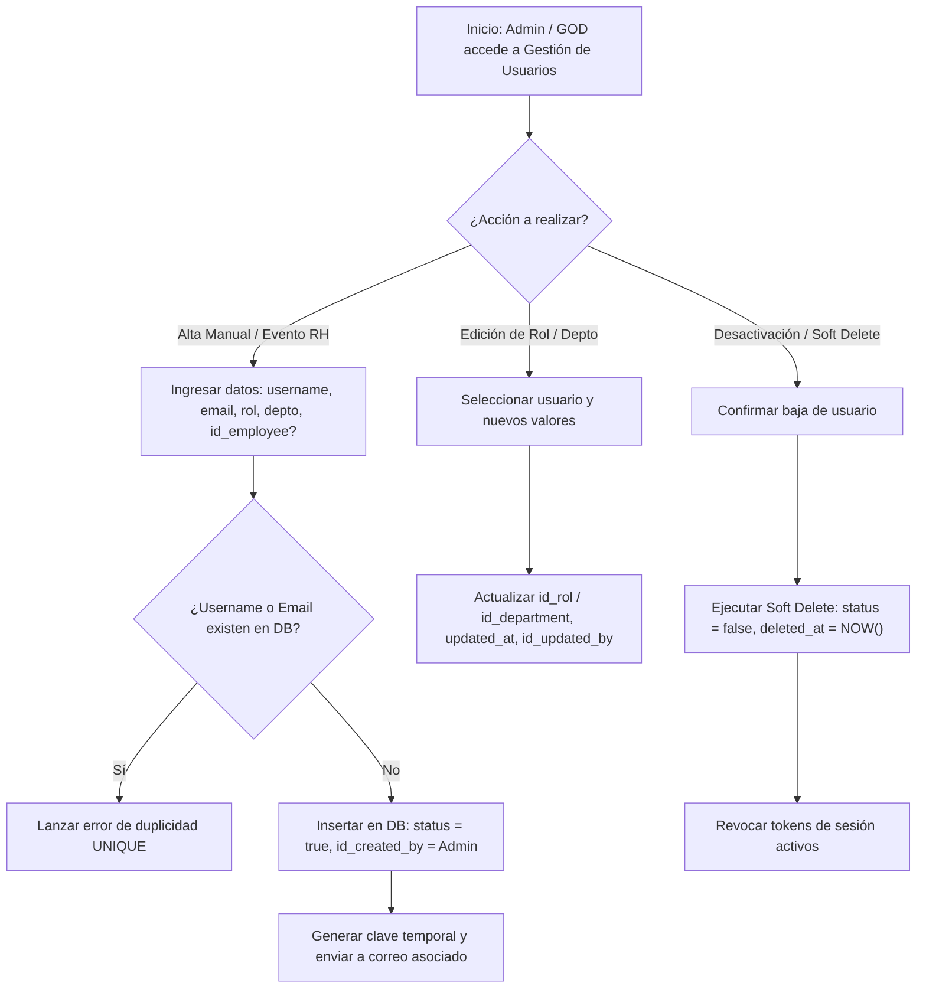
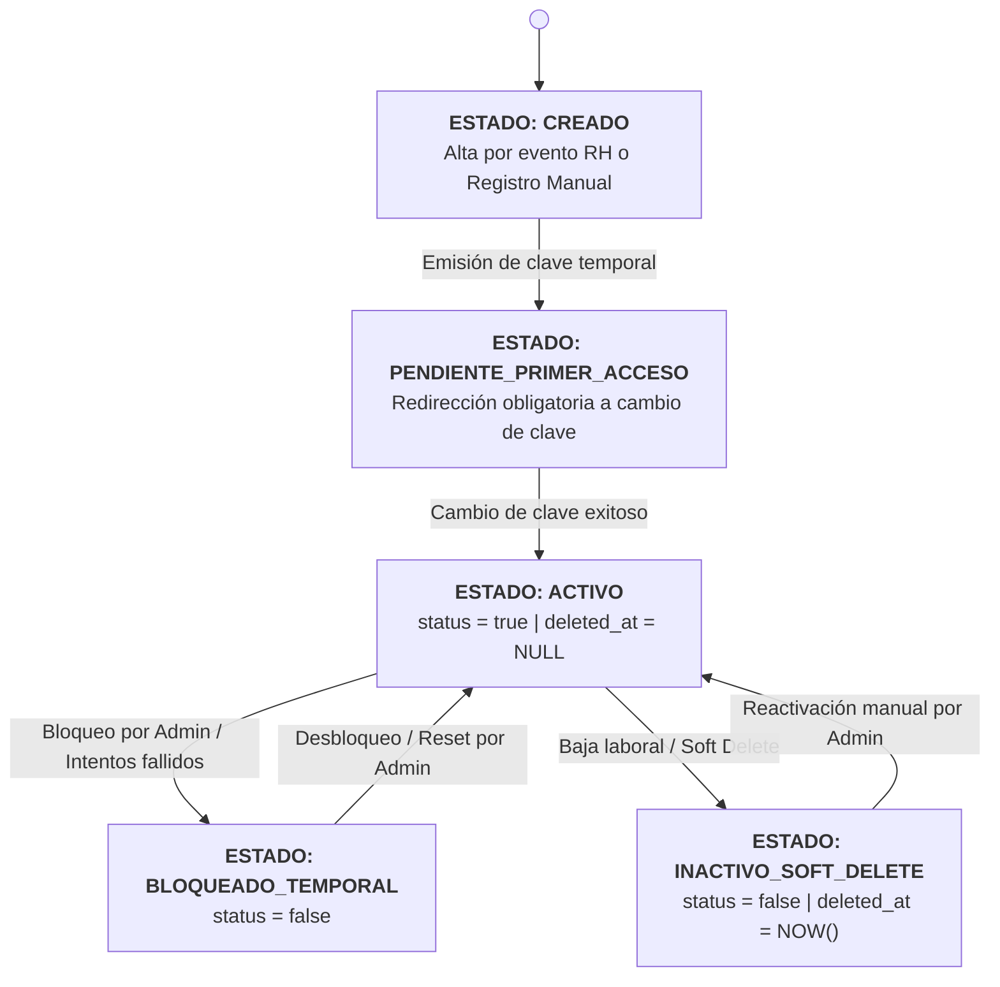

# 👥 Módulo: Usuarios, Accesos y Jerarquías (USR)

El módulo Core de Usuarios gestiona el control de acceso, la autenticación, la asignación de perfiles operativos, la estructura departamental y la jerarquía de roles dentro de KoonolApp. Garantiza que el acceso a la plataforma responda a la matriz de seguridad por departamentos y niveles organizacionales, sirviendo como la entidad transversal principal para la trazabilidad y auditoría de todas las operaciones del sistema.

---

---

## 💼 Reglas de Negocio (Business Rules)

### BR-USR-01: Unicidad y Restricción de Vinculación Empleado-Usuario

- **Descripción:** Todo empleado registrado en el catálogo maestro (`employees`) debe contar obligatoriamente con una cuenta de usuario asociada en la plataforma. Sin embargo, un registro en la tabla `users` puede prescindir de la relación con `id_employee` (`NULL`), reservado únicamente para cuentas de administración global (`GOD`, `ADMIN`) o cuentas de servicio.
- **Comportamiento Global:** La columna `id_employee` posee una restricción de unicidad (`UNIQUE`). Un mismo empleado no puede estar asociado a más de un usuario activo en el sistema.

### BR-USR-02: Creación Automática por Eventos de Recursos Humanos

- **Descripción:** Cuando el área de Recursos Humanos dé de alta un nuevo colaborador en la plataforma o mediante la sincronización del catálogo maestro, el backend debe autogenerar de forma reactiva su perfil en la tabla `users`.
- **Comportamiento Global:** La cuenta recién creada generará una contraseña temporal cifrada, asignará el rol inicial `USER` (Nivel 0), asociará el `id_department` correspondiente y enviará una notificación con credenciales temporales para el primer acceso.

### BR-USR-03: Restricción de Control de Acceso y Gestión de Usuarios

- **Descripción:** La creación manual, actualización de datos de la cuenta, cambio de rol, asignación de departamento o reactivación de usuarios es facultad exclusiva de los usuarios con rol `ADMIN` (Nivel 5) y `GOD` (Nivel 6).
- **Comportamiento Global:** El backend debe interceptar cualquier petición `POST`, `PUT`, `PATCH` o `DELETE` sobre las tablas `users`, `roles` y `departments`, rechazando con un error HTTP 403 (Forbidden) si el usuario ejecutor no posee el nivel adecuado.

### BR-USR-04: Inactivación Lógica y Control de Estado (Soft Delete)

- **Descripción:** La baja o suspensión de un usuario no eliminará registros en la base de datos (HARD DELETE prohibido). La desactivación se efectúa marcando `status = false` y asentando la fecha y hora exacta en `deleted_at`.
- **Comportamiento Global:** Un usuario con `status = false` o `deleted_at IS NOT NULL` tendrá su sesión revocada inmediatamente y no podrá autenticarse. Las consultas operativas del sistema omitirán estos usuarios por defecto, salvo en módulos de auditoría e históricos.

### BR-USR-05: Políticas de Contraseñas y Autenticación Segura

- **Descripción:** Las cuentas creadas por el sistema o por administradores se generan con una clave temporal de uso único. El usuario está obligado a cambiarla en su primer inicio de sesión.
- **Comportamiento Global:** El sistema admite dos vías de restablecimiento: autoservicio vía token temporal enviado al correo asociado al `username` o blanqueo manual ejecutado por un rol `ADMIN`/`GOD`. La columna `last_connection` debe actualizarse automáticamente tras cada inicio de sesión exitoso.

### BR-USR-06: Gestión de Catálogos de Roles y Departamentos

- **Descripción:** Los roles corresponden estrictamente a los 7 niveles de jerarquía institucionales (`USER`, `LEADER`, `SUPERVISOR`, `MANAGER`, `COMPANY_OWNER`, `ADMIN`, `GOD`). Se inicializan durante el despliegue del sistema.
- **Comportamiento Global:** Los roles y departamentos pueden ser editados en sus campos descriptivos (`name`, `description`) únicamente por `ADMIN` o `GOD`, manteniendo inmutable la lógica relacional de seguridad backend.

---

---

## 👥 Historias de Usuario (User Stories)

### 📌 Apartado 1: Autoservicio y Perfil Colaborador (Todos los Roles)

#### US-USR-01: Gestión de Perfil de Usuario

- **Como:** Colaborador del sistema (Cualquier Rol),
- **Quiero:** Personalizar mi fotografía de perfil y mi encabezado descriptivo (`headline`),
- **Para:** Identificarme correctamente ante mis compañeros de trabajo en los módulos transversales (Muro, Tareas).
- **Criterios de Aceptación:**
  - **C.A. 1.1:** El usuario puede cargar una imagen para su foto de perfil; el backend almacenará el recurso y actualizará la URL en `profile_picture`.
  - **C.A. 1.2:** El usuario puede redactar o modificar su `headline` con un límite máximo de 140 caracteres.
  - **C.A. 1.3:** El usuario no puede modificar su rol (`id_rol`) ni su departamento (`id_department`).
  - **C.A. 1.4:** Toda modificación actualiza automáticamente los campos `updated_at` y `id_updated_by` con el ID del propio usuario.

#### US-USR-02: Restablecimiento de Contraseña por Autoservicio

- **Como:** Colaborador autenticado o usuario con credencial olvidada,
- **Quiero:** Solicitar el restablecimiento de mi contraseña mediante mi correo electrónico asociado,
- **Para:** Recuperar o actualizar mi acceso de forma autónoma sin depender del equipo de TI.
- **Criterios de Aceptación:**
  - **C.A. 2.1:** En la pantalla de login, la opción "Olvidé mi contraseña" solicitará el email registrado. Si el correo existe y `status = true`, se enviará un token de recuperación de uso único con vigencia de 15 minutos.
  - **C.A. 2.2:** Si el usuario ingresa con contraseña temporal (creación nueva o reseteo), el frontend debe redirigirlo obligatoriamente a la vista de "Cambiar Contraseña" impidiendo la navegación a otros módulos.
  - **C.A. 2.3:** Al cambiar la clave, la nueva contraseña debe cumplir con los requerimientos de complejidad (mínimo 12 caracteres, mayúscula, minúscula, número y caracter especial) y actualizar `updated_at`.

#### US-USR-03: Visualización de Estado de Sesión e Información Personal

- **Como:** Colaborador autenticado,
- **Quiero:** Consultar la información básica de mi cuenta y la fecha de mi última conexión,
- **Para:** Confirmar mi nivel de acceso y mantener la trazabilidad de mi seguridad.
- **Criterios de Aceptación:**
  - **C.A. 3.1:** El panel de perfil mostrará el nombre de usuario (`username`), correo (`email`), departamento asignado (`departments.name`) y la fecha/hora guardada en `last_connection`.
  - **C.A. 3.2:** El campo `last_connection` se actualiza exclusivamente en la base de datos tras una autenticación exitosa mediante JWT o sesión activa.

### 📌 Apartado 2: Administración de Usuarios y Jerarquías (Exclusivo GOD y ADMIN)

#### US-USR-04: Alta Manual de Usuarios

- **Como:** Administrador del Sistema (`ADMIN` / `GOD`),
- **Quiero:** Registrar manualmente cuentas de usuario para personal especial, cuentas de servicio o administradores sin registro previo en RH,
- **Para:** Garantizar el acceso a usuarios clave de la organización.
- **Criterios de Aceptación:**
  - **C.A. 4.1:** El formulario requiere `username`, `email`, `id_rol` e `id_department` obligatorios. El campo `id_employee` es opcional.
  - **C.A. 4.2:** El sistema valida que `username` y `email` sean únicos en la base de datos antes de guardar.
  - **C.A. 4.3:** Se genera automáticamente un id (UUID v4), `status = true`, `created_at = NOW()` y `id_created_by` con el UUID del administrador ejecutor.
  - **C.A. 4.4:** Se emite una clave temporal aleatoria enviada al email del nuevo usuario.

#### US-USR-05: Modificación de Rol y Departamento

- **Como:** Administrador del Sistema (`ADMIN` / `GOD`),
- **Quiero:** Reasignar el rol o el departamento de un usuario existente,
- **Para:** Mantener actualizada la matriz de permisos y el encapsulamiento departamental ante cambios organizacionales.
- **Criterios de Aceptación:**
  - **C.A. 5.1:** El administrador puede cambiar `id_rol` e `id_department` de cualquier usuario, excepto de sí mismo para evitar el bloqueo accidental de sus facultades de administración.
  - **C.A. 5.2:** El backend asienta la fecha de cambio en `updated_at` y la clave del autor en `id_updated_by`.
  - **C.A. 5.3:** La reasignación de departamento aplica de manera inmediata restringiendo o expandiendo los módulos accesibles por el usuario en su siguiente petición HTTP.

#### US-USR-06: Inactivación y Blanqueo Manual de Cuenta (Soft Delete)

- **Como:** Administrador del Sistema (`ADMIN` / `GOD`),
- **Quiero:** Suspender el acceso de un usuario o forzar el reseteo de su contraseña,
- **Para:** Proteger la seguridad de la plataforma ante bajas laborales o incidentes de seguridad.
- **Criterios de Aceptación:**
  - **C.A. 6.1:** Al desactivar una cuenta, la interfaz invoca un borrado lógico actualizando `status = false`, `deleted_at = NOW()` y `id_updated_by = UUID_ADMIN`.
  - **C.A. 6.2:** Al ejecutar "Resetear Contraseña", el administrador genera una nueva clave temporal para el usuario seleccionado, enviando una notificación por correo.
  - **C.A. 6.3:** Las cuentas inactivadas permanecen visibles en la vista de administración filtrando por "Inactivos", con opción de reactivación (`status = true`, `deleted_at = NULL`).

#### US-USR-07: Gestión de Catálogos de Roles y Departamentos

- **Como:** Administrador del Sistema (`ADMIN` / `GOD`),
- **Quiero:** Crear o actualizar los nombres y descripciones del catálogo de departamentos y roles,
- **Para:** Adaptar la estructura institucional según la evolución de la empresa.
- **Criterios de Aceptación:**
  - **C.A. 7.1:** Permite crear nuevos registros en la tabla `departments` especificando `name` y `description`.
  - **C.A. 7.2:** Permite editar los campos `name` y `description` en `roles` y `departments`.
  - **C.A. 7.3:** Todo cambio en los catálogos guarda trazabilidad con `id_created_by` / `id_updated_by` y timestamps asociados.

---

---

## 🔄 Diagramas de Flujo

### 1. Flujo Operativo: Autenticación, Primer Acceso y Cambio de Clave

#### Referencias:

- Reglas de Negocio (BR):
  - **[BR-USR-04]**: Inactivación Lógica y Control de Estado (Soft Delete)
  - **[BR-USR-05]**: Políticas de Contraseñas y Autenticación Segura
- Historias de Usuario (US):
  - **[US-USR-02]**: Restablecimiento de Contraseña por Autoservicio
  - **[US-USR-03]**: Visualización de Estado de Sesión e Información Personal
- Criterios de Aceptación (C.A):
  - **[C.A-2.2]**: Redirección obligatoria a la vista de cambio de contraseña al ingresar con clave temporal
  - **[C.A-2.3]**: Requisitos de complejidad de la nueva contraseña y actualización del campo updated_at
  - **[C.A-3.2]**: Actualización exclusiva del campo last_connection tras una autenticación exitosa

### 2. Flujo Operativo: Administración de Usuarios y Soft Delete

#### Referencias:

- Reglas de Negocio (BR):
  - **[BR-USR-01]**: Unicidad y Restricción de Vinculación Empleado-Usuario
  - **[BR-USR-02]**: Creación Automática por Eventos de Recursos Humanos
  - **[BR-USR-03]**: Restricción de Control de Acceso y Gestión de Usuarios
  - **[BR-USR-04]**: Inactivación Lógica y Control de Estado (Soft Delete)
  - **[BR-USR-05]**: Políticas de Contraseñas y Autenticación Segura
- Historias de Usuario (US):
  - **[US-USR-04]**: Alta Manual de Usuarios
  - **[US-USR-05]**: Modificación de Rol y Departamento
  - **[US-USR-06]**: Inactivación y Blanqueo Manual de Cuenta (Soft Delete)
- Criterios de Aceptación (C.A):
  - **[C.A-4.1]**: Requerimiento de campos obligatorios y opcionalidad de id_employee en el alta
  - **[C.A-4.2]**: Validación de unicidad para username y email antes de registrar
  - **[C.A-4.3]**: Generación automática de id (UUID v4), status = true, created_at e id_created_by
  - **[C.A-4.4]**: Emisión y envío de clave temporal aleatoria al email registrado
  - **[C.A-5.1]**: Permitir reasignación de rol y departamento por parte de administradores
  - **[C.A-5.2]**: Asentamiento de auditoría en updated_at e id_updated_by tras actualización
  - **[C.A-6.1]**: Borrado lógico actualizando status = false, deleted_at e id_updated_by

### 3. Diagrama de Transición de Estados de la Cuenta de Usuario

#### Referencias:

- Reglas de Negocio (BR):
  - **[BR-USR-02]**: Creación Automática por Eventos de Recursos Humanos
  - **[BR-USR-04]**: Inactivación Lógica y Control de Estado (Soft Delete)
  - **[BR-USR-05]**: Políticas de Contraseñas y Autenticación Segura
- Historias de Usuario (US):
  - **[US-USR-02]**: Restablecimiento de Contraseña por Autoservicio
  - **[US-USR-04]**: Alta Manual de Usuarios
  - **[US-USR-06]**: Inactivación y Blanqueo Manual de Cuenta (Soft Delete)
- Criterios de Aceptación (C.A):
  - **[C.A-2.2]**: Flujo de primera vez con redirección obligatoria a cambio de contraseña
  - **[C.A-6.1]**: Transición a estado inactivo mediante borrado lógico (status = false, deleted_at)
  - **[C.A-6.2]**: Blanqueo/reseteo manual de contraseña para desbloqueo
  - **[C.A-6.3]**: Mantenimiento de cuentas inactivas con posibilidad de reactivación manual (status = true, deleted_at = NULL)

---

---

- ⬆️ [Volver arriba](#)
- 📖 [Ir al Índice](../README.md#-5-índice-de-módulos-funcionales)
