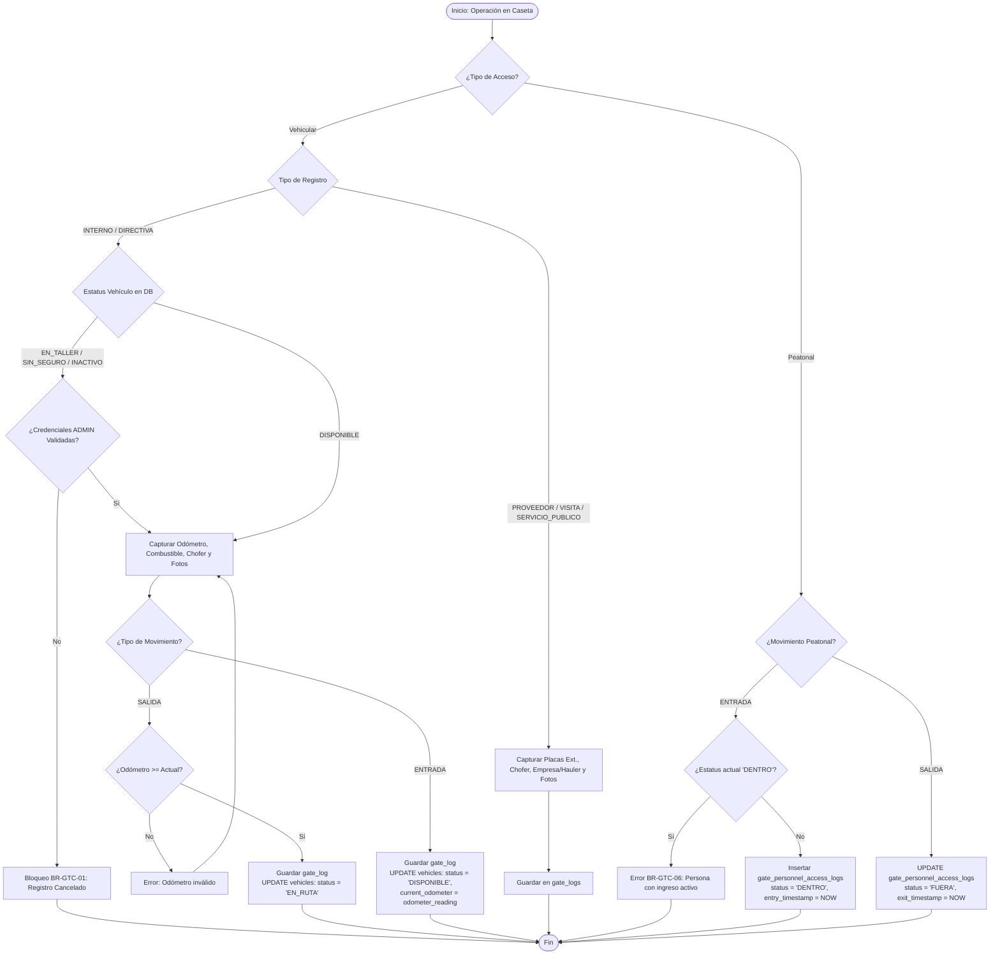

# 👥 Módulo: Control de Caseta (Gate Control - GTC)

El módulo de **Control de Caseta** tiene como propósito digitalizar y centralizar la bitácora de accesos vehiculares y peatonales de los recintos de la empresa. Gestiona el flujo de la flotilla propia y directiva, el acceso de transportistas externos, proveedores, fletes y contratistas, asegurando la trazabilidad de kilometrajes, estatus operativos, autorizaciones de seguridad y evidencias fotográficas.

---

---

## 💼 Reglas de Negocio (Business Rules)

### BR-GTC-01: Bloqueo Operativo Vehicular por Estatus Restringido

- **Descripción:** Todo vehículo registrado en la tabla `vehicles` cuyo estatus sea `EN_TALLER`, `SIN_SEGURO` o `INACTIVO` tiene prohibida la salida del recinto. El sistema interceptará el intento de registro de salida en caseta y bloqueará la transacción. La única forma de mitigar el bloqueo es mediante la autenticación e ingreso de credenciales en tiempo real de un usuario con el rol global `ADMIN`.
- **Comportamiento Global:** Restricción a nivel Backend e interfaz en el endpoint de creación de `gate_logs`. Impide la inserción con `log_type = 'SALIDA'` si la entidad `vehicles` asociada no posee el estado `DISPONIBLE`, salvo que la solicitud incluya la firma de validación de un rol `ADMIN`.

### BR-GTC-02: Transición Automática de Estatus y Odómetro Vehicular

- **Descripción:** La confirmación de movimientos de la flotilla propia/directiva en caseta sincroniza inmediatamente la entidad `vehicles`. Al registrar una `SALIDA` de tipo `'INTERNO'` o `'DIRECTIVA'`, el estatus del vehículo cambia automáticamente a `EN_RUTA`. Al registrar una `ENTRADA`, el estatus del vehículo regresa a `DISPONIBLE` y se actualiza el campo `vehicles.current_odometer` con el valor reportado en la lectura.
- **Comportamiento Global:** Desencadenamiento de transacción en base de datos al insertar un registro inmutable en `gate_logs`. Ejecuta un `UPDATE` sobre `vehicles` actualizando `status` y `current_odometer`.

### BR-GTC-03: Obligatoriedad de Evidencia Fotográfica Digital

- **Descripción:** Todo movimiento vehicular registrado en `gate_logs` (tanto entradas como salidas de flota interna o externa) requiere obligatoriamente adjuntar al menos 5 fotografías como evidencia visual de las condiciones de la unidad.
- **Comportamiento Global:** Validación de esquema de datos en Backend. El campo `gate_logs.pictures` (`JSONB`) no puede ser nulo ni ser un arreglo vacío `[]`. Debe contener los metadatos y rutas URL válidas de las imágenes almacenadas.

### BR-GTC-04: Monotonicidad y Consistencia del Odómetro

- **Descripción:** La lectura del odómetro (`odometer_reading`) capturada por el guardia al momento de una `SALIDA` debe ser mayor o igual al valor acumulado en `vehicles.current_odometer`. Para registros de `ENTRADA`, el valor ingresado debe ser mayor o igual al odómetro capturado en la salida previa inmediata.
- **Comportamiento Global:** Validación de integridad lógica antes de la persistencia. Se rechazan lecturas que representen un decremento en el kilometraje recorrido por la unidad.

### BR-GTC-05: Integridad Condicional por Tipo de Registro Vehicular

- **Descripción:** Los campos requeridos en `gate_logs` varían según el tipo de registro (`registration_type`):
  - Para `'INTERNO'` y `'DIRECTIVA'`: es obligatorio asociar `id_vehicle`, `id_driver`, `id_department`, `fuel_level_percentage` y `odometer_reading`.
  - Para `'PROVEEDOR'`, `'VISITA'` y `'SERVICIO_PUBLICO'`: se omiten las llaves de vehículo propio y es obligatorio capturar `external_plates`, `external_driver_name` y `company_provenance` (asociando `id_hauler` si aplica a un proveedor de transporte registrado).
- **Comportamiento Global:** Control de validación dinámica en el API Backend y formularios de UI.

### BR-GTC-06: Control de Unicidad y Permanencia Peatonal

- **Descripción:** Un colaborador, contratista o visitante no puede registrar un evento de entrada en `gate_personnel_access_logs` si mantiene una sesión de permanencia activa previa (`status = 'DENTRO'`). Al registrar el egreso peatonal, el sistema actualiza la fila existente cambiando el estatus a `'FUERA'` y asignando `exit_timestamp = now()`.
- **Comportamiento Global:** Consulta previa de verificación en `gate_personnel_access_logs` filtrando por la persona y `status = 'DENTRO'`. Impide duplicidad de estancias físicas dentro de las instalaciones.

---

---

## 👥 Historias de Usuario (User Stories)

### US-GTC-01: Registro de Entrada y Salida de Flotilla Propia y Directiva

- **Como:** Guardia de Caseta (`USER`),
- **Quiero:** Registrar la entrada o salida de los vehículos pertenecientes a la flotilla propia o directiva de la empresa,
- **Para:** Mantener actualizado el estatus operativo del vehículo, controlar el kilometraje y garantizar el historial de asignación de choferes.

**Criterios de Aceptación:**

- **C.A. 1.1:** Al seleccionar `registration_type` como `'INTERNO'` o `'DIRECTIVA'`, la interfaz despliega los campos para seleccionar el vehículo (`id_vehicle`), chofer (`id_driver`), departamento (`id_department`), nivel de combustible (`fuel_level_percentage`) y odómetro (`odometer_reading`).
- **C.A. 1.2:** Si el movimiento es de tipo `'SALIDA'`, el sistema valida que el vehículo esté en estatus `DISPONIBLE` y que el odómetro capturado sea mayor o igual a `vehicles.current_odometer`.
- **C.A. 1.3:** La aplicación exige adjuntar al menos una fotografía (`pictures`). Al guardar, se genera el registro inmutable en `gate_logs` con `id_guard_entry = auth.user_id` y el vehículo actualiza su estatus en `vehicles` a `EN_RUTA`.
- **C.A. 1.4:** Al registrar una `'ENTRADA'`, el sistema guarda la lectura del odómetro, cambia el estatus del vehículo en `vehicles` a `DISPONIBLE` y actualiza `vehicles.current_odometer`.

### US-GTC-02: Autorización de Excepción de Salida por Administrador

- **Como:** Administrador del Sistema (`ADMIN`),
- **Quiero:** Autorizar mediante firma de credenciales la salida de un vehículo restringido (`EN_TALLER`, `SIN_SEGURO`, `INACTIVO`),
- **Para:** Permitir traslados de emergencia o mantenimiento sin vulnerar la regla de bloqueo del sistema.

**Criterios de Aceptación:**

- **C.A. 2.1:** Cuando el guardia intenta registrar la salida de un vehículo cuyo estatus no sea `DISPONIBLE`, el sistema despliega un diálogo de bloqueo invocando la regla **BR-GTC-01**.
- **C.A. 2.2:** La interfaz solicita la re-autenticación (correo/contraseña o PIN de seguridad) de un usuario con nivel de rol `ADMIN` (Nivel 5) para omitir la restricción.
- **C.A. 2.3:** Si la validación de credenciales del `ADMIN` es exitosa, se permite la persistencia de la salida en `gate_logs` y se asienta el evento en la bitácora de auditoría. Si es denegada o cancelada, la transacción se revierte.

### US-GTC-03: Control de Acceso para Vehículos Externos y Fletes

- **Como:** Guardia de Caseta (`USER`),
- **Quiero:** Registrar el ingreso y egreso de transporte de proveedores, fletes externos y servicios públicos,
- **Para:** Registrar la trazabilidad de placas externas, transportistas (_haulers_) y condiciones de las unidades que ingresan a la planta.

**Criterios de Aceptación:**

- **C.A. 3.1:** Al seleccionar `registration_type` en (`'PROVEEDOR'`, `'VISITA'`, `'SERVICIO_PUBLICO'`), el sistema habilita los campos `external_plates`, `external_driver_name`, `company_provenance` y la vinculación opcional de `id_hauler` desde el catálogo de transportistas.
- **C.A. 3.2:** Se requiere de forma obligatoria el ingreso de las placas externas, el nombre del chofer y la captura de evidencia fotográfica en el atributo `pictures`.
- **C.A. 3.3:** El registro queda asentado en `gate_logs` vinculando el identificador del guardia en `id_guard_entry` (al ingresar) o `id_guard_exit` (al egresar).

### US-GTC-04: Control de Registro Peatonal de Personal y Visitantes

- **Como:** Guardia de Caseta (`USER`),
- **Quiero:** Registrar la entrada y salida del personal interno, contratistas, proveedores y visitantes a pie,
- **Para:** Conocer en tiempo real la nómina de personas presentes dentro de las instalaciones y garantizar la seguridad del recinto.

**Criterios de Aceptación:**

- **C.A. 4.1:** Al registrar una entrada peatonal (`person_type` $\in$ `['EMPLEADO', 'CONTRATISTA', 'VISITA', 'PROVEEDOR', 'CLIENTE']`), el guardia captura `external_name`, `external_company`, `external_id_number` (No. de INE/Identificación) y `visit_purpose`. Si es empleado, se vincula `id_user`.
- **C.A. 4.2:** El sistema valida la regla **BR-GTC-06**. Si la persona no tiene una estancia activa, genera un registro en `gate_personnel_access_logs` con `status = 'DENTRO'`, `entry_timestamp = now()` e `id_guard_entry = auth.user_id`.
- **C.A. 4.3:** Para marcar la salida de una persona, el guardia selecciona el registro activo con `status = 'DENTRO'`, actualizando la fila a `status = 'FUERA'`, marcando `exit_timestamp = now()` e insertando `id_guard_exit = auth.user_id`.

---

---

## 🔄 Diagramas de Flujo

### 1. Flujo Operativo de Registro Vehicular y Peatonal en Caseta

#### Referencias

- Reglas de Negocio (BR):
  - **[BR-GTC-01]**: Bloqueo Operativo Vehicular por Estatus Restringido
  - **[BR-GTC-02]**: Transición Automática de Estatus y Odómetro Vehicular
  - **[BR-GTC-03]**: Obligatoriedad de Evidencia Fotográfica Digital
  - **[BR-GTC-04]**: Monotonicidad y Consistencia del Odómetro
  - **[BR-GTC-05]**: Integridad Condicional por Tipo de Registro Vehicular
  - **[BR-GTC-06]**: Control de Unicidad y Permanencia Peatonal
- Historias de Usuario (US):
  - **[US-GTC-01]**: Registro de Entrada y Salida de Flotilla Propia y Directiva
  - **[US-GTC-02]**: Autorización de Excepción de Salida por Administrador
  - **[US-GTC-03]**: Control de Acceso para Vehículos Externos y Fletes
  - **[US-GTC-04]**: Control de Registro Peatonal de Personal y Visitantes
- Criterios de Aceptación (C.A):
  - **[C.A. 1.1]**: Despliegue dinámico de campos para flota interna/directiva
  - **[C.A. 1.2]**: Validación de estatus e incremento de odómetro en salida
  - **[C.A. 1.3]**: Persistencia de fotografías y actualización a estado EN_RUTA
  - **[C.A. 1.4]**: Retorno de flota, actualización a DISPONIBLE y sincronización de odómetro
  - **[C.A. 2.1]**: Despliegue de diálogo de bloqueo por vehículo restringido
  - **[C.A. 2.2]**: Solicitud de re-autenticación de rol ADMIN
  - **[C.A. 2.3]**: Confirmación de autorización e inserción en bitácora
  - **[C.A. 3.1]**: Habilitación de campos externos y catálogo de haulers
  - **[C.A. 3.2]**: Captura obligatoria de placas, chofer externo y evidencia fotográfica
  - **[C.A. 3.3]**: Registro inmutable de movimiento vehicular externo
  - **[C.A. 4.1]**: Captura de datos de identificación para ingreso peatonal
  - **[C.A. 4.2]**: Validación de permanencia única y registro de ingreso
  - **[C.A. 4.3]**: Marcado de egreso peatonal y cierre de estancia activa

---

---

- ⬆️ [Volver arriba](#)
- 📖 [Ir al Índice](../README.md#-5-índice-de-módulos-funcionales)
