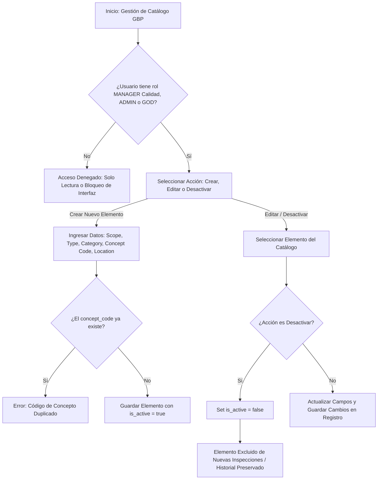
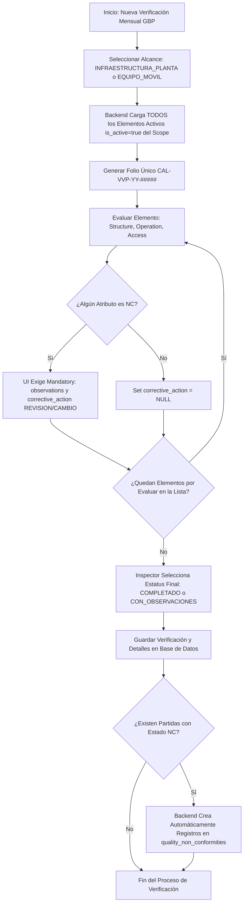

# 🔍 Módulo: Calidad - Verificación de Vidrio y Plástico Quebradizo (Glass & Brittle Plastic - GBP)

El módulo de **Verificación de Vidrio y Plástico Quebradizo** digitaliza el control preventivo y la auditoría mensual de insumos, estructuras, luminarias, ventanas y equipos constituidos por materiales frágiles dentro de las instalaciones operativas y flota vehicular de la empresa. Su propósito es mitigar riesgos de contaminación física en la cadena de suministro, garantizar el cumplimiento de estándares de inocuidad y gestionar las acciones correctivas ante roturas o deterioros.

---

---

## 💼 Reglas de Negocio (Business Rules)

### BR-GBP-01: Scope Operativo y Carga Masiva de Elementos Activos

- **Descripción:** Las verificaciones de vidrio y plástico quebradizo se ejecutan con una periodicidad mensual obligatoria. Antes de iniciar la captura, el inspector debe seleccionar el alcance operativo a auditar (`resource_scope`: `INFRAESTRUCTURA_PLANTA` o `EQUIPO_MOVIL`).
- **Comportamiento Global:** Al seleccionar el `resource_scope`, el backend genera la plantilla de evaluación incluyendo automáticamente todos los elementos registrados en el catálogo `glass_brittle_plastics` que tengan `is_active = true` y cuyo `resource_type` pertenezca a los tipos válidos (`ALMACEN_1`, `ALMACEN_2`, `VEHICULO_PROPIO`, `VEHICULO_RENTADO`). No se permiten auditorías parciales u omisión de elementos activos dentro del alcance seleccionado.

### BR-GBP-02: Determinación Manual del Estatus de Verificación

- **Descripción:** El estatus final de la verificación mensual (`COMPLETADO` o `CON_OBSERVACIONES`) es asignado de forma manual y explícita por el inspector de Calidad al finalizar la revisión global.
- **Comportamiento Global:** La presencia de evaluaciones No Conformes (`NC`) en el detalle sirve como evidencia técnica, pero no cambia automáticamente el estatus por código en la base de datos; la responsabilidad del dictamen final recae únicamente en el usuario evaluador.

### BR-GBP-03: Condicionalidad de Observaciones y Acciones Correctivas por NC

- **Descripción:** Cada elemento evaluado en la tabla de detalle exige la calificación individual de tres atributos: estructura (`structure_status`), operación (`operation_status`) y acceso (`access_status`), aceptando únicamente los valores `'C'` (Conforme) o `'NC'` (No Conforme).
- **Comportamiento Global:**
  - Si al menos uno de los tres atributos se registra como `'NC'`, los campos `observations` y `corrective_action` se vuelven estrictamente obligatorios en el backend. El campo `corrective_action` solo acepta los valores `'REVISION'` o `'CAMBIO'`.
  - Si los tres atributos se registran como `'C'`, el campo `corrective_action` debe almacenarse obligatoriamente como `NULL`.

### BR-GBP-04: Detonación Automática de Registros de No Conformidad

- **Descripción:** Cualquier partida de detalle evaluada con estatus No Conforme (`'NC'`) en alguno de sus atributos debe integrarse con el subsistema de gestión de desviaciones.
- **Comportamiento Global:** Al guardar la verificación, por cada fila en `quality_glass_plastic_details` que presente un estado `'NC'`, el backend genera automáticamente un registro vinculado en la tabla central de no conformidades (`quality_non_conformities`), enviando el código del elemento (`concept_code`), las observaciones y la acción correctiva estipulada (`REVISION` o `CAMBIO`).

### BR-GBP-05: Control Restringido del Catálogo Centralizado

- **Descripción:** El catálogo maestro de insumos y estructuras de vidrio y plástico quebradizo (`glass_brittle_plastics`) cuenta con acceso altamente restringido para evitar modificaciones no autorizadas en la matriz de auditoría.
- **Comportamiento Global:** Únicamente los usuarios autenticados con los roles `MANAGER` (perteneciente al departamento de Calidad), `ADMIN` o `GOD` poseen facultades para crear, editar o cambiar el estado operativo (`is_active`) de los elementos del catálogo.

### BR-GBP-06: Estructura Estándar de Folios Autogenerados

- **Descripción:** Cada verificación mensual registrada en el módulo debe contar con un identificador único e irrepetible autogenerado por el servidor.
- **Comportamiento Global:** El folio se genera bajo el formato `CAL-VVP-YY-#####`, donde `YY` representa los últimos dos dígitos del año en curso y `#####` un consecutivo numérico de 5 dígitos reiniciado anualmente.

### BR-GBP-07: Inmutabilidad Histórica y Preservación por Baja Lógica

- **Descripción:** Cuando un elemento de vidrio o plástico quebradizo es retirado, sustituido o remodelado en planta/vehículo, no debe eliminarse físicamente de la base de datos.
- **Comportamiento Global:** El elemento se deshabilita asignando `is_active = false` (desactivación lógica). Esto previene su inclusión en futuras auditorías mensuales (**BR-GBP-01**) mientras preserva intacto el historial de verificaciones pasadas y la integridad relacional de la base de datos.

---

---

## 👥 Historias de Usuario (User Stories)

### US-GBP-01: Gestión del Catálogo Maestro de Vidrio y Plástico Quebradizo

- **Como:** Gerente de Calidad (`MANAGER`), `ADMIN` o `GOD`.
- **Quiero:** Dar de alta, actualizar y desactivar elementos de vidrio y plástico quebradizo en el catálogo centralizado.
- **Para:** Mantener actualizada la matriz de auditoría de planta y equipos móviles sin comprometer la trazabilidad de inspecciones previas.
- **Criterios de Aceptación:**
  - **C.A. 1.1:** Solo los roles `MANAGER` (Calidad), `ADMIN` y `GOD` pueden acceder a la interfaz de creación y edición del catálogo (**BR-GBP-05**).
  - **C.A. 1.2:** Al registrar un elemento, se debe validar la unicidad del `concept_code` y requerir de forma obligatoria `resource_scope`, `resource_type`, `category` y `location_or_model`.
  - **C.A. 1.3:** La desactivación de un elemento (`is_active = false`) lo excluye de futuras inspecciones mensuales sin afectar las verificaciones históricas registradas previamente (**BR-GBP-07**).

---

### US-GBP-02: Ejecución y Registro de la Verificación Mensual

- **Como:** Colaborador del departamento de Calidad (`USER`, `LEADER`, `SUPERVISOR`, `MANAGER`).
- **Quiero:** Seleccionar el alcance operativo y evaluar el estado físico, funcional y de acceso de todos los elementos activos de vidrio y plástico quebradizo.
- **Para:** Cumplir con la auditoría mensual de inocuidad y detectar de forma oportuna grietas, roturas o astillamientos.
- **Criterios de Aceptación:**
  - **C.A. 2.1:** El usuario debe seleccionar inicialmente el `resource_scope` (`INFRAESTRUCTURA_PLANTA` o `EQUIPO_MOVIL`). El sistema cargará automáticamente todos los elementos del catálogo con `is_active = true` asociados a los tipos autorizados (**BR-GBP-01**).
  - **C.A. 2.2:** Se autogenera el folio único con la estructura `CAL-VVP-YY-#####` (**BR-GBP-06**).
  - **C.A. 2.3:** Para cada elemento, el usuario debe marcar `structure_status`, `operation_status` y `access_status` como `'C'` o `'NC'`.
  - **C.A. 2.4:** Si algún atributo es marcado como `'NC'`, la UI debe exigir la captura de `observations` y la selección de `corrective_action` (`REVISION` o `CAMBIO`). Si todos son `'C'`, `corrective_action` se guarda como `NULL` (**BR-GBP-03**).
  - **C.A. 2.5:** El usuario debe seleccionar manualmente el estatus general del encabezado (`COMPLETADO` o `CON_OBSERVACIONES`) (**BR-GBP-02**).

---

### US-GBP-03: Generación de No Conformidades por Elementos Defectuosos

- **Como:** Colaborador del departamento de Calidad (`USER`, `LEADER`, `SUPERVISOR`, `MANAGER`).
- **Quiero:** Que el sistema canalice automáticamente los hallazgos de elementos con No Conformidad (`'NC'`).
- **Para:** Garantizar que el personal operativo gestione la reparación o reemplazo inmediato del insumo afectado.
- **Criterios de Aceptación:**
  - **C.A. 3.1:** Al procesar el guardado de la verificación, el backend identifica todas las partidas de detalle con al menos un atributo en `'NC'` y crea un registro correspondiente en `quality_non_conformities` (**BR-GBP-04**).
  - **C.A. 3.2:** El registro de No Conformidad debe vincular el `concept_code` del elemento, la ubicación/modelo, el detalle de las observaciones y la acción correctiva seleccionada.

---

---

## 🔄 Diagramas de Flujo

### 1. Flujo de Administración del Catálogo de Elementos

#### Referencias

- Reglas de Negocio (BR):
  - **[BR-GBP-05]**: Control restringido del catálogo a roles MANAGER, ADMIN y GOD.
  - **[BR-GBP-07]**: Inmutabilidad histórica y preservación mediante baja lógica (is_active = false).
- Historias de Usuario (US):
  - **[US-GBP-01]**: Gestión del Catálogo Maestro de Vidrio y Plástico Quebradizo.
- Criterios de Aceptación (C.A):
  - **[C.A. 1.1]**: Validación de roles autorizados para modificación.
  - **[C.A. 1.2]**: Validaciones de unicidad y campos requeridos.
  - **[C.A. 1.3]**: Desactivación lógica preservando historial.

### 2. Flujo Operativo de la Verificación Mensual

#### Referencias

- Reglas de Negocio (BR):
  - **[BR-GBP-01]**: Scope operativo y carga masiva obligatoria de elementos activos.
  - **[BR-GBP-02]**: Determinación manual del estatus final por el inspector.
  - **[BR-GBP-03]**: Obligatoriedad de observaciones y acciones correctivas ante No Conformidades.
  - **[BR-GBP-04]**: Detonación automática de registros en quality_non_conformities.
  - **[BR-GBP-06]**: Estructura estándar de folios autogenerados (GBP-YY-#####).
- Historias de Usuario (US):
  - **[US-GBP-02]**: Ejecución y Registro de la Verificación Mensual.
  - **[US-GBP-03]**: Generación de No Conformidades por Elementos Defectuosos.
- Criterios de Aceptación (C.A):
  - **[C.A. 2.1]**: Selección de alcance y carga masiva de plantilla.
  - **[C.A. 2.2]**: Autogeneración de folio de inspección.
  - **[C.A. 2.4]**: Validaciones condicionales para campos de observaciones y acciones correctivas.
  - **[C.A. 2.5]**: Asignación manual del dictamen del encabezado.
  - **[C.A. 3.1]**: Creación automática de no conformidades para partidas con 'NC'.

---

---

- ⬆️ [Volver arriba](#)
- 📖 [Ir al Índice](../README.md#-5-índice-de-módulos-funcionales)
