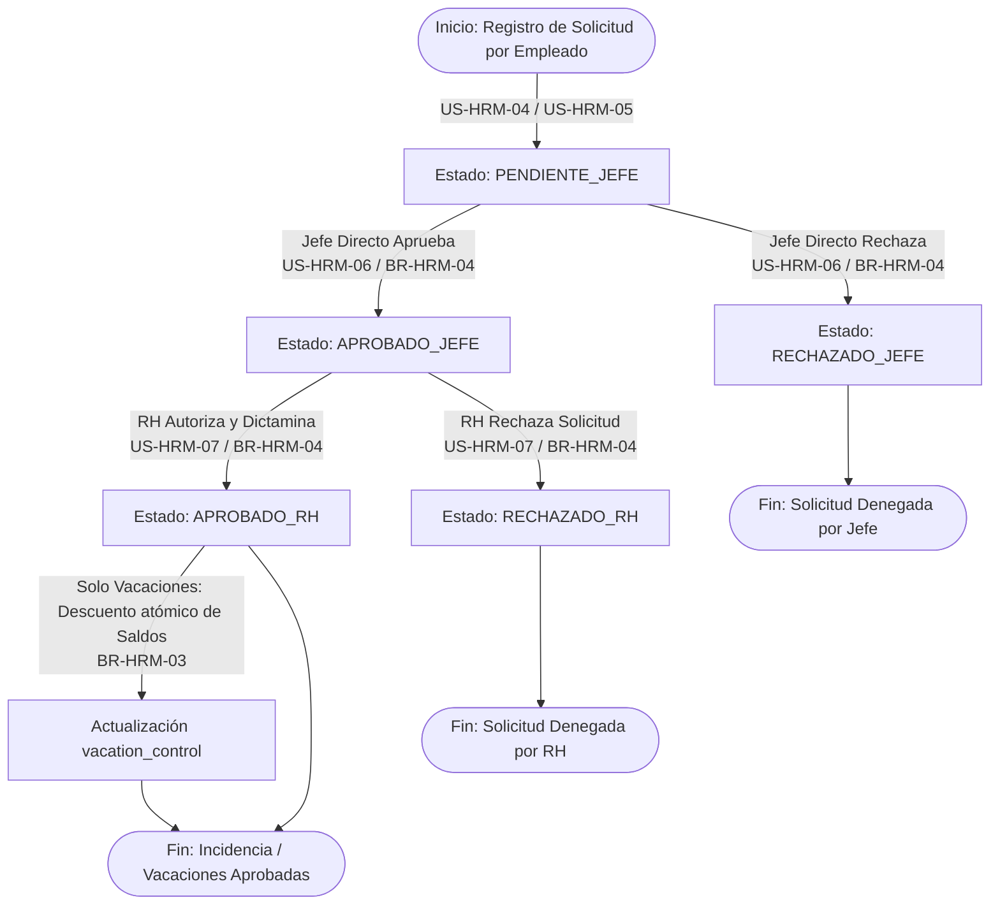
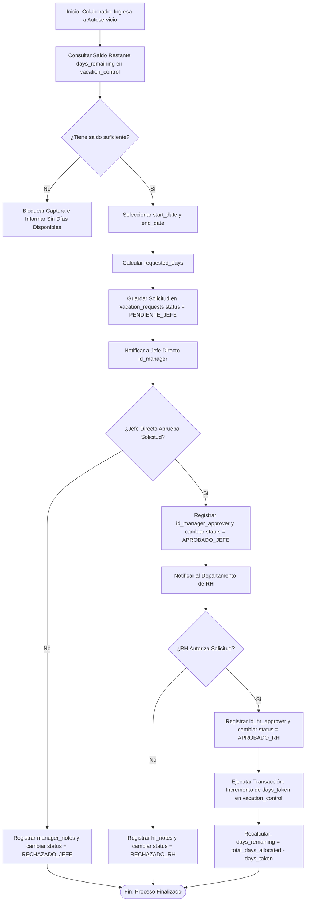
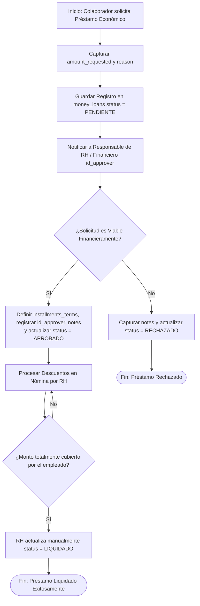

# 👥 Módulo: Gestión de Personal y Recursos Humanos (Human Resource Management - HRM)

El módulo de **Gestión de Personal y Recursos Humanos** centraliza la operación diaria y los servicios al colaborador, complementando a **SAP Business One** como la fuente de verdad. Mientras que los datos generales e identitarios del personal se sincronizan y replican desde SAP, la base de datos propia administra de forma exclusiva campos de gestión local, notas internas de RH y módulos especializados como el control de brigadas internas de protección civil (asignación de miembros, responsables y seguimiento de capacitaciones).

Asimismo, el sistema potencia la experiencia mediante un portal de autoservicio para los empleados y flujos de aprobación (mayoritariamente bietápicos entre líderes directos y Recursos Humanos) para gestionar solicitudes de vacaciones, préstamos económicos personales e incidencias de asistencia (faltas, llegadas tardías, salidas anticipadas y permisos durante la jornada laboral).

---

---

## 💼 Reglas de Negocio (Business Rules)

### BR-HRM-01: Sincronización e Integridad de la Ficha del Empleado

- **Descripción:** **SAP Business One** es la única fuente de verdad (_Single Source of Truth_) para los datos maestros de personal. **KoonolApp** recibe las altas y actualizaciones mediante Webhooks sincronizando directamente con la tabla `employees`. Cada registro en `employees` debe estar vinculado de forma unívoca (1:1) con un usuario activo en la tabla `users`. La baja operativa de un colaborador se gestiona mediante borrado lógico utilizando la columna `deleted_at`, cambiando su estado a `INACTIVO`.
- **Comportamiento Global:** Se prohíbe la creación directa o eliminación física (_hard delete_) de registros en `employees` mediante interfaz de usuario sin que provenga o sea validado contra la clave `sap_id`. Si un empleado pasa a estado `INACTIVO` o es marcado con `deleted_at`, sus credenciales asociadas en la tabla `users` se desactivan automáticamente impidiendo el acceso a **KoonolApp**.

### BR-HRM-02: Control de Brigadas Internas de Protección Civil

- **Descripción:** Un colaborador activo puede estar asignado a una brigada de seguridad industrial mediante la tabla `employee_brigades`. Los tipos de brigada permitidos están estandarizados: `'PRIMEROS_AUXILIOS'`, `'EVACUACION'`, `'INCENDIOS'` y `'BUSQUEDA Y RESCATE'`.
- **Comportamiento Global:** Un colaborador solo puede pertenecer activamente a una brigada a la vez mediante la restricción de unicidad (`id_employee`). La baja de la brigada se realiza alternando la bandera `status = false`, manteniendo el histórico de certificaciones en `certified_at` sin alterar la continuidad laboral del empleado.

### BR-HRM-03: Asignación Manual de Bolsa Anual y Cálculo Automático de Vacaciones

- **Descripción:** El saldo anual de días de vacaciones correspondientes a cada colaborador por concepto de antigüedad es capturado o actualizado manualmente por el departamento de Recursos Humanos en la tabla `vacation_control` para un periodo específico (`year_corresponding`).
- **Comportamiento Global:** La base de datos garantiza la unicidad del par (`id_employee`, `year_corresponding`). Ante la aprobación final de una solicitud de vacaciones (`vacation_requests`), el backend ejecuta una transacción atómica que:
  1. Incrementa `days_taken` con el valor de `requested_days`.
  2. Recalcula automáticamente `days_remaining = total_days_allocated - days_taken`.
  3. Deniega la transacción si `requested_days` excede el saldo de `days_remaining` disponible para el año correspondiente.

### BR-HRM-04: Flujo de Aprobación Bietápico para Vacaciones y Permisos

- **Descripción:** Todas las solicitudes de vacaciones (`vacation_requests`) y permisos de asistencia (`attendance_permits`) ingresadas por un colaborador (`USER`) deben cumplir un ciclo de aprobación estricto en dos fases:
  - **Fase 1 (Jefe Directo):** Transición de `PENDIENTE_JEFE` a `APROBADO_JEFE` o `RECHAZADO_JEFE` por parte del usuario asignado como `id_manager` del empleado.
  - **Fase 2 (Recursos Humanos):** Únicamente las solicitudes en estado `APROBADO_JEFE` pueden ser procesadas por el departamento de RH, transitando a `APROBADO_RH` o `RECHAZADO_RH`.
- **Comportamiento Global:** Ninguna solicitud afectará los saldos o registros de pre-nómina hasta alcanzar el estado definitivo `APROBADO_RH`. Si una solicitud es rechazada en la Fase 1 o Fase 2, se cierra el flujo exigiendo el registro obligatorio de comentarios en `manager_notes` o `hr_notes` respectivamente.

### BR-HRM-05: Tipificación de Permisos de Asistencia y Carga de Evidencia

- **Descripción:** Los permisos de asistencia registrados en `attendance_permits` deben clasificar la incidencia según los tipos de evento autorizados (`permit_type`: `'ENTRADA_DESTIEMPO'`, `'SALIDA_ANTICIPADA'`, `'FALTA_JUSTIFICADA'`, `'CHECAR_FUERA_HORARIO'`) y declarar la justificación laboral o administrativa (`justification`: `'PERMISO SIN GOCE DE SUELDO'`, `'PERMISO CON GOCE DE SUELDO'`, `'SUSPENSION DEL TRABAJO'`, `'DEVOLUCION DE HORAS'`, `'OTROS'`).
- **Comportamiento Global:** Cuando el tipo de permiso o la justificación requiera soporte documental (como en faltas por incapacidad médica o trámites oficiales), el sistema permite almacenar el enlace del archivo digitalizado en `evidence_document`. RH puede exigir este campo como obligatorio antes de emitir la aprobación final en `APROBADO_RH`.

### BR-HRM-06: Gestión y Ciclo Financiero de Préstamos Económicos

- **Descripción:** Los colaboradores pueden solicitar préstamos económicos a través de la tabla `money_loans`, especificando el monto solicitado (`amount_requested`) y el motivo (`reason`); el plazo en parcialidades semanales/quincenales/mensuales (`installments_terms`) serán determinados por recursos humanos una vez aprobada la solicitud.
- **Comportamiento Global:** La solicitud inicia en estado `PENDIENTE`. La revisión y autorización es responsabilidad exclusiva de un usuario con rol con facultades como RH (`id_approver`), el cual actualiza el estatus a `APROBADO` o `RECHAZADO` y determinara el plazo a devolver el monto. Una vez cubierto el monto prestado por el colaborador, el responsable de RH deberá actualizar el estado a `LIQUIDADO` de manera manual.

---

---

## 👥 Historias de Usuario (User Stories)

### US-HRM-01: Sincronización y Ficha del Empleado

- **Como:** Personal de Recursos Humanos,
- **Quiero:** Visualizar la lista de empleados sincronizada desde SAP Business One y consultar su departamento, puesto, fecha de ingreso y datos de contacto,
- **Para:** Mantener centralizado el expediente general del personal sin necesidad de realizar altas manuales duplicadas.
- **Criterios de Aceptación:**
  - **C.A. 1.1:** La interfaz debe listar los empleados provenientes de la tabla `employees`, mostrando `employee_payroll_id`, `sap_id`, nombre completo, `job_title`, departamento e `hire_date`.
  - **C.A. 1.2:** Los datos sensibles como `salary` solo serán visibles para usuarios con rol `MANAGER` de RH, `ADMIN` o `GOD`.
  - **C.A. 1.3:** Al desactivar a un colaborador desde SAP o por baja laboral, el registro en **KoonolApp** debe actualizarse con `status = 'INACTIVO'` y registrar la fecha en `deleted_at`.

### US-HRM-02: Asignación y Control de Brigadistas

- **Como:** Coordinador de RH,
- **Quiero:** Asignar colaboradores activos a brigadas de protección civil y registrar sus fechas de última capacitación,
- **Para:** Mantener al día los requerimientos normativos de brigadas de emergencia en planta.
- **Criterios de Aceptación:**
  - **C.A. 2.1:** La pantalla de brigadas debe permitir seleccionar un empleado activo e ingresar su rol en la tabla `employee_brigades` con un `brigade_type` válido (`'PRIMEROS_AUXILIOS'`, `'EVACUACION'`, `'INCENDIOS'`, `'BUSQUEDA Y RESCATE'`).
  - **C.A. 2.2:** Permite marcar el campo `is_chief = true` para identificar al líder de la brigada.
  - **C.A. 2.3:** Si un empleado deja de formar parte de la brigada, la aplicación debe cambiar `status` a `false` preservando la fecha de certificación en `certified_at`.

### US-HRM-03: Carga de Bolsa Anual de Vacaciones

- **Como:** Personal de Recursos Humanos,
- **Quiero:** Capturar el total de días de vacaciones otorgados a un colaborador para el periodo actual,
- **Para:** Establecer el saldo inicial disponible sobre el cual el empleado podrá realizar solicitudes.
- **Criterios de Aceptación:**
  - **C.A. 3.1:** El formulario de `vacation_control` requiere seleccionar un colaborador (`id_employee`), ingresar el año de vigencia (`year_corresponding`) y la cantidad de días asignados (`total_days_allocated`).
  - **C.A. 3.2:** El sistema debe inicializar por defecto `days_taken = 0` y `days_remaining = total_days_allocated`.
  - **C.A. 3.3:** Si ya existe un registro para el mismo `id_employee` y `year_corresponding`, el sistema debe denegar el duplicado mediante la restricción única `uq_vacation_control_employee_year`.

### US-HRM-04: Solicitud de Vacaciones (Autoservicio Colaborador)

- **Como:** Colaborador (`USER`),
- **Quiero:** Solicitar un periodo de vacaciones desde mi portal de autoservicio seleccionando las fechas de inicio y fin,
- **Para:** Notificar a mi jefe directo y programar mis días de descanso sin trámites en papel.
- **Criterios de Aceptación:**
  - **C.A. 4.1:** El usuario debe visualizar su saldo de días restantes (`days_remaining`) antes de capturar la solicitud.
  - **C.A. 4.2:** La interfaz calculará automáticamente `requested_days` en base a las fechas `start_date` y `end_date`. Si `requested_days` supera los días disponibles en `vacation_control`, la interfaz bloqueará el envío.
  - **C.A. 4.3:** Al enviar la solicitud, se insertará un registro en `vacation_requests` con `status = 'PENDIENTE_JEFE'`.

### US-HRM-05: Solicitud de Permiso de Asistencia e Incidencias

- **Como:** Colaborador (`USER`),
- **Quiero:** Registrar un permiso de salida, entrada a destiempo o falta justificable adjuntando el motivo y comprobante,
- **Para:** Justificar mi incidencia de horario ante mi jefe directo y RH.
- **Criterios de Aceptación:**
  - **C.A. 5.1:** El formulario debe requerir la selección de `permit_type`, la fecha del suceso (`target_date`), la hora aproximada (`start_time`), la categoría de `justification` y el detalle en `reason`.
  - **C.A. 5.2:** Permite cargar un archivo digital de comprobante (por ej. justificante médico) asignando la URL resultante al campo `evidence_document`.
  - **C.A. 5.3:** La solicitud se guardará en `attendance_permits` bajo el estado inicial `PENDIENTE_JEFE`.

### US-HRM-06: Aprobación / Rechazo por Mando Directo

- **Como:** Responsable de Área (`MANAGER` / `SUPERVISOR`),
- **Quiero:** Revisar las solicitudes de vacaciones y permisos pendientes de mi equipo a cargo,
- **Para:** Validar la viabilidad operativa del área y autorizar la solicitud hacia RH o rechazarla con justificación.
- **Criterios de Aceptación:**
  - **C.A. 6.1:** El panel de aprobaciones mostrará únicamente las solicitudes en estado `PENDIENTE_JEFE` pertenecientes a los empleados cuya jefatura (`id_manager`) coincida con el usuario en sesión.
  - **C.A. 6.2:** Al aprobar la solicitud, el estado de `vacation_requests` o `attendance_permits` se actualiza a `APROBADO_JEFE` registrando la firma en `id_manager_approver`.
  - **C.A. 6.3:** Al rechazar, el estado pasa a `RECHAZADO_JEFE` obligando a capturar comentarios en `manager_notes`.

### US-HRM-07: Dictamen Final e Impacto por Recursos Humanos

- **Como:** Administrador / Generalista de RH,
- **Quiero:** Dar la autorización final a las solicitudes previamente aprobadas por los jefes directos,
- **Para:** Asentarlas en la pre-nómina y desencadenar el descuento de días del control de vacaciones.
- **Criterios de Aceptación:**
  - **C.A. 7.1:** RH podrá visualizar únicamente las solicitudes en estado `APROBADO_JEFE`.
  - **C.A. 7.2:** Al autorizar una solicitud de vacaciones (`status = 'APROBADO_RH'`), el sistema registrará `id_hr_approver` e incrementará automáticamente los días consumidos en `vacation_control.days_taken` y actualizará `days_remaining`.
  - **C.A. 7.3:** Si RH rechaza la solicitud (`status = 'RECHAZADO_RH'`), se asentará la razón en `hr_notes` y no se afectarán las bolsas de vacaciones del colaborador.

### US-HRM-08: Tramitación de Préstamos Económicos

- **Como:** Colaborador (`USER`),
- **Quiero:** Registrar una solicitud de préstamo indicando el monto deseado,
- **Para:** Solicitar apoyo financiero formal a la empresa.
- **Criterios de Aceptación:**
  - **C.A. 8.1:** El usuario debe capturar `amount_requested` y la explicación en `reason`.
  - **C.A. 8.2:** El registro se crea en `money_loans` con `status = 'PENDIENTE'`.
  - **C.A. 8.3:** El aprobador asignado autoriza (`status = 'APROBADO'`) o deniega (`status = 'RECHAZADO'`) completando los campos `installments_terms`, `id_approver` y `notes`.

---

---

## 🔄 Diagramas de Flujo

### 1. Diagrama de Transición de Estados para Vacaciones y Permisos de Asistencia

#### Referencias

- Reglas de Negocio (BR):
  - **[BR-HRM-03]:** Asignación Manual de Bolsa Anual y Cálculo Automático de Vacaciones.
  - **[BR-HRM-04]:** Flujo de Aprobación Bietápico para Vacaciones y Permisos.
- Historias de Usuario (US):
  - **[US-HRM-04]:** Solicitud de Vacaciones (Autoservicio Colaborador).
  - **[US-HRM-05]:** Solicitud de Permiso de Asistencia e Incidencias.
  - **[US-HRM-06]:** Aprobación / Rechazo por Mando Directo.
  - **[US-HRM-07]:** Dictamen Final e Impacto por Recursos Humanos.
- Criterios de Aceptación (C.A):
  - **[C.A. 4.3, 5.3]:** Creación de registros en estado inicial PENDIENTE_JEFE.
  - **[C.A. 6.2, 6.3]:** Transiciones de la primera fase a APROBADO_JEFE o RECHAZADO_JEFE.
  - **[C.A. 7.2, 7.3]:** Dictamen final de RH (APROBADO_RH / RECHAZADO_RH) y descuento automático de días.

### 2. Diagrama de Flujo Operativo: Ciclo de Solicitud y Aprobación Bietápica de Vacaciones

#### Referencias

- Reglas de Negocio (BR):
  - **[BR-HRM-03]:** Asignación Manual de Bolsa Anual y Cálculo Automático de Vacaciones.
  - **[BR-HRM-04]:** Flujo de Aprobación Bietápico para Vacaciones y Permisos.
- Historias de Usuario (US):
  - **[US-HRM-03]:** Carga de Bolsa Anual de Vacaciones.
  - **[US-HRM-04]:** Solicitud de Vacaciones (Autoservicio Colaborador).
  - **[US-HRM-06]:** Aprobación / Rechazo por Mando Directo.
  - **[US-HRM-07]:** Dictamen Final e Impacto por Recursos Humanos.
- Criterios de Aceptación (C.A):
  - **[C.A. 4.1, 4.2]:** Validación de saldo disponible e ingreso de fechas.
  - **[C.A. 6.1, 6.2]:** Evaluación y firmas del jefe inmediato.
  - **[C.A. 7.2]:** Cierre de aprobación por RH y recálculo atómico de saldos en base de datos.

### 3. Diagrama de Flujo Operativo: Tramitación de Préstamos Económicos

#### Referencias

- Reglas de Negocio (BR):
  - **[BR-HRM-06]:** Gestión y Ciclo Financiero de Préstamos Económicos.
- Historias de Usuario (US):
  - **[US-HRM-08]:** Tramitación de Préstamos Económicos.
- Criterios de Aceptación (C.A):
  - **[C.A. 8.1, 8.2]:** Captura inicial de monto y motivo en estado PENDIENTE.
  - **[C.A. 8.3]:** Definición del plazo installments_terms, firmas de aprobación y cambio manual a LIQUIDADO.

---

---

- ⬆️ [Volver arriba](#)
- 📖 [Ir al Índice](../README.md#-5-índice-de-módulos-funcionales)
