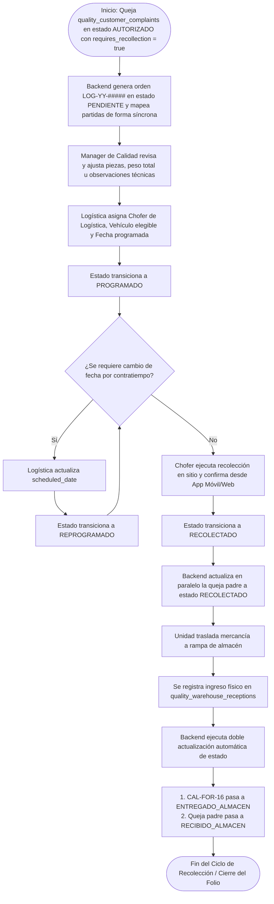
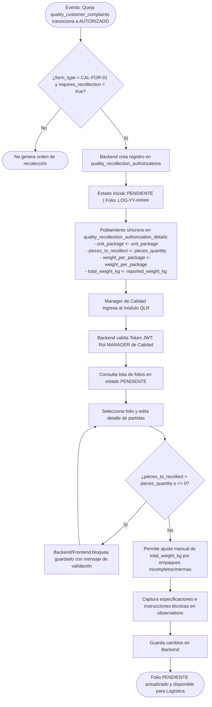
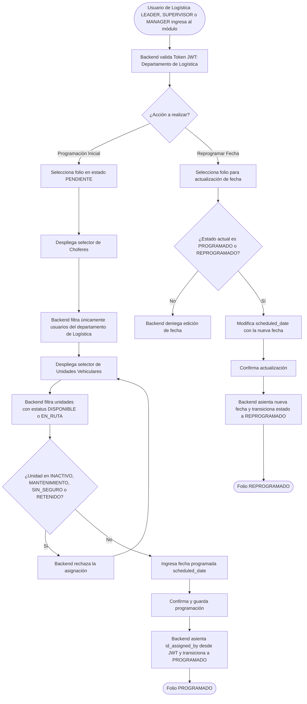
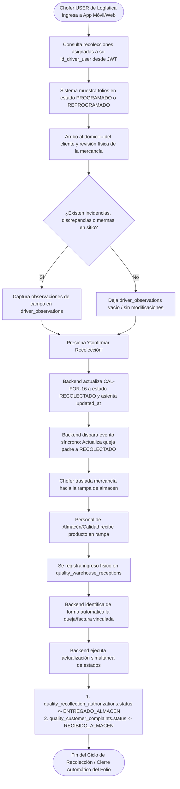

# 🚛 Módulo: Calidad/Logística - Recolección de Devoluciones (Quality Logistics Recollection - QLR)

El módulo de **Recolección de Devoluciones** gestiona el ciclo operativo y la trazabilidad del formato **CAL-FOR-16** (Autorización de Recolección). Su propósito es digitalizar, coordinar y auditar el proceso de retorno de mercancía desde el domicilio del cliente hacia las instalaciones de la empresa, derivado de un reporte de queja de cliente (**CAL-FOR-01**) previamente dictaminado y aprobado.

---

---

## 💼 Reglas de Negocio (Business Rules)

### BR-QLR-01: Generación Automática del Encabezado y Mapeo de Partidas

- **Descripción:** Cuando una queja (`quality_customer_complaints`) con `form_type = 'CAL-FOR-01'` transiciona a estado `AUTORIZADO` y posee el indicador `requires_recollection = true`, el backend creará en automático la orden en `quality_recollection_authorizations` (estado `PENDIENTE`, folio `LOG-YY-#####`).
- **Comportamiento Global:**
  - Se prohíbe la creación manual directa de autorizaciones de recolección; existe una relación de origen estricta 1:1 con la queja autorizada.
  - De forma síncrona, el backend poblará la tabla `quality_recollection_authorization_details` replicando las partidas de `quality_complaint_items`:
    - `unit_package` $\leftarrow$ `quality_complaint_items.unit_package`
    - `pieces_to_recollect` $\leftarrow$ `quality_complaint_items.pieces_quantity`
    - `weight_per_package` $\leftarrow$ `quality_complaint_items.weight_per_package`
    - `total_weight_kg` $\leftarrow$ `quality_complaint_items.reported_weight_kg`
  - `YY` corresponde a los dos últimos dígitos del año en curso y `#####` a un consecutivo de 5 dígitos reiniciado anualmente.

### BR-QLR-02: Segregación de Responsabilidades y Modificación por Calidad

- **Descripción:** La edición del registro `CAL-FOR-16` se divide según el departamento del usuario autenticado:
  - **Departamento de Calidad (`MANAGER`):** Tras la generación automática del backend, el Manager de Calidad tiene la facultad de revisar y corregir los datos de las partidas (`pieces_to_recollect`, `total_weight_kg`), así como ingresar las especificaciones técnicas u observaciones en el campo `observations`.
  - **Departamento de Logística (`LEADER`, `SUPERVISOR`, `MANAGER`):** Exclusividad para asignar y editar la programación operativa: chofer (`id_driver_user`), unidad vehicular (`id_vehicle`), fecha programada (`scheduled_date`) y firma del asignador (`id_assigned_by`).
  - **Operador / Chofer (`USER`):** Facultad para consultar sus asignaciones, ingresar incidencias de campo en `driver_observations` y confirmar la recolección.
- **Comportamiento Global:** El backend validará los roles y departamentos desde el Token JWT, bloqueando la escritura cruzada de campos ajenos al perfil.

### BR-QLR-03: Elegibilidad de Operador y Unidad Vehicular

- **Descripción:** Para programar una recolección, el usuario asignado (`id_driver_user`) debe pertenecer al departamento de Logística. Asimismo, la unidad vehicular (`id_vehicle`) seleccionada debe contar con estatus `DISPONIBLE` o `EN_RUTA` en el catálogo maestro.
- **Comportamiento Global:** Se rechazarán peticiones de asignación con vehículos en estado `INACTIVO`, `MANTENIMIENTO`, `SIN_SEGURO` o `RETENIDO`.

### BR-QLR-04: Transición de Estados Operativos del Folio

- **Descripción:** El ciclo de vida del estado (`status`) en `quality_recollection_authorizations` evoluciona según la siguiente secuencia:
  - **`PENDIENTE`:** Estado inicial al crearse de forma automatizada.
  - **`PROGRAMADO`:** Transición al guardar la asignación completa de chofer, vehículo y fecha programada.
  - **`REPROGRAMADO`:** Transición al actualizar `scheduled_date` en un registro `PROGRAMADO` o `REPROGRAMADO` previa ejecución.
  - **`RECOLECTADO`:** Asentado en sitio por el chofer asignado desde la aplicación móvil/web; el backend disparará de forma síncrona la actualización del estado de la queja padre (`quality_customer_complaints.status`) a `RECOLECTADO`.
  - **`ENTREGADO_ALMACEN`:** Transición automática disparada tras la recepción física en rampa.
- **Comportamiento Global:** Las transiciones son secuenciales y no pueden violar el orden cronológico del flujo.

### BR-QLR-05: Ajuste Manual de Pesos por Pérdida/Incompletos y Tope de Piezas

- **Descripción:** El campo `total_weight_kg` no se calcula de forma fija por multiplicación directa de piezas por peso unitario. El sistema debe permitir el ingreso o ajuste manual de `total_weight_kg` para contemplar casos de consumo parcial del cliente (por ejemplo: empaques incompletos).
- **Comportamiento Global:**
  - El número de bultos/piezas autorizadas a recolectar no podrá exceder la cantidad reportada en la queja ($0 < \text{pieces\_to\_recollect} \le \text{quality\_complaint\_items.pieces\_quantity}$).
  - `total_weight_kg` se inicializa con `reported_weight_kg` pero admite modificaciones directas por el Manager de Calidad.

### BR-QLR-06: Registro de Inconformidades u Observaciones de Campo por el Chofer

- **Descripción:** Al momento de ejecutar la recolección en el domicilio del cliente, el chofer asignado podrá ingresar notas e incidencias en el campo `driver_observations` (por ejemplo: empaque dañado, recolección parcial, discrepancia física).
- **Comportamiento Global:** La presencia de observaciones en `driver_observations` no bloquea la transición del folio a estado `RECOLECTADO`.

### BR-QLR-07: Cierre Automático por Recepción Física en Almacén

- **Descripción:** Al registrarse el ingreso físico de la mercancía en `quality_warehouse_receptions` referenciando el folio o queja correspondiente, el backend ejecutará dos actualizaciones automáticas simultáneas:
  1. Cambiará `quality_recollection_authorizations.status` a `ENTREGADO_ALMACEN`.
  2. Cambiará `quality_customer_complaints.status` a `RECIBIDO_ALMACEN`.
- **Comportamiento Global:** Marca el fin del flujo de logística inversa y cierra la orden de recolección sin requerir cierres manuales en el módulo de Logística y actualiza el estado en el módulo de Devoluciones.

---

---

## 👥 Historias de Usuario (User Stories)

### US-QLR-01: Edición Técnica, Ajuste de Mermas/Pesos e Instrucciones (Calidad)

- **Como:** `MANAGER` del departamento de Calidad.
- **Quiero:** Auditar la orden de recolección generada por el sistema, corregir desviaciones en piezas o peso total por empaques incompletos y agregar observaciones técnicas.
- **Para:** Garantizar que la autorización de carga refleje la realidad física y proporcione instrucciones precisas al chofer.
- **Criterios de Aceptación:**
  - **C.A. 1.1:** Muestra los folios en estado `PENDIENTE` cuyos datos de partidas provienen de `quality_complaint_items` (**BR-QLR-01**).
  - **C.A. 1.2:** Permite editar `pieces_to_recollect`, validando que no sea mayor a `pieces_quantity` de la queja de origen (**BR-QLR-05**).
  - **C.A. 1.3:** Permite capturar o corregir directamente `total_weight_kg` independientemente del peso nominal, contemplando empaques parciales/mermas (**BR-QLR-05**).
  - **C.A. 1.4:** Habilita la captura y guardado de especificaciones de empaque o manejo en el campo `observations`.

### US-QLR-02: Programación Logística de Ruta y Asignación

- **Como:** Colaborador con rol `LEADER`, `SUPERVISOR` o `MANAGER` del departamento de Logística.
- **Quiero:** Asignar un operador, una unidad vehicular y una fecha programada al folio `LOG-YY-#####`.
- **Para:** Incorporar la recolección a la planeación de rutas diarias de la empresa.
- **Criterios de Aceptación:**
  - **C.A. 2.1:** El selector de choferes filtra y muestra únicamente usuarios pertenecientes al departamento de Logística (**BR-QLR-03**).
  - **C.A. 2.2:** El selector de unidades despliega solo vehículos en estatus `DISPONIBLE` o `EN_RUTA` (**BR-QLR-03**).
  - **C.A. 2.3:** Al guardar la asignación con datos válidos, el backend registra `id_assigned_by` del usuario autenticado y transiciona el estado a `PROGRAMADO` (**BR-QLR-04**).

### US-QLR-03: Confirmación de Recolección en Domicilio del Cliente desde App

- **Como:** Operador / Chofer (`USER`) del departamento de Logística.
- **Quiero:** Consultar las recolecciones asignadas a mi nombre, ingresar observaciones del cliente si existen y confirmar la recolección física.
- **Para:** Notificar que el producto ha sido retirado y se encuentra en tránsito de retorno a la planta.
- **Criterios de Aceptación:**
  - **C.A. 3.1:** El chofer visualiza la lista de recolecciones donde `id_driver_user` coincide con su usuario y el estado es `PROGRAMADO` o `REPROGRAMADO`.
  - **C.A. 3.2:** Permite capturar texto opcional en el campo `driver_observations` (**BR-QLR-06**).
  - **C.A. 3.3:** Al presionar "Confirmar Recolección", el sistema actualiza el estado a `RECOLECTADO` y asienta la fecha/hora en `updated_at`, e invocará el evento backend para actualizar la queja de origen (`quality_customer_complaints`) al estado `RECOLECTADO` (**BR-QLR-04**).

### US-QLR-04: Reprogramación de Recolecciones Pendientes

- **Como:** Colaborador con mando (`LEADER` o superior) del departamento de Logística.
- **Quiero:** Modificar la fecha programada de recolección de un folio no recolectado.
- **Para:** Reordenar la operación ante contratiempos en ruta o ausencias en el sitio del cliente.
- **Criterios de Aceptación:**
  - **C.A. 4.1:** Permite la edición de `scheduled_date` únicamente si el estado actual es `PROGRAMADO` o `REPROGRAMADO`.
  - **C.A. 4.2:** Al confirmar la nueva fecha, el estado cambia automáticamente a `REPROGRAMADO` (**BR-QLR-04**).

### US-QLR-05: Cierre Automático por Recepción Física en Almacén

- **Como:** Sistema KoonolApp (Proceso de Fondo / Backend).
- **Quiero:** Detectar el asentamiento de la mercancía en `quality_warehouse_receptions`.
- **Para:** Finalizar automáticamente el ciclo de vida de la recolección pasando su estatus a `ENTREGADO_ALMACEN`.
- **Criterios de Aceptación:**
  - **C.A. 5.1:** Ante la inserción exitosa en `quality_warehouse_receptions`, el backend identifica la queja/factura asociada y localiza la orden de recolección vinculada.
  - **C.A. 5.2:** El sistema actualiza el estado de `quality_recollection_authorizations` a `ENTREGADO_ALMACEN` y asienta la marca temporal en `updated_at` (**BR-QLR-07**).

---

---

## 🔄 Diagramas de Flujo

### 1. Ciclo de Vida y Transición de Estados del Folio LOG-YY-#####

#### Referencias

- Reglas de Negocio (BR):
  - **[BR-QLR-01]:** Generación Automática del Encabezado y Mapeo de Partidas
  - **[BR-QLR-02]:** Segregación de Responsabilidades y Modificación por Calidad
  - **[BR-QLR-04]:** Transición de Estados Operativos del Folio
  - **[BR-QLR-07]:** Cierre Automático por Recepción Física en Almacén
- Historias de Usuario (US):
  - **[US-QLR-01]:** Edición Técnica, Ajuste de Mermas/Pesos e Instrucciones (Calidad)
  - **[US-QLR-02]:** Programación Logística de Ruta y Asignación
  - **[US-QLR-03]:** Confirmación de Recolección en Domicilio del Cliente desde App
  - **[US-QLR-04]:** Reprogramación de Recolecciones Pendientes
  - **[US-QLR-05]:** Cierre Automático por Recepción Física en Almacén
- Criterios de Aceptación (C.A):
  - **[C.A 2.3]:** Al guardar la asignación, el sistema registra id_assigned_by y pasa a PROGRAMADO
  - **[C.A 3.3]:** Al confirmar recolección, el estado cambia a RECOLECTADO y actualiza la queja a RECOLECTADO
  - **[C.A 4.2]:** Al confirmar nueva fecha, el estado cambia a REPROGRAMADO
  - **[C.A 5.1]:** Identificación de queja/factura vinculada tras recepción física
  - **[C.A 5.2]:** Actualización automática a ENTREGADO_ALMACEN en recolección y RECIBIDO_ALMACEN en queja

### 2. Generación Automática y Revisión Técnica de Calidad

#### Referencias

- Reglas de Negocio (BR):
  - **[BR-QLR-01]:** Generación Automática del Encabezado y Mapeo de Partidas
  - **[BR-QLR-02]:** Segregación de Responsabilidades y Modificación por Calidad
  - **[BR-QLR-05]:** Ajuste Manual de Pesos por Pérdida/Incompletos y Tope de Piezas
- Historias de Usuario (US):
  - **[US-QLR-01]**: Edición Técnica, Ajuste de Mermas/Pesos e Instrucciones (Calidad)
- Criterios de Aceptación (C.A):
  - **[C.A 1.1]:** Muestra folios en PENDIENTE derivados de quejas de origen
  - **[C.A 1.2]:** Validar que $0 < \text{pieces\_to\_recollect} \le \text{pieces\_quantity}$ de la queja
  - **[C.A 1.3]:** Permitir captura o corrección directa de total_weight_kg
  - **[C.A 1.4]:** Habilitar captura y guardado de observaciones técnicas

### 3. Programación y Reprogramación Logística de Rutas

#### Referencias

- Reglas de Negocio (BR):
  - **[BR-QLR-02]:** Segregación de Responsabilidades y Modificación por Calidad
  - **[BR-QLR-03]:** Elegibilidad de Operador y Unidad Vehicular
  - **[BR-QLR-04]:** Transición de Estados Operativos del Folio
- Historias de Usuario (US):
  - **[US-QLR-02]:** Programación Logística de Ruta y Asignación
  - **[US-QLR-04]:** Reprogramación de Recolecciones Pendientes
- Criterios de Aceptación (C.A):
  - **[C.A 2.1]:** Filtro de choferes pertenecientes al departamento de Logística
  - **[C.A 2.2]:** Filtro de unidades con estatus DISPONIBLE o EN_RUTA
  - **[C.A 2.3]:** Registra id_assigned_by del usuario autenticado y pasa a PROGRAMADO
  - **[C.A 4.1]:** Edición de fecha permitida únicamente en PROGRAMADO o REPROGRAMADO
  - **[C.A 4.2]:** Transición automática a REPROGRAMADO al cambiar fecha

### 4. Confirmación de Campo en App Móvil y Cierre Automático por Almacén

#### Referencias

- Reglas de Negocio (BR):
  - **[BR-QLR-02]:** Segregación de Responsabilidades y Modificación por Calidad
  - **[BR-QLR-04]:** Transición de Estados Operativos del Folio
  - **[BR-QLR-06]:** Registro de Inconformidades u Observaciones de Campo por el Chofer
  - **[BR-QLR-07]:** Cierre Automático por Recepción Física en Almacén
- Historias de Usuario (US):
  - **[US-QLR-03]:** Confirmación de Recolección en Domicilio del Cliente desde App
  - **[US-QLR-05]:** Cierre Automático por Recepción Física en Almacén
- Criterios de Aceptación (C.A):
  - **[C.A 3.1]:** Chofer visualiza asignaciones asociadas a su id_driver_user en PROGRAMADO o REPROGRAMADO
  - **[C.A 3.2]:** Permite captura de texto opcional en driver_observations
  - **[C.A 3.3]:** Actualización a RECOLECTADO, marca updated_at e invoca actualización de la queja a RECOLECTADO
  - **[C.A 5.1]:** Identificación automática de queja/factura asociada al insertar recepción física
  - **[C.A 5.2]:** Cierre automático a estado ENTREGADO_ALMACEN en recolección y RECIBIDO_ALMACEN en la queja

---

---

- ⬆️ [Volver arriba](#)
- 📖 [Ir al Índice](../README.md#-5-índice-de-módulos-funcionales)
