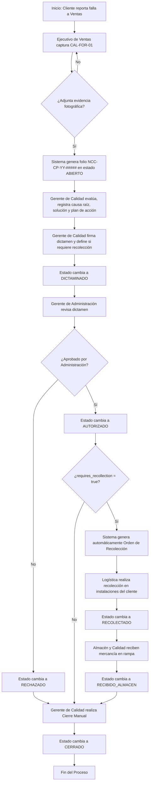
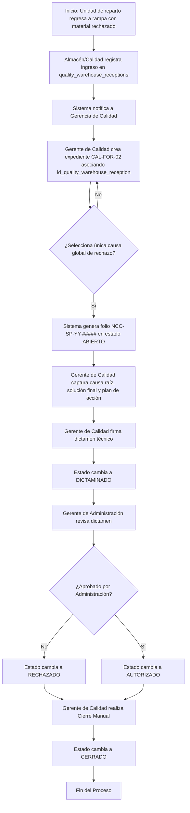
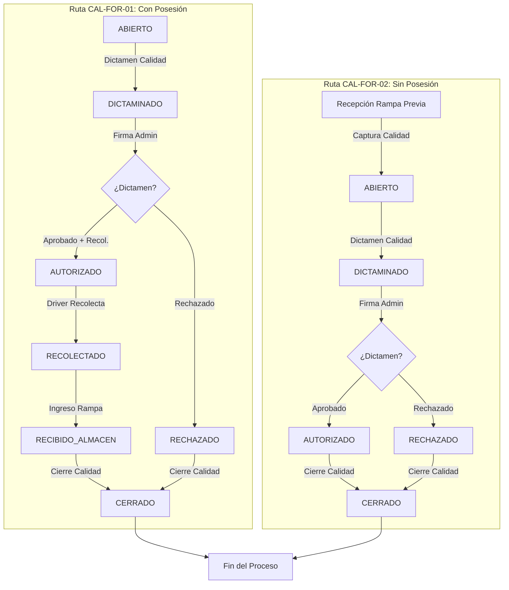

# 🔍 Módulo: Calidad - Devoluciones y Rechazos de Producto por Cliente (Customer Product Rejection - CPR)

El módulo de **Devoluciones y Rechazos de Producto por Cliente** gestiona el flujo operativo, investigación técnica, dictamen y resolución ante no conformidades reportadas por el cliente. Abarca tanto reclamaciones posteriores a la entrega con mercancía en poder del cliente (**Con Posesión - CAL-FOR-01**) como rechazos inmediatos en ruta de reparto (**Sin Posesión - CAL-FOR-02**). Garantiza la trazabilidad de lotes/pesos, la ejecución de planes de acción correctiva y la aprobación administrativa/técnica interdepartamental; apoyándose de los subsistemas de recolección logística, recepción en almacén y registro central de no conformidades (Quality Management System - QMS).

---

---

## 💼 Reglas de Negocio (Business Rules)

### BR-CPR-01: Tipificación de Formatos, Folios Distintivos e Integración con el SGC

- **Descripción:** Las solicitudes de devolución y rechazo deben clasificarse según la posesión física de la mercancía.
- **Comportamiento Global:**
  - **`CAL-FOR-01` (Con Posesión):** Aplica cuando el cliente recibió formalmente el pedido y posteriormente reporta un reclamo. Genera folios con el prefijo `NCC-CP-YY-#####`.
  - **`CAL-FOR-02` (Sin Posesión):** Aplica cuando el cliente rechaza la entrega de forma inmediata en la unidad de transporte. Genera folios con el prefijo `NCC-SP-YY-#####`.
  - `YY` corresponde a los dos últimos dígitos del año en curso y `#####` a un consecutivo de 5 dígitos reiniciado anualmente.
- **Integración SGC:** Al cambiar el estado del folio a `CERRADO`, el backend actualiza automáticamente el expediente vinculado en el sistema central de no conformidades (`quality_non_conformities`) con `source_type = 'RECLAMO_CLIENTE'`.

### BR-CPR-02: Flujo Asincrónico y Secuencia de Estados

- **Descripción:** El ciclo de vida de un folio se rige por la secuencia de estados de acuerdo con el tipo de formato.
- **Comportamiento por Ruta:**
  - **Ruta `CAL-FOR-01` (Con Posesión):**
    `ABIERTO` (Ventas) → `DICTAMINADO` (Calidad) → `AUTORIZADO` / `RECHAZADO` (Administración) → `RECOLECTADO` (Chofer) → `RECIBIDO_ALMACEN` (Almacén) → `CERRADO` (Calidad).
  - **Ruta `CAL-FOR-02` (Sin Posesión):**
    Ocurre la recepción física previa en rampa (`quality_warehouse_receptions`). Posteriormente se genera la queja: `ABIERTO` (Calidad) → `DICTAMINADO` (Calidad) → `AUTORIZADO` / `RECHAZADO` (Administración) → `CERRADO` (Calidad).
  - Las solicitudes `CAL-FOR-02` omiten por completo la orden de recolección y el estado `RECOLECTADO`.

### BR-CPR-03: Registro de Queja Con Posesión (CAL-FOR-01)

- **Descripción:** El flujo para producto en posesión del cliente inicia formalmente desde la fuerza de ventas.
- **Comportamiento Global:**
  - El **Ejecutivo de Ventas** registra el formulario `CAL-FOR-01` ingresando cliente, factura/remisión (`invoice_reference`), partidas afectadas y evidencia fotográfica.
  - El folio se crea con estado inicial `ABIERTO`.

### BR-CPR-04: Registro de Rechazo Inmediato Sin Posesión (CAL-FOR-02)

- **Descripción:** Los rechazos inmediatos en ruta de reparto se originan a partir del reingreso físico de la unidad de transporte a rampa.
- **Comportamiento Global:**
  - La mercancía es recepcionada en primera instancia por personal de rampa/almacén en la tabla `quality_warehouse_receptions`.
  - El **MANAGER de Calidad** crea formalmente el expediente `CAL-FOR-02` en `quality_customer_complaints` asociando obligatoriamente el ID de la recepción previa (`id_quality_warehouse_reception`).

### BR-CPR-05: Exclusividad Mutua en Desviaciones Logísticas Globales (CAL-FOR-02)

- **Descripción:** En solicitudes `CAL-FOR-02`, el motivo de rechazo en ruta debe delimitarse a nivel de encabezado.
- **Comportamiento Global:** Las banderas de desviación global (`is_dev_not_found`, `is_dev_outside_hours`, `is_dev_payment_missing`, `is_dev_customer_rejected`) son mutuamente excluyentes. El sistema permite marcar únicamente una causa global por folio de rechazo inmediato.

### BR-CPR-06: Obligatoriedad Condicional de Evidencia Fotográfica

- **Descripción:** La exigencia de evidencia visual para respaldar el dictamen varía según el origen de la reclamación.
- **Comportamiento Global:**
  - Para **`CAL-FOR-01` (Con Posesión):** El campo `has_photo_evidence` debe ser `true` y la carga de al menos una imagen en `photos_url` (`JSONB`) es obligatoria a nivel de partida.
  - Para **`CAL-FOR-02` (Sin Posesión):** La adjunción de imágenes es opcional.

### BR-CPR-07: Dictamen Técnico y Plan de Acción Mínimo

- **Descripción:** Para que un folio pueda avanzar al estado `DICTAMINADO`, el departamento de Calidad debe documentar el análisis técnico y los compromisos de solución.
- **Comportamiento Global:** El backend impide la transición a `DICTAMINADO` si no se ha capturado el análisis de causa raíz (`root_cause_analysis`), la solución final (`final_solution`), la definición del flag `requires_recollection` (booleano) y al menos un registro activo en la tabla `quality_complaint_action_plans`.

### BR-CPR-08: Matriz de Firmas y Doble Autorización

- **Descripción:** La aprobación de un reclamo exige la validación formal conjunta del departamento de Calidad y la Gerencia de Administración.
- **Comportamiento Global:**
  - El **MANAGER de Calidad** firma digitalmente registrando `id_quality_reviewer` y `quality_signature_at` al momento de dictaminar.
  - El **MANAGER de Administración** revisa el dictamen y aprueba o rechaza registrando `id_admin_authorizer` y `admin_signature_at`.
  - La presencia de ambas firmas es prerrequisito para que el estado cambie a `AUTORIZADO` o `RECHAZADO`.

### BR-CPR-09: Generación Automática de Orden de Recolección (Solo CAL-FOR-01)

- **Descripción:** Cuando una queja para producto en posesión del cliente es autorizada y requiere el retorno del material, se automatiza el despacho logístico.
- **Comportamiento Global:** Si `form_type = 'CAL-FOR-01'`, el estado es `AUTORIZADO` y `requires_recollection = true`, el backend genera automáticamente un registro en `quality_recollection_authorizations` (estado `PENDIENTE`) y desglose en `quality_recollection_authorization_details`.

### BR-CPR-10: Cierre Manual

- **Descripción:** La conclusión definitiva de un folio de queja/devolución es una acción explícita ejecutada por Calidad.
- **Comportamiento Global:**
  - En estado `AUTORIZADO`, la transición a `CERRADO` es realizada manualmente por el **MANAGER de Calidad** tras verificar el cumplimiento de los compromisos en `quality_complaint_action_plans`.

---

---

## 👥 Historias de Usuario (User Stories)

### US-CPR-01: Levantamiento de Queja por Producto Con Posesión (CAL-FOR-01)

- **Como:** Ejecutivo de Ventas.
- **Quiero:** Registrar el reporte de queja presentado por un cliente adjuntando evidencia fotográfica.
- **Para:** Iniciar el proceso de evaluación técnica y dictamen por parte del departamento de Calidad.
- **Criterios de Aceptación:**
  - **C.A. 1.1:** La UI solicita datos del cliente, factura/remisión (`invoice_reference`), detalle de productos, lotes, empaques, piezas, peso en KG y la relatoría del problema (`problem_description`).
  - **C.A. 1.2:** El sistema exige la marca `has_photo_evidence = true` y la carga obligatoria de al menos una URL de imagen en `photos_url` (**BR-CPR-06**).
  - **C.A. 1.3:** Al guardar, se genera el folio `NCC-CP-YY-#####` en estado inicial `ABIERTO` (**BR-CPR-01**, **BR-CPR-02**).
  - **C.A. 1.4:** Cada partida permite desglosar el producto (`id_product`), lote, fecha de caducidad, empaque, piezas devueltas, peso en KG y el checklist de desviaciones de inocuidad o calidad.

### US-CPR-02: Registro de Rechazo Inmediato Sin Posesión (CAL-FOR-02)

- **Como:** Gerente (`MANAGER`) de Calidad.
- **Quiero:** Dar de alta un rechazo de producto retornado en ruta de reparto vinculándolo a su recepción física en rampa.
- **Para:** Documentar la causa del rechazo inmediato y pasar el folio al proceso de dictamen y plan de acción.
- **Criterios de Aceptación:**
  - **C.A. 2.1:** El registro exige seleccionar una recepción existente previamente registrada en `quality_warehouse_receptions` (`id_quality_warehouse_reception`) (**BR-CPR-04**).
  - **C.A. 2.2:** Permite seleccionar únicamente una causa global de rechazo en ruta (`is_dev_*`) (**BR-CPR-05**) y desglosar las partidas afectadas.
  - **C.A. 2.3:** La carga de imágenes fotográficas es opcional (**BR-CPR-06**).
  - **C.A. 2.4:** Al guardar, se genera el folio `NCC-SP-YY-#####` en estado inicial `ABIERTO` (**BR-CPR-01**, **BR-CPR-02**).

### US-CPR-03: Dictamen Técnico, Análisis de Causa Raíz y Plan de Acción

- **Como:** Gerente (`MANAGER`) de Calidad.
- **Quiero:** Registrar el análisis de causa raíz, la solución propuesta, el plan de acción y definir si se requiere recolección física.
- **Para:** Firmar el dictamen técnico y solicitar la aprobación administrativa.
- **Criterios de Aceptación:**
  - **C.A. 3.1:** Para avanzar al estado `DICTAMINADO`, la UI exige capturar `root_cause_analysis`, `final_solution`, establecer el flag `requires_recollection` (`true`/`false`) y agregar al menos un compromiso asignado en `quality_complaint_action_plans` (**BR-CPR-07**).
  - **C.A. 3.2:** El `MANAGER` de Calidad aplica su firma digital, registrando `id_quality_reviewer` y `quality_signature_at` (**BR-CPR-08**).
  - **C.A. 3.3:** El estado del folio actualiza a `DICTAMINADO`.

### US-CPR-04: Autorización Administrativa, Disparo Logístico y Cierre del Folio

- **Como:** Gerente de Administración (`MANAGER`) y Gerente de Calidad (`MANAGER`).
- **Quiero:** Revisar y firmar la aprobación del dictamen, detonar automáticamente la orden de recolección (si aplica) y cerrar el expediente.
- **Para:** Validar la resolución financiera/comercial, asegurar el retorno logístico del material.
- **Criterios de Aceptación:**
  - **C.A. 4.1:** El `MANAGER` de Administración revisa el folio dictaminado y emite su firma (`id_admin_authorizer`, `admin_signature_at`), aprobando o rechazando el plan de acción. El estado cambia a `AUTORIZADO` o `RECHAZADO` (**BR-CPR-08**).
  - **C.A. 4.2:** Si el folio es `CAL-FOR-01`, su estado es `AUTORIZADO` y `requires_recollection = true`, el sistema crea en automático la orden de recolección en `quality_recollection_authorizations` con estado `PENDIENTE` (**BR-CPR-09**).
  - **C.A. 4.3:** En solicitudes `CAL-FOR-01`, el seguimiento operativo actualiza el flujo conforme se recolecta (`RECOLECTADO`) y se recibe en planta (`RECIBIDO_ALMACEN`) (**BR-CPR-02**).
  - **C.A. 4.4:** Una vez concluidos los compromisos, el `MANAGER` de Calidad realiza el cierre manual del expediente cambiando el estado a `CERRADO` (**BR-CPR-10**).

---

---

## 🔄 Diagramas de Flujo

### 1. Flujo Operativo CAL-FOR-01: Devolución Posterior (Con Posesión del Cliente)

#### Referencias

- Reglas de Negocio (BR):
  - **[BR-CPR-01]:** Tipificación de Formatos, Folios Distintivos e Integración con el SGC.
  - **[BR-CPR-02]:** Flujo Asincrónico y Secuencia de Estados (Ruta CAL-FOR-01).
  - **[BR-CPR-03]:** Registro de Queja Con Posesión (CAL-FOR-01) desde Ventas.
  - **[BR-CPR-06]:** Obligatoriedad Condicional de Evidencia Fotográfica (Obligatoria en CAL-FOR-01).
  - **[BR-CPR-07]:** Dictamen Técnico y Plan de Acción Mínimo.
  - **[BR-CPR-08]:** Matriz de Firmas y Doble Autorización (Calidad y Administración).
  - **[BR-CPR-09]:** Generación Automática de Orden de Recolección (Solo CAL-FOR-01).
  - **[BR-CPR-10]:** Cierre Manual.
- Historias de Usuario (US):
  - **[US-CPR-01]:** Levantamiento de Queja por Producto Con Posesión (CAL-FOR-01).
  - **[US-CPR-03]:** Dictamen Técnico, Análisis de Causa Raíz y Plan de Acción.
  - **[US-CPR-04]:** Autorización Administrativa, Disparo Logístico y Cierre del Folio.
- Criterios de Aceptación (C.A):
  - **[C.A-1.1]:** Captura de datos del cliente, remisión/factura y detalle de producto.
  - **[C.A-1.2]:** Carga obligatoria de al menos una foto en photos_url.
  - **[C.A-1.3]:** Generación de folio NCC-CP-YY-##### en estado 'ABIERTO'.
  - **[C.A-3.1]:** Exigencia de causa raíz, solución final y plan de acción para dictaminar.
  - **[C.A-3.2]:** Firma digital del Gerente de Calidad.
  - **[C.A-4.1]:** Firma del Gerente de Administración para pasar a 'AUTORIZADO' o 'RECHAZADO'.
  - **[C.A-4.2]:** Disparo automático de orden en quality_recollection_authorizations.
  - **[C.A-4.3]:** Actualización a 'RECOLECTADO' y 'RECIBIDO_ALMACEN'.
  - **[C.A-4.4]:** Cierre manual por Gerente de Calidad a 'CERRADO'.

### 2. Flujo Operativo CAL-FOR-02: Rechazo Inmediato (Sin Posesión del Cliente)

#### Referencias

- Reglas de Negocio (BR):
  - **[BR-CPR-01]:** Tipificación de Formatos, Folios Distintivos e Integración con el SGC.
  - **[BR-CPR-02]:** Flujo Asincrónico y Secuencia de Estados (Ruta CAL-FOR-02).
  - **[BR-CPR-04]:** Registro de Rechazo Inmediato Sin Posesión (CAL-FOR-02) desde recepción en rampa.
  - **[BR-CPR-05]:** Exclusividad Mutua en Desviaciones Logísticas Globales.
  - **[BR-CPR-06]:** Evidencia fotográfica opcional en CAL-FOR-02.
  - **[BR-CPR-07]:** Dictamen Técnico y Plan de Acción Mínimo.
  - **[BR-CPR-08]:** Matriz de Firmas y Doble Autorización (Calidad y Administración).
  - **[BR-CPR-10]:** Cierre Manual.
- Historias de Usuario (US):
  - **[US-CPR-02]:** Registro de Rechazo Inmediato Sin Posesión (CAL-FOR-02).
  - **[US-CPR-03]:** Dictamen Técnico, Análisis de Causa Raíz y Plan de Acción.
  - **[US-CPR-04]:** Autorización Administrativa, Disparo Logístico y Cierre del Folio.
- Criterios de Aceptación (C.A):
  - **[C.A-2.1]:** Exigencia de vincular una recepción existente en quality_warehouse_receptions.
  - **[C.A-2.2]:** Selección exclusiva de una sola causa global de rechazo (is*dev*\*).
  - **[C.A-2.3]:** Carga opcional de imágenes.
  - **[C.A-2.4]:** Generación de folio NCC-SP-YY-##### en estado 'ABIERTO'.
  - **[C.A-3.1]:** Captura de causa raíz, solución final y plan de acción para dictaminar.
  - **[C.A-3.2]:** Firma digital de Calidad.
  - **[C.A-4.1]:** Firma de Administración para pasar a 'AUTORIZADO' o 'RECHAZADO'.
  - **[C.A-4.4]:** Transición a 'CERRADO' mediante acción explícita de Calidad.

### 3. Diagrama de Transición de Estados y Disparadores del Folio

#### Referencias

- Reglas de Negocio (BR):
  - **[BR-CPR-02]:** Flujo Asincrónico y Secuencia de Estados por tipo de formato.
  - **[BR-CPR-08]:** Requisito de firmas conjuntas para mover a 'AUTORIZADO' o 'RECHAZADO'.
  - **[BR-CPR-09]:** Transición a 'RECOLECTADO' y 'RECIBIDO_ALMACEN' gatillada por el flujo logístico en CAL-FOR-01.
  - **[BR-CPR-10]:** Cierre manual exclusivo por Gerencia de Calidad.
- Historias de Usuario (US):
  - **[US-CPR-01]:** Inicio de estados en CAL-FOR-01.
  - **[US-CPR-02]:** Precondición de recepción previa en rampa para CAL-FOR-02.
  - **[US-CPR-03]:** Transición al estado 'DICTAMINADO'.
  - **[US-CPR-04]:** Transiciones a 'AUTORIZADO', 'RECHAZADO', 'RECOLECTADO', 'RECIBIDO_ALMACEN' y 'CERRADO'.
- Criterios de Aceptación (C.A):
  - **[C.A-1.3]:** Inicio en 'ABIERTO' para CAL-FOR-01.
  - **[C.A-2.4]:** Inicio en 'ABIERTO' para CAL-FOR-02 tras recepción en almacén.
  - **[C.A-3.3]:** Cambio a estado 'DICTAMINADO'.
  - **[C.A-4.1]:** Cambio a 'AUTORIZADO' o 'RECHAZADO'.
  - **[C.A-4.3]:** Avance operativo a 'RECOLECTADO' y 'RECIBIDO_ALMACEN'.
  - **[C.A-4.4]:** Cierre explícito a 'CERRADO'.

---

---

- ⬆️ [Volver arriba](#)
- 📖 [Ir al Índice](../README.md#-5-índice-de-módulos-funcionales)
