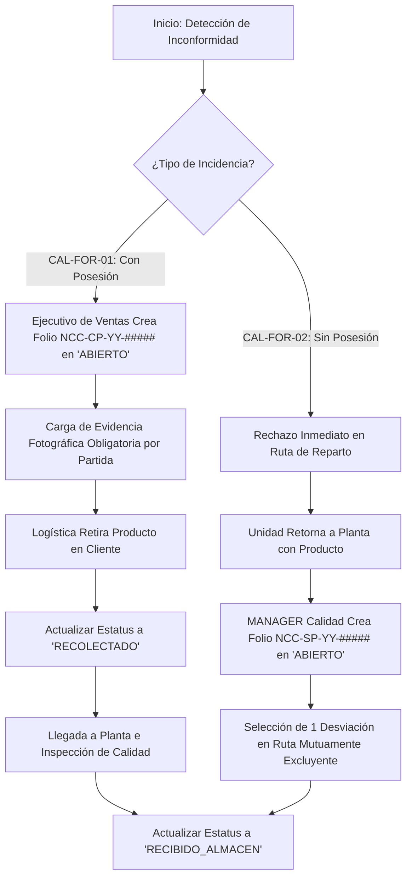
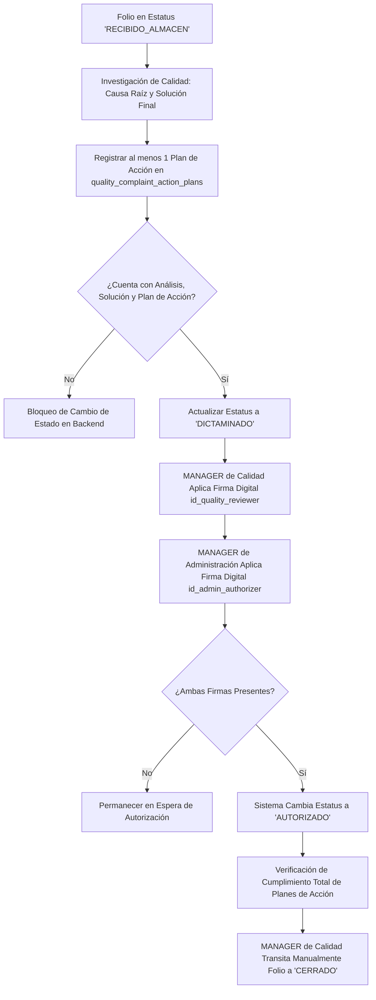

# 🔍 Módulo: Calidad - Devoluciones y Rechazos de Producto por Cliente (Customer Product Rejection - CPR)

El módulo de **Devoluciones y Rechazos de Producto por Cliente** gestiona el flujo operativo y de investigación técnica, dictamen y resolución ante no conformidades reportadas por el cliente, abarcando tanto reclamaciones posteriores a la entrega con mercancía en poder del cliente (**Con Posesión - CAL-FOR-01**) como rechazos inmediatos en ruta de reparto (**Sin Posesión - CAL-FOR-02**). Garantiza la trazabilidad de lotes/pesos, la ejecución de planes de acción correctiva y la aprobación administrativa/técnica interdepartamental de la mercancía reingresada; apoyandose de los subsistemas de recolección logística, recepción en almacén y registro central de no conformidades.

---

---

## 💼 Reglas de Negocio (Business Rules)

### BR-CPR-01: Tipificación de Formatos y Folios Distintivos

- **Descripción:** Las solicitudes de devolución y rechazo deben clasificarse según el estado de la posesión física de la mercancía.
- **Comportamiento Global:**
  - **CAL-FOR-01 (Con Posesión):** Aplica cuando el cliente recibió formalmente el pedido y posteriormente reporta un reclamo. Genera folios con el prefijo `NCC-CP-YY-#####`.
  - **CAL-FOR-02 (Sin Posesión):** Aplica cuando el cliente rechaza la entrega de forma inmediata en la unidad de transporte. Genera folios con el prefijo `NCC-SP-YY-#####`.
    _(En ambos casos, `YY` corresponde a los dos últimos dígitos del año en curso y `#####` a un consecutivo de 5 dígitos reiniciado anualmente; además de gatillar automáticamente la creación de un expediente vinculado en el sistema central de no conformidades `quality_non_conformities`)._

### BR-CPR-02: Flujo de Estados y Exclusión del Estado RECOLECTADO

- **Descripción:** El ciclo de vida de un folio se rige por la secuencia estricta de estados: `'ABIERTO'`, `'RECOLECTADO'`, `'RECIBIDO_ALMACEN'`, `'DICTAMINADO'`, `'AUTORIZADO/RECHAZADO'` y `'CERRADO'`.
- **Comportamiento Global:**
  - Para solicitudes **CAL-FOR-01**, el estado `'ABIERTO'` es generado por un Ejecutivo de Ventas. Requiere pasar obligatoriamente por el estado `'RECOLECTADO'` cuando Logística retira el producto en las instalaciones del cliente.
  - Para solicitudes **CAL-FOR-02**, el estado `'ABIERTO'` es generado directamente por el `MANAGER` de Calidad al momento en que la mercancía rechazada reingresa a la planta. Se omite el estado `'RECOLECTADO'`, transitando directamente de `'ABIERTO'` a `'RECIBIDO_ALMACEN'`.

### BR-CPR-03: Registro de Queja Con Posesión (CAL-FOR-01)

- **Descripción:** El flujo para producto en posesión del cliente inicia formalmente desde la fuerza de ventas.
- **Comportamiento Global:**
  - El cliente reporta la problemática al Ejecutivo de Ventas y proporciona evidencia fotográfica.
  - El Ejecutivo de Ventas registra el formulario **CAL-FOR-01** en el sistema.

### BR-CPR-04: Registro de Rechazo Inmediato Sin Posesión (CAL-FOR-02)

- **Descripción:** Los rechazos inmediatos en ruta de reparto se originan a partir del reingreso físico de la unidad de transporte a planta.
- **Comportamiento Global:**
  - La mercancía devuelta en la misma unidad es inspeccionada y recepcionada en primera instancia por personal de Calidad en almacén, registrando el evento en `quality_warehouse_receptions`.
  - Al completarse la recepción de almacén, el sistema notifica al `MANAGER` de Calidad.
  - El `MANAGER` de Calidad crea formalmente el expediente **CAL-FOR-02** en `quality_customer_complaints` y registra las banderas de desviación global correspondiente.

### BR-CPR-05: Exclusividad Mutua en Desviaciones Logísticas (CAL-FOR-02)

- **Descripción:** Cuando se registra una devolución de tipo **CAL-FOR-02** (Sin Posesión), el motivo del rechazo en ruta debe ser claramente delimitado a nivel de encabezado.
- **Comportamiento Global:** Las banderas de desviación global (`is_dev_not_found`, `is_dev_outside_hours`, `is_dev_payment_missing`, `is_dev_customer_rejected`) son mutuamente excluyentes. El sistema solo permite seleccionar una única causa global por folio de rechazo inmediato.

### BR-CPR-06: Obligatoriedad Condicional de Evidencia Fotográfica

- **Descripción:** La recolección de evidencia visual para respaldar el dictamen de calidad varía dependiendo del origen de la reclamación.
- **Comportamiento Global:**
  - Para formatos **CAL-FOR-01** (Con Posesión), el campo `has_photo_evidence` debe ser `true` y la carga de al menos una imagen en `photos_url` (`JSONB`) es estrictamente obligatoria a nivel de partida.
  - Para formatos **CAL-FOR-02** (Sin Posesión), la adjunción de imágenes es opcional.

### BR-CPR-07: Plan de Acción Mínimo para Dictamen Técnico

- **Descripción:** Para que un folio pueda avanzar al estado `'DICTAMINADO'`, el departamento de Calidad debe haber documentado el análisis de causa raíz y los compromisos de solución.
- **Comportamiento Global:** El backend impide la transición del estado `'RECIBIDO_ALMACEN'` a `'DICTAMINADO'` si no se ha capturado el análisis de causa raíz (`root_cause_analysis`), la solución final (`final_solution`) y al menos un registro activo en la tabla `quality_complaint_action_plans` (matriz de acciones correctivas). Esta regla aplica tanto para **CAL-FOR-01** como para **CAL-FOR-02**.

### BR-CPR-08: Definición y Aprobación del Plan de Acción

- **Descripción:** Todo reporte de queja o rechazo exige la formulación de un análisis de causa raíz y un plan de acción formalizado.
- **Comportamiento Global:**
  - El `MANAGER` de Calidad evalúa la queja e ingresa el análisis de causa raíz (`root_cause_analysis`), la solución propuesta y las partidas en la tabla `quality_complaint_action_plans`.
  - El `MANAGER` del departamento de Administración revisa el dictamen y emite una resolución: `AUTORIZADO` o `RECHAZADO`.

### BR-CPR-09: Matriz de Firmas y Doble Autorización

- **Descripción:** La aprobación de un reclamo/devolución dictaminado exige la validación formal conjunta del departamento de Calidad y la Gerencia de Administración.
- **Comportamiento Global:**
  - El `MANAGER` de Calidad firma digitalmente registrando `id_quality_reviewer` y `quality_signature_at`.
  - Posteriormente, el `MANAGER` del departamento de Administración firma registrando `id_admin_authorizer` y `admin_signature_at`.
  - La presencia de ambas firmas es prerrequisito indispensable para que el estado cambie a `'AUTORIZADO'` O `'RECHAZADO'`.

  ### BR-CPR-10: Integración Automática con Orden de Recolección (Solo CAL-FOR-01)

- **Descripción:** Cuando un plan de acción para un producto en posesión del cliente requiere el retorno físico del material, se automatiza el despacho logístico.
- **Comportamiento Global:** Si la solicitud es de tipo **CAL-FOR-01**, el plan de acción fue `AUTORIZADO` por la Gerencia de Administración y el plan estipula recolectar el producto, el backend genera automáticamente una orden de recolección para Logística en la tabla `quality_recollection_authorizations`.
- **Seguimiento Logístico:**
  - El chofer realiza la recolección física y actualiza el estatus en `quality_recollection_authorizations`.
  - La mercancía llega a planta y personal de Calidad efectúa la inspección de entrada registrándola en `quality_warehouse_receptions`.

### BR-CPR-11: Cierre Manual por Gerencia de Calidad

- **Descripción:** La conclusión definitiva de un folio de queja/devolución no es automática tras la autorización.
- **Comportamiento Global:** Una vez en estatus `'AUTORIZADO'`, la transición final a `'CERRADO'` es una acción manual ejecutada exclusivamente por el `MANAGER` de Calidad, quien debe verificar que la totalidad de los compromisos registrados en `quality_complaint_action_plans` hayan sido cumplidos en su totalidad.

---

---

## 👥 Historias de Usuario (User Stories)

### US-CPR-01: Levantamiento de Queja por Producto Con Posesión (CAL-FOR-01)

- **Como:** Ejecutivo de Ventas.
- **Quiero:** Registrar el reporte de queja presentado por un cliente con evidencia fotográfica adjunta.
- **Para:** Iniciar la evaluación técnica de Calidad y detonar el registro de No Conformidad.

#### Criterios de Aceptación:

1. **C.A. 1.1:** La UI solicita datos del cliente, factura/remisión (`invoice_reference`), detalle de productos, lotes, empaques, peso y la relatoría del problema (`problem_description`).
2. **C.A. 1.2:** El sistema exige la carga obligatoria de al menos una imagen fotográfica en `photos_url` (**BR-CPR-06**).
3. **C.A. 1.3:** Al guardar, se genera el folio `NCC-CP-YY-#####` en estado `'ABIERTO'` (**BR-CPR-02**) y se crea automáticamente el registro vinculado en `quality_non_conformities` (**BR-CPR-01**).
4. **C.A. 1.4:** Cada partida permite desglosar el producto (`id_product`), lote, fecha de caducidad, empaque, piezas devueltas, peso en KG y el checklist de desviaciones técnicas/inocuidad.

---

### US-CPR-02: Registro de Rechazo Inmediato Sin Posesión (CAL-FOR-02)

- **Como:** Gerente (`MANAGER`) de Calidad.
- **Quiero:** Dar de alta un rechazo de producto retornado en ruta de reparto tras su recepción en almacén.
- **Para:** Documentar la causa del rechazo inmediato y solicitar la aprobación del plan de acción.

#### Criterios de Aceptación:

1. **C.A. 2.1:** El registro solo puede crearse previa notificación y existencia de la inspección de ingreso en `quality_warehouse_receptions` (**BR-CPR-04**).
2. **C.A. 2.2:** Permite seleccionar la causa global de rechazo en ruta y desglosar las partidas afectadas.
3. **C.A. 2.3:** Al guardar, se genera el folio `NCC-SP-YY-#####` en estado `'ABIERTO'` (**BR-CPR-02**) y se gatilla la No Conformidad en `quality_non_conformities` (**BR-CPR-01**).
4. **C.A. 2.4:** Cada partida permite desglosar el producto (`id_product`), lote, fecha de caducidad, empaque, piezas devueltas, peso en KG y el checklist de desviaciones técnicas/inocuidad.

---

### US-CPR-03: Recepción en Almacén, Dictamen Técnico y Plan de Acción

- **Como:** Inspector / Gerente de Calidad.
- **Quiero:** Verificar las condiciones físicas de la mercancía que ingresa a almacén, analizar la causa raíz y registrar el plan de acción.
- **Para:** Establecer las responsabilidades técnicas y pasar el folio al estado `'DICTAMINADO'`.

#### Criterios de Aceptación:

1. **C.A. 3.1:** Para folios **CAL-FOR-01**, Logística actualiza el estado a `'RECOLECTADO'` y posteriormente Calidad valida las condiciones en planta cambiando a `'RECIBIDO_ALMACEN'`. Para **CAL-FOR-02**, pasa de `'ABIERTO'` a `'RECIBIDO_ALMACEN'` omitiendo `'RECOLECTADO'` (**BR-CPR-02**).
2. **C.A. 3.2:** Para transitar a `'DICTAMINADO'`, la UI exige el llenado de `root_cause_analysis`, `final_solution` y al menos un compromiso asignado en `quality_complaint_action_plans` (**BR-CPR-07**).

---

### US-CPR-04: Autorización Interdepartamental y Cierre del Folio

- **Como:** Gerente de Calidad (`MANAGER`) y Gerente de Administración (`MANAGER`).
- **Quiero:** Firmar digitalmente el dictamen de devolución y proceder al cierre formal de la queja.
- **Para:** Garantizar el tratamiento adecuado del producto, coordinar la logística de recolección si aplica y cerrar el expediente.

#### Criterios de Aceptación:

1. **C.A. 4.1:** El `MANAGER` de Calidad ingresa el análisis de causa raíz y partidas en `quality_complaint_action_plans` (**BR-CPR-09**).
2. **C.A. 4.2:** El `MANAGER` de Calidad firma la resolución dictaminada (`id_quality_reviewer`).
3. **C.A. 4.3:** El `MANAGER` de Administración aprueba o rechaza el plan de acción y aplica su firma (`id_admin_authorizer`). Al completar ambas firmas, el folio pasa al estado `'AUTORIZADO'` O `'RECHAZADO'` (**BR-CPR-09**).
4. **C.A. 4.4:** Si el plan es para **CAL-FOR-01**, está `AUTORIZADO` e incluye recolección, el sistema crea en automático la orden en `quality_recollection_authorizations` (**BR-CPR-10**).
5. **C.A. 4.5:** El `MANAGER` de Calidad realiza el cierre manual del expediente (`'CERRADO'`) al concluir las actividades o recibir la respuesta de Administración (**BR-CPR-11**).

---

---

## 🔄 Diagramas de Flujo

### 1. Flujo del Ciclo de Vida de Devoluciones y Rechazos (CAL-FOR-01 vs CAL-FOR-02)

#### Referencias

- Reglas de Negocio (BR):
  - **[BR-CPR-01]**: Tipificación de formatos (CAL-FOR-01 vs CAL-FOR-02) y folios distintivos.
  - **[BR-CPR-02]**: Flujo de estados y omisión del estado 'RECOLECTADO' en rechazos inmediatos.
  - **[BR-CPR-03]**: Exclusividad mutua en banderas de desviación en ruta.
  - **[BR-CPR-04]**: Obligatoriedad condicional de fotos (mandatorio para CAL-FOR-01, opcional para CAL-FOR-02).
- Historias de Usuario (US):
  - **[US-CPR-01]**: Apertura y Registro Inicial del Reclamo/Rechazo.
- Criterios de Aceptación (C.A):
  - **[C.A. 1.1]**:
  - **[C.A. 1.2]**:
  - **[C.A. 1.3]**:
  - **[C.A. 2.1]**:

### 2. Flujo de Dictamen Técnico, Doble Firma y Cierre

#### Referencias

- Reglas de Negocio (BR):
  - **[BR-CPR-05]**: Plan de acción mínimo y análisis técnico para dictamen.
  - **[BR-CPR-06]**: Matriz de firmas y doble autorización (Calidad y Administración).
  - **[BR-CPR-07]**: Cierre manual exclusivo por Gerencia de Calidad.
- Historias de Usuario (US):
  - **[US-CPR-02]**: Recepción en Almacén, Dictamen Técnico y Plan de Acción.
  - **[US-CPR-03]**: Autorización Interdepartamental y Cierre del Folio.
- Criterios de Aceptación (C.A):
  - **[C.A. 2.2]**:
  - **[C.A. 3.1]**:
  - **[C.A. 3.2]**:
  - **[C.A. 3.3]**:

---

---

- ⬆️ [Volver arriba](#)
- 📖 [Ir al Índice](../README.md#-5-índice-de-módulos-funcionales)
