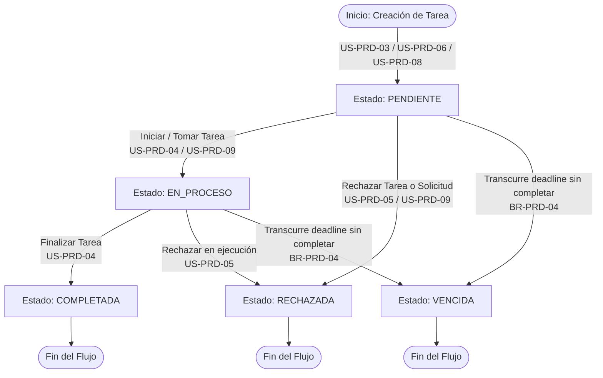
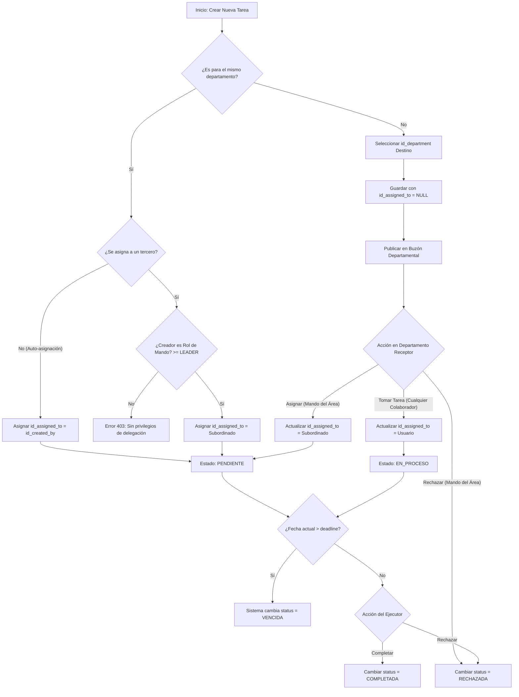

# ✏️ Módulo: Productividad (Productivity - PRD)

El módulo de **Productividad** gestiona las herramientas operativas personales y colaborativas de KoonolApp. Abarca la gestión privada de notas personales con recordatorios programados y el flujo de asignación, delegación, seguimiento y ejecución de tareas tanto a nivel intra-departamental como inter-departamental.

---

---

## 💼 Reglas de Negocio (Business Rules)

### BR-PRD-01: Privacidad y Aislamiento Absoluto de Notas Personales

- **Descripción:** Las notas registradas en la tabla `personal_notes` son estrictamente privadas. Únicamente el usuario creador (`id_user`) tiene facultades de lectura, edición, archivado o eliminación lógica.
- **Comportamiento Global:** Las consultas backend a `personal_notes` deben inyectar obligatoriamente el filtro `id_user = JWT.user_id` en la cláusula `WHERE`. Ningún rol (incluyendo MANAGER, ADMIN o GOD) podrá consultar las notas personales de otro colaborador.

### BR-PRD-02: Restricciones de Delegación por Nivel de Jerarquía

- **Descripción:** La asignación directa de una tarea a un tercero dentro del mismo departamento (`id_assigned_to != id_created_by`) está reservada exclusivamente para usuarios con roles de mando: LEADER (Nivel 1), SUPERVISOR (Nivel 2), MANAGER (Nivel 3) o superiores.
- **Comportamiento Global:** Colaboradores con rol USER (Nivel 0) solo pueden asignarse tareas a sí mismos (`id_assigned_to = id_created_by`) o emitir solicitudes interdepartamentales dirigidas a un departamento en general (`id_department != NULL` e `id_assigned_to = NULL`). Si un USER intenta asignar directamente una tarea a otro usuario, el backend rebotará la petición con un error HTTP 403 (Forbidden).

### BR-PRD-03: Gestión de Tareas Interdepartamentales y Buzón Departamental

- **Descripción:** Cuando una tarea se crea dirigida a un departamento (`id_department`) sin un usuario asignado (`id_assigned_to = NULL`), esta ingresa al Buzón Departamental.
- **Comportamiento Global:** Cualquier colaborador con `status = true` perteneciente al departamento destino puede tomar la tarea (auto-asignársela actualizando `id_assigned_to = UUID_USER`). Asimismo, los roles de mando de ese departamento receptor pueden tomar la tarea o reasignarla a cualquier subordinado de su área.

### BR-PRD-04: Transiciones de Estado y Control de Vencimiento de Tareas

- **Descripción:** Las tareas gestionan su ciclo de vida mediante los estados: PENDIENTE, EN_PROCESO, COMPLETADA, VENCIDA y RECHAZADA.
- **Comportamiento Global:**
  - Si la fecha y hora actual superan el campo `deadline` (`NOW() > deadline`) y la tarea se encuentra en estado PENDIENTE o EN_PROCESO, un proceso programado (cron job/worker) o la lectura en API actualizará automáticamente el estado a VENCIDA.
  - El usuario asignado (`id_assigned_to`) puede cambiar el estado a EN_PROCESO, COMPLETADA o RECHAZADA.
  - Los roles de mando del departamento destino pueden cambiar a RECHAZADA una tarea no asignada del Buzón Departamental.

### BR-PRD-05: Retroalimentación y Comentarios de Recepción (receiver_comments)

- **Descripción:** El campo `receiver_comments` es opcional y sirve como canal directo de comunicación entre el ejecutor (`id_assigned_to`) y el creador (`id_created_by`).
- **Comportamiento Global:** El ejecutor asignado puede redactar o actualizar `receiver_comments` en cualquier momento de la ejecución (PENDIENTE, EN_PROCESO, COMPLETADA o RECHAZADA) sin bloquear o exigir obligatoriamente el cierre de la tarea.

### BR-PRD-06: Notificaciones de Recordatorios en Notas Personales

- **Descripción:** Cuando una nota personal activa la bandera `is_reminder = true` y especifica una fecha/hora en `reminder_at`, el sistema debe enviar alertas de seguimiento.
- **Comportamiento Global:** El motor de notificaciones internas emitirá avisos periódicos al usuario titular desde la configuración del recordatorio hasta el cumplimiento de la fecha `reminder_at`.

### BR-PRD-07: Control de Eliminación Lógica y Modificación (Soft Delete)

- **Descripción:** Se prohíbe la eliminación física (hard delete) en las tablas `personal_notes` y `tasks`.
- **Comportamiento Global:** Únicamente el usuario creador (`id_created_by` / `id_user`) tiene la facultad de eliminar lógicamente un registro asentando la fecha en `deleted_at`. Al eliminar una tarea, el backend registrará el UUID del ejecutor en `id_updated_by`.

---

---

## 👥 Historias de Usuario (User Stories)

### 📌 Apartado 1: Notas Personales (Todos los Roles)

#### US-PRD-01: Gestión de Notas Personales

- **Como:** Colaborador del sistema (Cualquier Rol),
- **Quiero:** Crear, editar, marcar como favorita y archivar notas personales,
- **Para:** Organizar mi información y apuntes privados dentro de la intranet.
- **Criterios de Aceptación:**
  - **C.A. 1.1:** El usuario puede registrar una nota especificando `title` (obligatorio) y `body` (opcional). El sistema asigna `status = 'ACTIVA'`, `favorite = false` e `id_user` con el UUID de la sesión.
  - **C.A. 1.2:** El usuario puede alternar el campo `favorite` entre `true` y `false`, así como cambiar el `status` entre `'ACTIVA'` y `'ARCHIVADO'`.
  - **C.A. 1.3:** Solo el creador de la nota puede consultar o modificar sus registros.
  - **C.A. 1.4:** Al eliminar una nota, el sistema ejecuta un borrado lógico actualizando `deleted_at = NOW()`.

#### US-PRD-02: Programación de Recordatorios en Notas

- **Como:** Colaborador del sistema (Cualquier Rol),
- **Quiero:** Asignar una fecha y hora de recordatorio a mis notas personales,
- **Para:** Recibir notificaciones oportunas sobre pendientes o eventos clave.
- **Criterios de Aceptación:**
  - **C.A. 2.1:** Al activar el interruptor de recordatorio (`is_reminder = true`), el campo `reminder_at` se vuelve obligatorio y debe contener una fecha y hora futura.
  - **C.A. 2.2:** El sistema genera notificaciones internas programadas dirigidas al usuario titular hasta la fecha indicada en `reminder_at`.
  - **C.A. 2.3:** Si `is_reminder` se desactiva (`false`), el campo `reminder_at` se limpia a `NULL` y se cancelan las notificaciones pendientes.

---

### 📌 Apartado 2: Mis Tareas y Auto-asignación (Colaborador / Ejecución)

#### US-PRD-03: Creación y Auto-asignación de Tareas Personales

- **Como:** Colaborador del sistema (Cualquier Rol),
- **Quiero:** Registrar tareas personales asignadas a mí mismo,
- **Para:** Gestionar mis actividades diarias y controlar mis tiempos de entrega.
- **Criterios de Aceptación:**
  - **C.A. 3.1:** El formulario solicita `title` (obligatorio), `body`, `priority` (BAJA, MEDIA, ALTA) y `deadline` (fecha/hora límite).
  - **C.A. 3.2:** El sistema asigna automáticamente `id_created_by` e `id_assigned_to` con el UUID del usuario en sesión, `id_department` con su departamento actual, y `status = 'PENDIENTE'`.
  - **C.A. 3.3:** El campo `created_at` se establece con la fecha/hora actual de la transacción.

#### US-PRD-04: Gestión de Estado y Comentarios de Ejecución

- **Como:** Colaborador asignado a una tarea (`id_assigned_to`),
- **Quiero:** Actualizar el estado de la tarea y añadir comentarios para el creador,
- **Para:** Comunicar el avance de la actividad y reportar su conclusión.
- **Criterios de Aceptación:**
  - **C.A. 4.1:** El usuario asignado puede cambiar el estado de la tarea de PENDIENTE a EN_PROCESO o COMPLETADA.
  - **C.A. 4.2:** El usuario asignado puede redactar o modificar el texto de `receiver_comments` en cualquier estado de la tarea.
  - **C.A. 4.3:** Cada actualización asienta la fecha actual en `updated_at` e `id_updated_by = UUID_USER`.
  - **C.A. 4.4:** Si la fecha actual sobrepasa `deadline` sin estar COMPLETADA o RECHAZADA, el sistema actualiza visual y lógicamente el estado a VENCIDA.

#### US-PRD-05: Rechazo de Tareas Asignadas

- **Como:** Colaborador asignado a una tarea (`id_assigned_to`),
- **Quiero:** Rechazar una tarea que no me corresponde o que no puedo ejecutar,
- **Para:** Informar al creador sobre la imposibilidad de llevar a cabo la actividad.
- **Criterios de Aceptación:**
  - **C.A. 5.1:** El ejecutor puede seleccionar la opción "Rechazar Tarea", lo que actualiza `status = 'RECHAZADA'`.
  - **C.A. 5.2:** Se habilita la captura opcional de motivos en el campo `receiver_comments` para justificar el rechazo ante el creador.
  - **C.A. 5.3:** Una tarea en estado RECHAZADA interrumpe su ciclo operativo y envía una notificación automática a `id_created_by`.

---

### 📌 Apartado 3: Delegación y Supervisión Departamental (Roles de Mando: LEADER, SUPERVISOR, MANAGER, etc.)

#### US-PRD-06: Asignación Directa de Tareas a Subordinados

- **Como:** Usuario con rol de mando (LEADER, SUPERVISOR, MANAGER, COMPANY_OWNER, ADMIN, GOD),
- **Quiero:** Asignar tareas directamente a un colaborador de mi mismo departamento,
- **Para:** Distribuir la carga de trabajo operativa de mi equipo.
- **Criterios de Aceptación:**
  - **C.A. 6.1:** La interfaz despliega el selector de personal filtrando únicamente a los usuarios activos (`status = true`) del mismo `id_department` del usuario ejecutor.
  - **C.A. 6.2:** El backend verifica que el rol del creador sea mayor o igual a LEADER (Nivel $\ge$ 1); de lo contrario, la transacción es RECHAZADA.
  - **C.A. 6.3:** Al guardar, se asienta `id_created_by = UUID_MANDO` e `id_assigned_to = UUID_SUBORDINADO`. El asignado recibe una notificación inmediata.

#### US-PRD-07: Reasignación y Monitoreo de Tareas del Departamento

- **Como:** Usuario con rol de mando (LEADER, SUPERVISOR, MANAGER),
- **Quiero:** Consultar las tareas en curso de mi departamento y reasignarlas entre colaboradores si es necesario,
- **Para:** Balancear la carga operativa y garantizar el cumplimiento de los tiempos de entrega.
- **Criterios de Aceptación:**
  - **C.A. 7.1:** El mando puede acceder a la vista "Tablero Departamental", consultando todas las tareas donde `id_department` coincida con su área.
  - **C.A. 7.2:** Permite cambiar el valor de `id_assigned_to` en tareas que estén en estado PENDIENTE o EN_PROCESO.
  - **C.A. 7.3:** Toda reasignación guarda registros de auditoría actualizando `updated_at` e `id_updated_by`.

---

### 📌 Apartado 4: Solicitudes e Interacción Interdepartamental (Buzón Departamental)

#### US-PRD-08: Emisión de Tareas Interdepartamentales

- **Como:** Colaborador del sistema (Cualquier Rol),
- **Quiero:** Crear una tarea dirigida a otro departamento sin asignar a una persona específica,
- **Para:** Solicitar servicios, mantenimientos o requerimientos operativos a otras áreas de la empresa.
- **Criterios de Aceptación:**
  - **C.A. 8.1:** El formulario permite seleccionar un `id_department` distinto al departamento de origen del creador.
  - **C.A. 8.2:** El campo `id_assigned_to` se envía explícitamente como `NULL`.
  - **C.A. 8.3:** La tarea se guarda con `status = 'PENDIENTE'` y se publica en el Buzón Departamental del área seleccionada.

#### US-PRD-09: Reclamación o Rechazo de Tareas del Buzón Departamental

- **Como:** Colaborador o Mando del departamento receptor,
- **Quiero:** Reclamar una tarea del buzón de mi departamento o rechazarla si es improcedente,
- **Para:** Iniciar su atención operativa o declinar solicitudes fuera de alcance.
- **Criterios de Aceptación:**
  - **C.A. 9.1:** Cualquier integrante del departamento receptor puede ejecutar la acción "Tomar Tarea", lo que asigna `id_assigned_to = UUID_USUARIO` y cambia el estado a EN_PROCESO.
  - **C.A. 9.2:** Un usuario con rol de mando (LEADER o superior) del departamento receptor puede reasignar la tarea del buzón a cualquier integrante de su equipo.
  - **C.A. 9.3:** Un usuario con rol de mando del departamento receptor puede seleccionar "Rechazar Solicitud", estableciendo `status = 'RECHAZADA'` y complementando la justificación en `receiver_comments`.

---

---

## 🔄 Diagramas de Flujo

### 1. Diagrama de Transición de Estados de Tareas (tasks)

#### Referencias:

- Reglas de Negocio (BR):
  - **[BR-PRD-04]**: Transiciones de Estado y Control de Vencimiento de Tareas.
- Historias de Usuario (US):
  - **[US-PRD-03]**: Creación y Auto-asignación de Tareas Personales.
  - **[US-PRD-04]**: Gestión de Estado y Comentarios de Ejecución.
  - **[US-PRD-05]**: Rechazo de Tareas Asignadas.
  - **[US-PRD-06]**: Asignación Directa de Tareas a Subordinados.
  - **[US-PRD-08]**: Emisión de Tareas Interdepartamentales.
  - **[US-PRD-09]**: Reclamación o Rechazo de Tareas del Buzón Departamental.
- Criterios de Aceptación (C.A):
  - **[C.A. 4.1]**: Transición de estado a EN_PROCESO o COMPLETADA por el ejecutor asignado.
  - **[C.A. 4.4]**: Transición automática del estado a VENCIDA si transcurre la fecha límite.
  - **[C.A. 5.1]**: Cambio de estado a RECHAZADA por el ejecutor asignado.
  - **[C.A. 9.3]**: Cambio de estado a RECHAZADA por roles de mando en el Buzón Departamental.

### 2. Diagrama de Flujo Operativo: Asignación Directa vs. Buzón Interdepartamental

#### Referencias:

- Reglas de Negocio (BR):
  - **[BR-PRD-02]**: Restricciones de Delegación por Nivel de Jerarquía.
  - **[BR-PRD-03]**: Gestión de Tareas Interdepartamentales y Buzón Departamental.
  - **[BR-PRD-04]**: Transiciones de Estado y Control de Vencimiento de Tareas.
- Historias de Usuario (US):
  - **[US-PRD-03]**: Creación y Auto-asignación de Tareas Personales.
  - **[US-PRD-06]**: Asignación Directa de Tareas a Subordinados.
  - **[US-PRD-08]**: Emisión de Tareas Interdepartamentales.
  - **[US-PRD-09]**: Reclamación o Rechazo de Tareas del Buzón Departamental.
- Criterios de Aceptación (C.A):
  - **[C.A. 3.2]**: Auto-asignación e inserción de datos por defecto.
  - **[C.A. 6.2]**: Validación de privilegios de mando (Nivel >= 1) para delegación.
  - **[C.A. 8.2]**: Creación de tarea en buzón departamental con id_assigned_to NULL.
  - **[C.A. 9.1]**: Reclamación de tarea del buzón por cualquier colaborador receptor.
  - **[C.A. 9.3]**: Rechazo de solicitud por un rol de mando del departamento receptor.

---

---

- ⬆️ [Volver arriba](#)
- 📖 [Ir al Índice](../README.md#-5-índice-de-módulos-funcionales)
