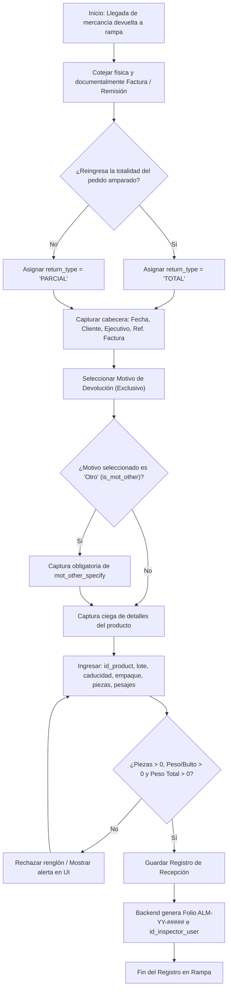
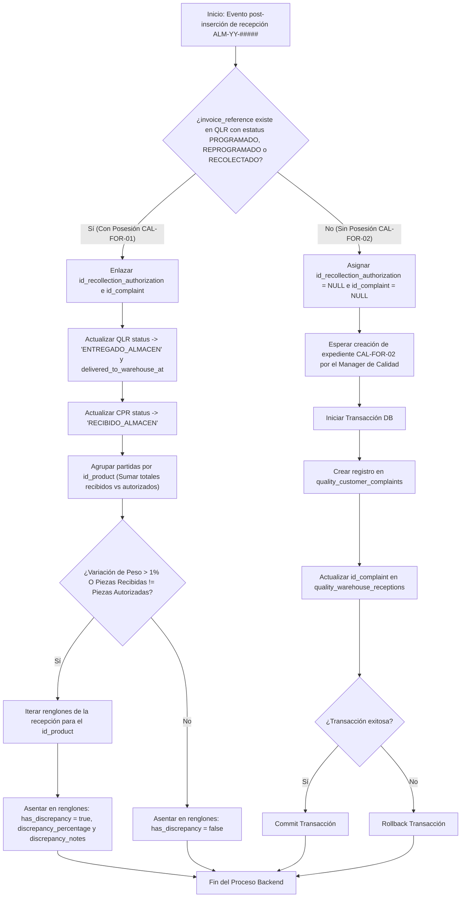
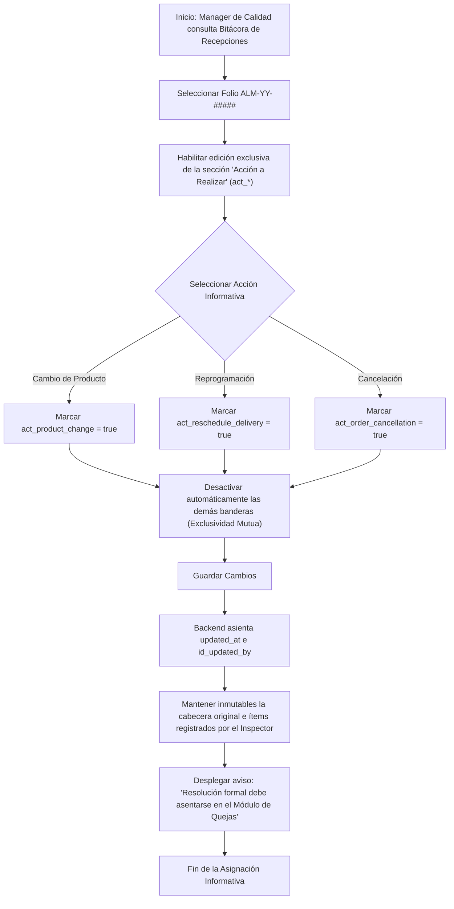

# 🔍 Módulo: Calidad - Recepción de Devoluciones en Almacén (Quality Warehouse Receptions - QWR)

El módulo de **Recepción de Devoluciones en Almacén** digitaliza y estandariza la bitácora operativa de entrada en rampa de mercancías devueltas, procedentes tanto de rechazos inmediatos en ruta de reparto (Sin Posesión - CAL-FOR-02) como de recolecciones autorizadas previamente (Con Posesión - CAL-FOR-01). Garantiza la captura imparcial de lotes, caducidades y pesajes por parte del personal de inspección en rampa, detonando de forma coordinada las transiciones de estado en el flujo global y alimentando el módulo de quejas de clientes.

---

---

## 💼 Reglas de Negocio (Business Rules)

### BR-QWR-01: Inmutabilidad del Registro de Recepción (Bitácora de Control)

- **Descripción:** Las recepciones registradas en la tabla `quality_warehouse_receptions` actúan como registros inmutables de bitácora desde la perspectiva del usuario en interfaz. No se permite el borrado físico ni lógico (`deleted_at` inexistente), asi como tampoco la edición manual de los datos capturados por el inspector.
- **Comportamiento Global:** Una vez insertada una recepción por el Inspector de Calidad, la estructura de la cabecera y los renglones capturados no pueden modificarse ni eliminarse. Los campos de auditoría de actualización (`updated_at` e `id_updated_by`) y las llaves foráneas de vinculación (`id_complaint`, `id_complaint_item`, `act_*`) están reservados exclusivamente para las interacciones posteriores del Manager de Calidad y para las actualizaciones automáticas del backend.

### BR-QWR-02: Exclusividad Mutua en Motivos de Devolución y justificación Obligatoria para Motivo "Otro"

- **Descripción:** El formulario de recepción exige la selección de exactamente un motivo de devolución entre las banderas booleanas disponibles (`is_mot_*`).
- **Comportamiento Global:**
  - A nivel de validación en backend/UI, únicamente uno de los campos de motivo puede enviarse con valor `true`.
  - Si se selecciona el motivo "Otro" (`is_mot_other = true`) el campo `mot_other_specify` requeriere obligatoriamente la justificación textual.

### BR-QWR-03: Determinación del Tipo de Devolución por Documento Físico

- **Descripción:** La clasificación de `return_type` (`'PARCIAL'` o `'TOTAL'`) se realiza en rampa tomando como referencia la copia física de la factura o remisión presentada por el chofer al reingresar.
- **Comportamiento Global:** El Inspector de Calidad coteja la mercancía física contra el documento impreso:
  - `'TOTAL'`: Si reingresa la totalidad del pedido/partidas amparadas en el documento físico.
  - `'PARCIAL'`: Si reingresa únicamente una fracción del volumen o ciertas partidas del documento físico.

### BR-QWR-04: Captura Ciega de Detalles de Producto, Agrupación y Notificación de Discrepancias

- **Descripción:** La captura de lotes, piezas y kilogramos en `quality_warehouse_reception_details` se realiza por pesado y conteo físico directo en rampa sin precargar los lotes esperados (captura ciega).
- **Comportamiento Global:**
  - Los campos `total_weight_kg > 0`, `pieces_quantity > 0`, `weight_per_package > 0` y `unit_package` (por ejemplo: `'SCO'`, `'BOL'`, `'BID'`) son estrictamente obligatorios a nivel de renglón.
  - **Evaluación de Discrepancias:** Cuando la recepción esté vinculada a una recolección previa (`id_recollection_authorization`), el backend consolidará la información **agrupando las partidas por `id_product`** (sumando los totales autorizados en QLR vs. los totales recibidos en QWR) para evitar fallos por inconsistencia en número de lote.
  - **Detonación de Discrepancia:** El backend marcará `has_discrepancy = true`, registrará el porcentaje en `discrepancy_percentage` y guardará el detalle en `discrepancy_notes` si al agrupar por `id_product` se cumple cualquiera de las siguientes dos condiciones:
    1. **Variación en Peso:** La variación porcentual del peso total recibido contra el peso ordenado excede el $1\%$ ($|\text{Peso Recibido} - \text{Peso Ordenado}| / \text{Peso Ordenado} > 0.01$).
    2. **Diferencia en Bultos/Piezas:** La sumatoria de `pieces_quantity` física recibida es distinta a la sumatoria de `pieces_to_recollect` autorizada.
- **Restricción Técnica (Backend):** Dado que la validación se hace agrupando por id_product, pero los campos de discrepancia viven a nivel de renglón (quality_warehouse_reception_details), si el cálculo consolidado detona una alerta, el backend debe iterar sobre todos los renglones (lotes) de ese producto en la recepción actual y actualizar en cada uno: has_discrepancy = true, el discrepancy_percentage calculado, y el texto "Discrepancia calculada a nivel consolidado del producto" en discrepancy_notes.

### BR-QWR-05: Carácter Informativo de la Acción a Realizar

- **Descripción:** Las banderas booleanas de acción a realizar en rampa (`act_product_change`, `act_reschedule_delivery`, `act_order_cancellation`) son estrictamente informativas y operativas para la logística de rampa, representan la resolución administrativa de la devolución y son mutuamente excluyentes entre sí.
- **Comportamiento Global:** Los valores de estos campos es nula al momento del registro inicial por parte del Inspector de Calidad. Únicamente los usuarios con rol **MANAGER** tienen permisos de escritura sobre estas banderas, pudiendo activar como máximo una sola acción por recepción. Cada actualización registra la fecha en `updated_at` y el identificador en `id_updated_by`. No sustituyen la resolución técnica ni los dictámenes financieros/comerciales documentados formalmente en `quality_customer_complaints`.

### BR-QWR-06: Vinculación de Origen, Llaves Foráneas y Eventos Síncronos

- **Descripción:** Al insertar la recepción en rampa, el backend vincula de forma autogestionada las llaves de origen y ejecuta las transiciones de estado hacia los módulos CPR y QLR.
- **Comportamiento Global:**
  - **Para Devoluciones Con Posesión (`CAL-FOR-01`):** El backend busca `invoice_reference` en `quality_recollection_authorizations` con `status IN ('PROGRAMADO', 'REPROGRAMADO', 'RECOLECTADO')`. Al encontrar coincidencia:
    1. Puebla `quality_warehouse_receptions.id_recollection_authorization`.
    2. Hereda el ID de la queja en `quality_warehouse_receptions.id_complaint`.
    3. **Trigger Síncrono:** Actualiza `quality_recollection_authorizations.status` $\rightarrow$ `'ENTREGADO_ALMACEN'` y asienta `CURRENT_TIMESTAMP` en `delivered_to_warehouse_at`.
    4. **Trigger Síncrono:** Actualiza `quality_customer_complaints.status` $\rightarrow$ `'RECIBIDO_ALMACEN'`.
  - **Para Rechazos Sin Posesión (`CAL-FOR-02`):** La recepción en rampa se crea sin orden de recolección (`id_recollection_authorization = NULL`) e `id_complaint` queda nulo momentáneamente. Cuando el Manager de Calidad crea la queja `CAL-FOR-02` asignando el ID de esta recepción, el backend actualiza `quality_warehouse_receptions.id_complaint` con la queja resultante.
- **Restricción Técnica (Backend):** La creación del registro en quality_customer_complaints y el consecuente UPDATE del id_complaint en quality_warehouse_receptions deben ejecutarse obligatoriamente dentro de una única Transacción de Base de Datos (DB Transaction) para garantizar la atomicidad. Si alguna de las dos operaciones falla, se debe hacer un rollback completo para evitar referencias huérfanas bidireccionales.

### BR-QWR-07: Independencia entre Recepción en Rampa y Levantamiento de Queja (CAL-FOR-02)

- **Descripción:** La captura de la recepción en almacén (**ALM-FOR-01**) y la creación del expediente de queja sin posesión (**CAL-FOR-02**) son registros totalmente independientes.
- **Comportamiento Global:** Al crear el folio `CAL-FOR-02` seleccionando una recepción física en rampa (`id_quality_warehouse_reception`), la captura del motivo de devolución en rampa (`quality_warehouse_receptions.is_mot_*`) y la investigación de desviaciones en la queja (`quality_customer_complaints` / `quality_complaint_items`) son procesos completamente independientes. El motivo registrado por Almacén no precargará ni limitará la causa global ni el checklist de desviaciones que el MANAGER de Calidad determine en el módulo CPR.

---

---

## 👥 Historias de Usuario (User Stories)

### US-QWR-01: Registro e Inspección en Rampa y Disparo de Eventos

- **Como:** Inspector de Calidad / Personal de Almacén (**INSPECTOR**)
- **Quiero:** Registrar la entrada física de mercancía devuelta especificando cliente, factura, tipo de devolución, motivo y el desglose de lotes/pesos.
- **Para:** Alimentar la bitácora inmutable de rampa y detonar las transiciones del flujo en los módulos de recolección y quejas.
- **Criterios de Aceptación:**
  - **C.A. 1.1:** El formulario solicita obligatoriamente: fecha/hora de recepción, cliente (`id_client`), ejecutivo (`id_sales_executive`), tipo de devolución (`return_type` = `'PARCIAL'` o `'TOTAL'` determinado mediante cotejo contra el documento físico), referencia de factura (`invoice_reference`) y exactamente un motivo (`is_mot_*` = `true`).
  - **C.A. 1.2:** Si se selecciona `is_mot_other` = `true`, la UI exige la captura de `mot_other_specify`.
  - **C.A. 1.3:** Permite capturar renglones en `quality_warehouse_reception_details` ingresando `id_product`, `lot_number_received`, `expiration_date_received`, `unit_package`, `pieces_quantity` ($> 0$), `weight_per_package` ($> 0$) y `total_weight_kg` ($> 0$). Un mismo producto puede repetirse si proviene de distintos lotes o caducidades.
  - **C.A. 1.4:** Al guardar, se genera el folio `ALM-YY-#####` e `id_inspector_user`. El backend busca la referencia de factura (`invoice_reference`) en las órdenes de recolección activas con estatus `PROGRAMADO`, `REPROGRAMADO` o `RECOLECTADO`. Al encontrar coincidencia, enlaza `id_recollection_authorization` e `id_complaint`, transicionando los estados correspondientes a `ENTREGADO_ALMACEN` y `RECIBIDO_ALMACEN`. El backend agrupa las partidas por `id_product` y compara las sumatorias de peso y piezas contra la orden de recolección; si el peso varía más del $1\%$ **O** la cantidad de piezas no coincide exactamente, asienta `has_discrepancy = true`, calcula `discrepancy_percentage` e ingresa la nota correspondiente.

### US-QWR-02: Asignación Informativa de Acción a Realizar por Dirección de Calidad

- **Como:** Manager de Calidad (**MANAGER**).
- **Quiero:** Consultar las recepciones registradas en bitácora y marcar la acción informativa de manejo en rampa (cambio de producto, reprogramación o cancelación).
- **Para:** Dar visibilidad operativa a los auxiliares de almacén sobre el destino visual del lote en rampa.
- **Criterios de Aceptación:**
  - **C.A. 2.1:** La UI permite al usuario con rol **MANAGER** consultar el listado de recepciones y editar únicamente la sección "Acción a Realizar" (`act_*`) de un folio guardado (**BR-QWR-05**).
  - **C.A. 2.2:** La UI permite seleccionar como máximo una acción (`act_product_change`, `act_reschedule_delivery` o `act_order_cancellation`). Al seleccionar una, desmarca automáticamente las demás (**BR-QWR-05**).
  - **C.A. 2.3:** Al guardar, el backend asienta `id_updated_by` y `updated_at`, manteniendo intacta la información original registrada por el inspector. El sistema despliega un aviso recordando que la resolución comercial y contable formal debe asentarse en el Módulo de Quejas (**BR-QWR-05**).

---

---

## 🔄 Diagramas de Flujo

### 1. Proceso de Inspección y Registro de Recepción en Rampa

#### Referencias

- Reglas de Negocio (BR):
  - **[BR-QWR-01]:** Inmutabilidad del Registro de Recepción (Bitácora de Control).
  - **[BR-QWR-02]:** Exclusividad Mutua en Motivos de Devolución y justificación Obligatoria para Motivo "Otro".
  - **[BR-QWR-03]:** Determinación del Tipo de Devolución por Documento Físico.
  - **[BR-QWR-04]:** Captura Ciega de Detalles de Producto, Agrupación y Notificación de Discrepancias.
- Historias de Usuario (US):
  - **[US-QWR-01]:** Registro e Inspección en Rampa y Disparo de Eventos.
- Criterios de Aceptación (C.A):
  - **[C.A 1.1]:** Validación de datos obligatorios en cabecera y selección de exactamente un motivo.
  - **[C.A 1.2]:** Justificación textual requerida al marcar el motivo "Otro".
  - **[C.A 1.3]:** Captura ciega con valores de pesaje y piezas estrictamente mayores a cero.

### 2. Vinculación de Origen, Validación de Discrepancias y Transiciones Síncronas

#### Referencias

- Reglas de Negocio (BR):
  - **[BR-QWR-04]:** Captura Ciega de Detalles de Producto, Agrupación y Notificación de Discrepancias.
  - **[BR-QWR-06]:** Vinculación de Origen, Llaves Foráneas y Eventos Síncronos.
  - **[BR-QWR-07]:** Independencia entre Recepción en Rampa y Levantamiento de Queja (CAL-FOR-02).
- Historias de Usuario (US):
  - **[US-QWR-01]:** Registro e Inspección en Rampa y Disparo de Eventos.
- Criterios de Aceptación (C.A):
  - **[C.A 1.4]:** Búsqueda de coincidencia por factura, vinculación de folios, actualización síncrona de estatus y cálculo consolidado de discrepancias por producto.

### 3. Asignación Informativa de Acción a Realizar en Rampa

#### Referencias

- Reglas de Negocio (BR):
  - **[BR-QWR-01]:** Inmutabilidad del Registro de Recepción (Bitácora de Control).
  - **[BR-QWR-05]:** Carácter Informativo de la Acción a Realizar.
- Historias de Usuario (US):
  - **[US-QWR-02]:** Asignación Informativa de Acción a Realizar por Dirección de Calidad.
- Criterios de Aceptación (C.A):
  - **[C.A 2.1]:** Restricción de edición exclusiva para el rol MANAGER sobre campos act\_\*.
  - **[C.A 2.2]:** Exclusividad mutua en la selección de acciones.
  - **[C.A 2.3]:** Registro de auditoría (updated_at, id_updated_by), preservación de inmutabilidad y despliegue de aviso legal/administrativo.

---

---

- ⬆️ [Volver arriba](#)
- 📖 [Ir al Índice](../README.md#-5-índice-de-módulos-funcionales)
