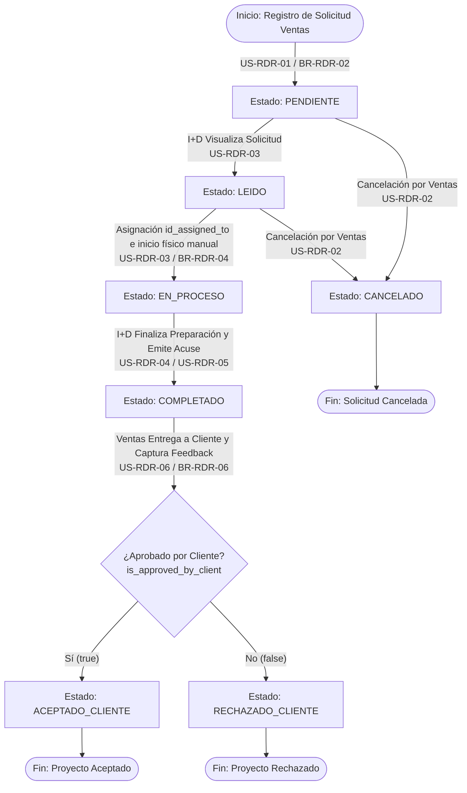
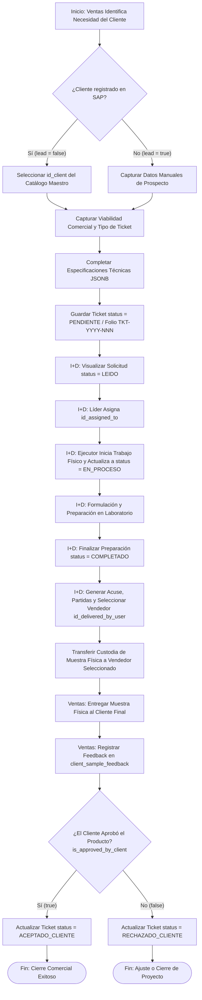

# 🎫Módulo: Solicitud de Muestras y Desarrollos a I+D (R&D Request - RDR)

El módulo de **Solicitud de Muestras y Desarrollos a I+D** gestiona la relación operativa e interdepartamental entre el equipo de Ventas y el laboratorio de I+D (Investigación y Desarrollo). Permite canalizar requerimientos técnicos del mercado (solicitudes de muestras, desarrollos desde cero o visitas técnicas), controlar la preparación y asignación de prototipos en el laboratorio, formalizar la entrega física al cliente mediante acuses de recibo y registrar la retroalimentación técnica/comercial posterior para el cierre del ciclo de innovación.

---

---

## 💼 Reglas de Negocio (Business Rules)

### BR-RDR-01: Generación Autónoma y Estructura de Folios Únicos

**Descripción:** Todo ticket de solicitud y acuse de entrega generado en el módulo debe poseer un folio correlativo irrepetible asignado automáticamente por el backend al momento del asentamiento.
**Comportamiento Global:**

- Para solicitudes (`rd_tickets`), la columna `folio` sigue la estructura `TKT-YYYY-NNN`.
- Para acuses de entrega (`rd_ticket_receipts`), la columna `folio_receipt` sigue la estructura `REC-YYYY-NNN`.
- El backend garantiza la unicidad (`UNIQUE`) de ambos campos en la base de datos.

### BR-RDR-02: Definición de Cliente (Prospecto Lead vs. Cliente SAP)

**Descripción:** El sistema debe permitir la creación de solicitudes tanto para clientes activos registrados en el ERP (SAP Business One) como para prospectos comerciales en fase de desarrollo.
**Comportamiento Global:**

- Si `lead = false`, es obligatorio vincular una llave foránea válida en `id_client` (proveniente del catálogo maestro `clients`).
- Si `lead = true`, `id_client` se registra como `NULL` y es obligatorio capturar los metadatos manuales en `company_name`, `company_address`, `contact_name`, `contact_phone` y `contact_email`.

### BR-RDR-03: Contenedor Dinámico de Especificaciones Técnicas (technical_specifications)

**Descripción:** Los parámetros técnicos requeridos varían según el tipo de ticket (`ticket_type`: `MUESTRA`, `DESARROLLO`, `VISITA_TECNICA`) y el segmento de producto (`product_segment`: `CARNICOS`, `SAZONADORES`, `SABORIZANTES`, `COLORANTES`, `ADITIVOS`, `GENERAL`).
**Comportamiento Global:** La columna `technical_specifications` de tipo `JSONB` almacenará de forma flexible las variables dinámicas del formulario (por ejmplo: solubilidad, pH, aroma, perfiles de sabor, dosis objetivo, documentacion solicitada). El backend validará que la estructura `JSON` se ajuste al esquema correspondiente según la combinación de `ticket_type` y `product_segment`.

### BR-RDR-04: Transiciones de Estado y Asignación de Responsables en I+D

**Descripción:** Las solicitudes ingresan al laboratorio en estado `PENDIENTE`. Un líder o supervisor de I+D asignará al ingeniero ejecutor para iniciar el desarrollo.
**Comportamiento Global:**

- Al crearse, `status = 'PENDIENTE'` e `id_assigned_to` inicia en `NULL`.
- Al ser visualizado o tomado por I+D, cambia a `LEIDO`.
- Al asignar un ejecutor (`id_assigned_to`) y comenzada la tarea fisicamente, el responsable deberá actualizar el estado a `EN_PROCESO`.
- Una vez preparado el desarrollo/muestra, I+D finaliza actualizando a `COMPLETADO`.
- Si el cliente rechaza la factibilidad inicial o Ventas retira la solicitud, el estado cambia a `CANCELADO`.

### BR-RDR-05: Exención de Auditoría en Tablas de Detalle (3NF) y Registro de Acuse

**Descripción:** La emisión de acuses de entrega (`rd_ticket_receipts`) contempla un desglose de partidas (`rd_ticket_receipt_details`) para detallar los productos enviados.
**Comportamiento Global:** En estricto apego a la 3NF y a las Políticas Globales (Sección 3.3), la tabla `rd_ticket_receipt_details` hereda la auditoría y autoridad del encabezado `rd_ticket_receipts`. Por lo tanto, no contiene columnas `created_at`, `updated_at` ni llaves de usuario. Cada partida exige la especificación de disponibilidad (`product_availability`: `DP` - Disponibilidad de Producto, `DS` - Disponible según Stock, `SP` - Sobre Pedido).

### BR-RDR-06: Vínculo de Retroalimentación y Cierre de Dictamen Comercial

**Descripción:** Toda entrega de muestra debe registrar la evaluación final del cliente para determinar la viabilidad del proyecto.  
**Comportamiento Global:** La captura de retroalimentación en `client_sample_feedback` vincula directamente la prueba realizada con el acuse (`id_sample_receipt`). El asentamiento del campo `is_approved_by_client` (booleano) actualizará automáticamente el campo `status` del ticket original (`rd_tickets`) a `ACEPTADO_CLIENTE` (si `true`) o `RECHAZADO_CLIENTE` (si `false`), marcando la fecha y hora de registro y el usuario de ventas responsable en `id_registered_by`.

---

---

## 👥 Historias de Usuario (User Stories)

### 📌 Apartado 1: Solicitud y Registro de Requerimiento (Perspectiva Departamento de Ventas)

#### US-RDR-01: Registro de Solicitud de Muestra, Desarrollo o Visita Técnica

- **Como:** Ejecutivo del departamento de Ventas,
- **Quiero:** Registrar un nuevo ticket de requerimiento hacia el área de I+D especificando el tipo de cliente, viabilidad comercial y parámetros técnicos,
- **Para:** Solicitar la formulación o preparación de muestras alineadas a las necesidades del cliente.

**Criterios de Aceptación:**

- **C.A. 1.1:** El usuario selecciona el tipo de cliente (`lead = true/false`). Si es cliente SAP, selecciona de la lista `id_client`; si es prospecto, completa los campos de contacto manuales.
- **C.A. 1.2:** Se requiere la captura de viabilidad comercial: consumo estimado (`estimated_consumption`), precio objetivo (`target_price`) e indicación de si existe muestra de referencia del cliente (`has_reference_sample`).
- **C.A. 1.3:** El formulario despliega los campos técnicos correspondientes en función de la selección de `ticket_type` y `product_segment`, empaquetando la información en la columna `JSONB` `technical_specifications`.
- **C.A. 1.4:** Al guardar, el backend asigna `id_requested_by` con el UUID del vendedor en sesión, establece `status = 'PENDIENTE'` y genera el folio correlativo `TKT-YYYY-NNN`.

#### US-RDR-02: Seguimiento y Cancelación de Solicitudes por Ventas

- **Como:** Ejecutivo del departamento de Ventas,
- **Quiero:** Consultar el estado de mis solicitudes enviadas y cancelar aquellas que hayan perdido factibilidad comercial,
- **Para:** Mantener actualizada la cola de trabajo del laboratorio y evitar desperdicio de recursos.

**Criterios de Aceptación:**

- **C.A. 2.1:** El vendedor visualiza un tablero filtrado con las solicitudes que ha registrado (`id_requested_by`).
- **C.A. 2.2:** Mientras el ticket se encuentre en estado `PENDIENTE` o `LEIDO`, el vendedor puede solicitar su cancelación, cambiando el `status` a `CANCELADO`.
- **C.A. 2.3:** Si el ticket ya se encuentra `EN_PROCESO`, la cancelación requiere confirmación por parte de I+D.

---

### 📌 Apartado 2: Planificación, Asignación y Formulación (Perspectiva Departamento de I+D)

#### US-RDR-03: Asignación y Gestión de Solicitudes en Laboratorio

- **Como:** Lider/Supervisor de I+D,
- **Quiero:** Visualizar la cola de solicitudes pendientes y asignar ingenieros responsables para cada desarrollo,
- **Para:** Distribuir eficientemente la carga de trabajo en el laboratorio de aplicaciones.

**Criterios de Aceptación:**

- **C.A. 3.1:** Al ingresar a una solicitud `PENDIENTE`, el sistema actualiza de forma automática su estado a `LEIDO`.
- **C.A. 3.2:** El mando de I+D selecciona al usuario ejecutor en `id_assigned_to`. Una vez guardada la asignación, el usuario responsable del ticket deberá actualizar manualmente el estado del ticket a `EN_PROCESO`.
- **C.A. 3.3:** El ejecutor asignado puede consultar las especificaciones contenidas en `technical_specifications` para guiar la formulación.

#### US-RDR-04: Finalización de Preparación de Muestra en I+D

- **Como:** Ingeniero del departamento de I+D,
- **Quiero:** Marcar como completada la preparación de una muestra o prototipo,
- **Para:** Notificar al vendedor que el producto está listo para ser recolectado y entregado al cliente.

**Criterios de Aceptación:**

- **C.A. 4.1:** Al terminar la preparación, el usuario de I+D cambia el estado del ticket a `COMPLETADO`.
- **C.A. 4.2:** El sistema registra `updated_at = NOW()` e `id_updated_by` con el UUID del ingeniero de I+D.
- **C.A. 4.3:** Se dispara una notificación automática al ejecutivo de ventas solicitante (`id_requested_by`).

---

### 📌 Apartado 3: Entrega Física y Retroalimentación Comercial (Vista Compartida Ventas e I+D)

#### US-RDR-05: Emisión de Acuse de Entrega de Muestras al Cliente

- **Como:** Ingeniero del departamento de I+D,
- **Quiero:** Generar el acuse de recibo de la muestra entregada al cliente con el detalle de partidas e instrucciones de uso,
- **Para:** Formalizar la entrega física de la muestra y pactar la fecha de retroalimentación.

**Criterios de Aceptación:**

- **C.A. 5.1:** A partir de un ticket en estado `COMPLETADO`, el ingeniero del departamento de I+D genera el acuse (`rd_ticket_receipts`), registrando la persona a la que va dirigida (`attention_to`), dirección de entrega (`delivery_address`) y fecha compromiso de evaluación (`feedback_expected_at`).
- **C.A. 5.2:** En la sección de detalle (`rd_ticket_receipt_details`), se agregan las partidas entregadas con sus campos obligatorios: `product_name`, `quantity`, `unit_of_measure`, `dosage_and_usage` y `product_availability` (`DP`, `DS`, `SP`).
- **C.A. 5.3:** El backend genera el folio `folio_receipt` bajo el formato `REC-YYYY-NNN`, vincula el UUID del vendedor en `id_delivered_by_user` y establece el estado del acuse como `ENTREGADO`.

#### US-RDR-06: Registro de Retroalimentación del Cliente y Cierre de Proyecto

- **Como:** Ejecutivo del departamento de Ventas,
- **Quiero:** Capturar los comentarios del cliente y el dictamen de aprobación o rechazo de la muestra,
- **Para:** Informar a I+D sobre el desempeño técnico del desarrollo e iniciar el cierre comercial.

**Criterios de Aceptación:**

- **C.A. 6.1:** El usuario selecciona la partida del acuse (`id_sample_receipt`) e ingresa la retroalimentación en `feedback_notes`.
- **C.A. 6.2:** Selecciona la aprobación o rechazo en `is_approved_by_client` (booleano) y guarda el registro guardando su UUID en `id_registered_by`.
- **C.A. 6.3:** El sistema actualiza el estado del acuse a `CON_RETROALIMENTACION` y, de forma atómica, actualiza el estado del ticket principal (`rd_tickets`) a `ACEPTADO_CLIENTE` (si `is_approved_by_client = true`) o `RECHAZADO_CLIENTE` (si `is_approved_by_client = false`).

---

---

## 🔄 Diagramas de Flujo

### 1.Diagrama de Transición de Estados del Ticket I+D

#### Referencias

- Reglas de Negocio (BR):
  - **[BR-RDR-02]**: Definición de Cliente (Prospecto Lead vs. Cliente SAP).
  - **[BR-RDR-04]**: Transiciones de Estado y Asignación de Responsables en I+D.
  - **[BR-RDR-06]**: Vínculo de Retroalimentación y Cierre de Dictamen Comercial.
- Historias de Usuario (US):
  - **[US-RDR-01]**: Registro de Solicitud de Muestra, Desarrollo o Visita Técnica.
  - **[US-RDR-02]**: Seguimiento y Cancelación de Solicitudes por Ventas.
  - **[US-RDR-03]**: Asignación y Gestión de Solicitudes en Laboratorio.
  - **[US-RDR-04]**: Finalización de Preparación de Muestra en I+D.
  - **[US-RDR-05]**: Emisión de Acuse de Entrega de Muestras al Cliente por I+D.
  - **[US-RDR-06]**: Registro de Retroalimentación del Cliente y Cierre de Proyecto.
- Criterios de Aceptación (C.A):
  - **[C.A. 1.4]**: Estado inicial PENDIENTE y asignación de folio.
  - **[C.A. 3.1, 3.2]**: Lectura por I+D y actualización manual a EN_PROCESO por el ejecutor asignado.
  - **[C.A. 4.1, 5.1]**: Transición a COMPLETADO tras la preparación y emisión del acuse por I+D.
  - **[C.A. 6.3]**: Cierre automático a ACEPTADO_CLIENTE o RECHAZADO_CLIENTE según la evaluación registrada por Ventas.

### 2.Diagrama de Flujo Operativo: Ciclo de Solicitud, Formulación, Acuse I+D y Feedback Comercial

#### Referencias

- Reglas de Negocio (BR):
  - **[BR-RDR-01]**: Generación Autónoma y Estructura de Folios Únicos.
  - **[BR-RDR-02]**: Definición de Cliente (Prospecto Lead vs. Cliente SAP).
  - **[BR-RDR-03]**: Contenedor Dinámico de Especificaciones Técnicas (technical_specifications).
  - **[BR-RDR-04]**: Transiciones de Estado y Asignación de Responsables en I+D.
  - **[BR-RDR-05]**: Exención de Auditoría en Tablas de Detalle (3NF) y Registro de Acuse.
  - **[BR-RDR-06]**: Vínculo de Retroalimentación y Cierre de Dictamen Comercial.
- Historias de Usuario (US):
  - **[US-RDR-01]**: Registro de Solicitud de Muestra, Desarrollo o Visita Técnica.
  - **[US-RDR-03]**: Asignación y Gestión de Solicitudes en Laboratorio.
  - **[US-RDR-04]**: Finalización de Preparación de Muestra en I+D.
  - **[US-RDR-05]**: Emisión de Acuse de Entrega de Muestras al Cliente por I+D.
  - **[US-RDR-06]**: Registro de Retroalimentación del Cliente y Cierre de Proyecto.
- Criterios de Aceptación (C.A):
  - **[C.A. 1.1, 1.3]**: Selección de tipo de cliente y registro de especificaciones JSONB.
  - **[C.A. 3.2]**: Asignación de responsable y actualización manual a EN_PROCESO.
  - **[C.A. 5.1, 5.2, 5.3]**: Generación de acuse por I+D con folios REC-YYYY-NNN y asignación explícita de id_delivered_by_user para la transferencia de custodia.
  - **[C.A. 6.1, 6.3]**: Asentamiento de feedback por Ventas y actualización atómica del estado final del ticket.

---

---

- ⬆️ [Volver arriba](#)
- 📖 [Ir al Índice](../README.md#-5-índice-de-módulos-funcionales)
