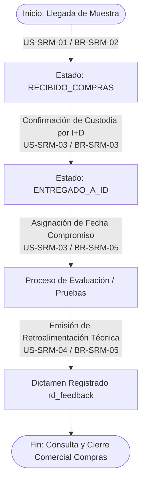
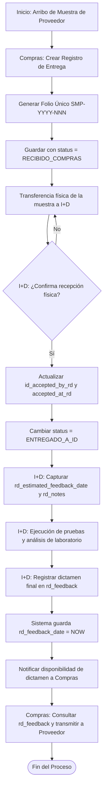

# 📫 Módulo: Recepción de Muestras de Proveedores (SRM)

El módulo de Recepción de Muestras de Proveedores (Sample Receipt Management) digitaliza y controla el flujo operativo, la cadena de custodia y la evaluación técnica de las muestras enviadas por proveedores externos. Facilita la trazabilidad entre el departamento de Compras (responsable del registro inicial y enlace comercial) y el departamento de I+D (responsable de la custodia física, pruebas de laboratorio y retroalimentación técnica).

---

---

## 💼 Reglas de Negocio (Business Rules)

### BR-SRM-01: Generación Autónoma y Estructura de Folio Único

- **Descripción:** Todo registro de entrega de muestra debe poseer un identificador correlativo irrepetible generado automáticamente por el sistema al momento del asentamiento.
- **Comportamiento Global:** La columna folio debe seguir la estructura `SMP-YYYY-NNN` (donde `YYYY` representa el año en curso y `NNN` un consecutivo numérico anual). El backend validará la unicidad (`UNIQUE`) de dicho campo antes de escribir en la base de datos.

### BR-SRM-02: Recepción Irrestricta en Compras y Campos Obligatorios

- **Descripción:** El departamento de Compras está obligado a recibir y registrar en el sistema toda muestra física enviada por un proveedor. No existe la figura de rechazo físico en el punto de recepción inicial.
- **Comportamiento Global:** Para efectuar la inserción en `provider_sample_deliveries`, se exigen los campos obligatorios: `id_provider`, `product_name`, `quantity_received`, `unit_of_measure` e `id_received_by_purchasing`. La fecha `received_at` se asigna por defecto con el estampa de tiempo actual (`NOW()`) y el estado inicial se establece categóricamente como `RECIBIDO_COMPRAS`.

### BR-SRM-03: Cadena de Custodia y Confirmación de Recepción por I+D

- **Descripción:** La transferencia física de la muestra desde Compras hacia I+D requiere una confirmación explícita de recepción en la plataforma por parte de un colaborador del departamento de I+D.
- **Comportamiento Global:** Al confirmar la entrega física, el sistema actualiza de forma atómica los campos `id_accepted_by_rd` (UUID del usuario de I+D que recibe), `accepted_at_rd = NOW()` y cambia el campo status al valor `ENTREGADO_A_ID`.

### BR-SRM-04: Encapsulamiento y Mapeo de Facultades por Departamento

- **Descripción:** El acceso a la edición de campos está delimitado según el departamento del usuario autenticado y la fase de la muestra.
- **Comportamiento Global:**
  - Mientras el estado sea `RECIBIDO_COMPRAS`, únicamente los usuarios del departamento de Compras pueden modificar los datos de recepción (`product_name`, `brand_manufacturer`, `lot_number`, `expiration_date`, `production_date`, `purchasing_notes` y `documents`).
  - Una vez que el estado cambia a `ENTREGADO_A_ID`, los campos de Compras quedan en modo solo lectura (bloqueados), habilitándose la edición de las secciones técnicas (`rd_notes`, `rd_estimated_feedback_date`, `rd_feedback`) exclusivamente para el departamento de I+D.

### BR-SRM-05: Compromiso y Registro de Retroalimentación Técnica (rd_feedback)

- **Descripción:** Al asumir la custodia de una muestra, el departamento de I+D debe establecer una fecha tentativa de dictamen y, posteriormente, capturar la evaluación técnica para uso de Compras.
- **Comportamiento Global:** I+D debe registrar obligatoriamente `rd_estimated_feedback_date` al iniciar las pruebas. Al concluir las evaluaciones, la captura de `rd_feedback` asentará automáticamente `rd_feedback_date = NOW()` y registrará en `id_updated_by` la llave del ingeniero autor del dictamen.

---

---

## 👥 Historias de Usuario (User Stories)

### 📌 Apartado 1: Recepción y Registro Inicial (Perspectiva Departamento de Compras)

#### US-SRM-01: Registro de Recepción de Muestras de Proveedores

- **Como:** Colaborador del departamento de Compras,
- **Quiero:** Registrar las muestras físicas de productos entregadas por los proveedores y adjuntar sus documentos técnicos,
- **Para:** Dar ingreso formal a la muestra en el sistema y permitir su posterior transferencia a I+D.

**Criterios de Aceptación:**

- **C.A. 1.1:** El formulario requiere la selección del proveedor (`id_provider` proveniente del catálogo maestro `providers`), nombre del producto (`product_name`), cantidad recibida (`quantity_received`) y unidad de medida (`unit_of_measure`).
- **C.A. 1.2:** Los campos `brand_manufacturer`, `lot_number`, `expiration_date`, `production_date` y `purchasing_notes` son opcionales.
- **C.A. 1.3:** El sistema permite adjuntar archivos digitales (Hojas de Seguridad, Certificados de Análisis CoA, Fichas Técnicas) almacenando su estructura y metadatos en el campo de tipo JSONB `documents`.
- **C.A. 1.4:** Al guardar, el backend asigna el UUID del usuario autenticado en `id_received_by_purchasing`, establece `status = 'RECIBIDO_COMPRAS'`, guarda `received_at = NOW()` y genera el código de folio bajo la estructura `SMP-YYYY-NNN`.

#### US-SRM-02: Seguimiento y Entrega Físico-Operativa a I+D

- **Como:** Colaborador del departamento de Compras,
- **Quiero:** Consultar el listado de muestras en estado de recepción para coordinar su entrega a I+D,
- **Para:** Mantener un control del inventario temporal de muestras pendientes de traspaso.

**Criterios de Aceptación:**

- **C.A. 2.1:** La interfaz muestra una vista filtrada con las entregas de muestras cuyo `status` es igual a `RECIBIDO_COMPRAS`.
- **C.A. 2.2:** Mientras el registro se mantenga en `RECIBIDO_COMPRAS`, el usuario de Compras puede editar o complementar los datos capturados y la documentación adjunta.
- **C.A. 2.3:** Cada actualización en esta fase asienta la fecha/hora en `updated_at` y el identificador del usuario ejecutor en `id_updated_by`.

---

### 📌 Apartado 2: Custodia, Evaluación y Retroalimentación (Perspectiva Departamento de I+D)

#### US-SRM-03: Confirmación de Recepción y Custodia de Muestra

- **Como:** Colaborador/Ingeniero del departamento de I+D,
- **Quiero:** Aceptar la recepción física de una muestra transferida por Compras,
- **Para:** Formalizar el traspaso de responsabilidad y establecer la fecha compromiso para su evaluación.

**Criterios de Aceptación:**

- **C.A. 3.1:** El usuario de I+D visualiza las muestras pendientes de traspaso y ejecuta la acción "Aceptar Custodia".
- **C.A. 3.2:** El backend asigna `id_accepted_by_rd` con el UUID del usuario de I+D en sesión, establece `accepted_at_rd = NOW()` y actualiza `status = 'ENTREGADO_A_ID'`.
- **C.A. 3.3:** La interfaz habilita la captura de notas internas de laboratorio en `rd_notes` y la fecha tentativa de dictamen en `rd_estimated_feedback_date`.

#### US-SRM-04: Emisión de Retroalimentación Técnica (rd_feedback)

- **Como:** Colaborador/Ingeniero del departamento de I+D,
- **Quiero:** Capturar el dictamen técnico y las conclusiones de las pruebas realizadas a la muestra,
- **Para:** Proporcionar al departamento de Compras el feedback necesario para negociar o informar al proveedor.

**Criterios de Aceptación:**

- **C.A. 4.1:** El usuario de I+D puede capturar el resultado técnico en el campo de texto `rd_feedback`.
- **C.A. 4.2:** Al guardar el dictamen, el sistema estampa automáticamente la fecha y hora de emisión en `rd_feedback_date` y registra `id_updated_by` con el UUID del autor.
- **C.A. 4.3:** El sistema genera una notificación interna al usuario de Compras que registró la muestra (`id_received_by_purchasing`), informando que la retroalimentación técnica ha sido publicada.

---

### 📌 Apartado 3: Consulta Comercial y Trazabilidad (Vista Compartida Compras e I+D)

#### US-SRM-05: Consulta de Histórico de Muestras y Dictámenes

- **Como:** Colaborador de Compras o I+D,
- **Quiero:** Consultar el expediente completo de las muestras de proveedores registradas,
- **Para:** Verificar los dictámenes técnicos emitidos y transmitir los comentarios de I+D a los proveedores correspondientes.

**Criterios de Aceptación:**

- **C.A. 5.1:** La tabla de consulta permite aplicar filtros por proveedor (`id_provider`), nombre de producto, status (`RECIBIDO_COMPRAS`, `ENTREGADO_A_ID`) y rangos de fechas de recepción o caducidad.
- **C.A. 5.2:** Si la fecha actual sobrepasa la `rd_estimated_feedback_date` y el campo `rd_feedback` se encuentra vacío, la interfaz destaca visualmente el registro con un indicador de retraso.
- **C.A. 5.3:** Compras puede visualizar y descargar la documentación en `documents` (fichas/CoA) así como copiar el dictamen en `rd_feedback` para su envío directo al contacto del proveedor (`contact_email`).

---

---

## 🔄 Diagramas de Flujo

### 1.Diagrama de Transición de Estados de Muestras

#### Referencias:

- Reglas de Negocio (BR):
  - **[BR-SRM-02]**: Recepción Irrestricta en Compras y Campos Obligatorios.
  - **[BR-SRM-03]**: Cadena de Custodia y Confirmación de Recepción por I+D.
  - **[BR-SRM-05]**: Compromiso y Registro de Retroalimentación Técnica (rd_feedback).
- Historias de Usuario (US):
  - **[US-SRM-01]**: Registro de Recepción de Muestras de Proveedores.
  - **[US-SRM-03]**: Confirmación de Recepción y Custodia de Muestra.
  - **[US-SRM-04]**: Emisión de Retroalimentación Técnica (rd_feedback).
- Criterios de Aceptación (C.A):
  - **[C.A. 1.4]**: Asignación de estado inicial RECIBIDO_COMPRAS y sellado de tiempo.
  - **[C.A. 3.2]**: Cambio de estado a ENTREGADO_A_ID al aceptar la custodia física.
  - **[C.A. 4.2]**: Asentamiento de fecha de retroalimentación rd_feedback_date y autoría.

### 2. Diagrama de Flujo Operativo: Ciclo de Recepción, Custodia y Retroalimentación

#### Referencias:

- Reglas de Negocio (BR):
  - **[BR-SRM-01]**: Generación Autónoma y Estructura de Folio Único.
  - **[BR-SRM-03]**: Cadena de Custodia y Confirmación de Recepción por I+D.
  - **[BR-SRM-04]**: Encapsulamiento y Mapeo de Facultades por Departamento.
  - **[BR-SRM-05]**: Compromiso y Registro de Retroalimentación Técnica (rd_feedback).
- Historias de Usuario (US):
  - **[US-SRM-01]**: Registro de Recepción de Muestras de Proveedores.
  - **[US-SRM-03]**: Confirmación de Recepción y Custodia de Muestra.
  - **[US-SRM-04]**: Emisión de Retroalimentación Técnica (rd_feedback).
  - **[US-SRM-05]**: Consulta de Histórico de Muestras y Dictámenes.
- Criterios de Aceptación (C.A):
  - **[C.A. 1.1, 1.4]**: Captura de datos requeridos y asignación de folio único.
  - **[C.A. 3.2]**: Registro explícito de custodia (id_accepted_by_rd, accepted_at_rd).
  - **[C.A. 4.1, 4.3]**: Registro del dictamen técnico y envío de notificación a Compras.-
  - **[C.A. 5.3]**: Transmisión de la retroalimentación técnica al proveedor.

---

---

- ⬆️ [Volver arriba](#)
- 📖 [Ir al Índice](../README.md#-5-índice-de-módulos-funcionales)
