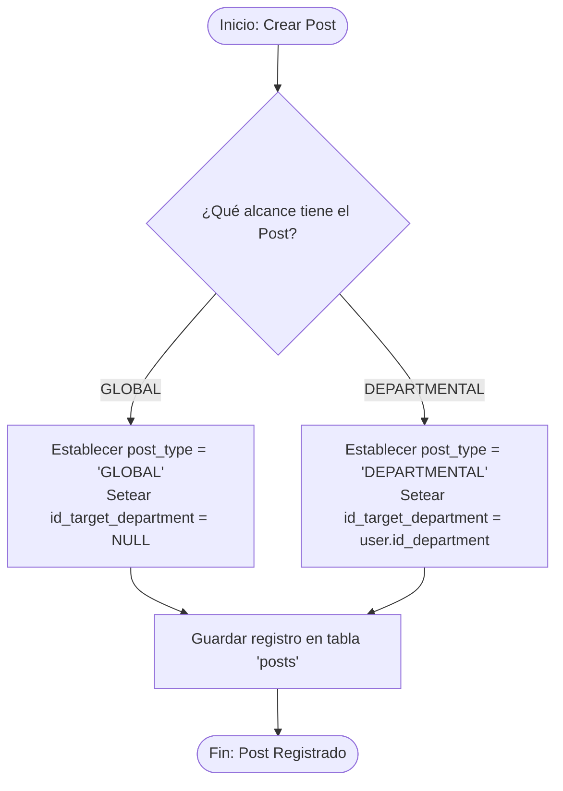

# 👥 Módulo: Social (Muro)

Este módulo gestiona la comunicación interna comunal, permitiendo la interacción informativa inter y departamental a través de publicaciones.

## 💼 Reglas de Negocio (Business Rules)

### BR-SC-01: Forzado de Contexto Departamental

- **Descripción:** Si una publicación (`post`) se registra con el valor `post_type` igual a `'DEPARTMENTAL'`, el backend interceptará la petición y guardará obligatoriamente el identificador del departamento del autor en el campo `id_target_department`.
- **Comportamiento Global:** Si el `post_type` es `'GLOBAL'`, el campo `id_target_department` persistirá estrictamente como `NULL`.

---

## 👥 Historias de Usuario (User Stories)

### US-02: Publicación de Comunicados Estructurados

- **Como:** Colaborador de KoonolApp,
- **Quiero:** publicar un comunicado seleccionando si su alcance es Global o Departamental y adjuntando archivos de soporte si es necesario,
- **Para:** difundir información operativa de manera masiva o restringida a mi área de trabajo sin perder la trazabilidad de los adjuntos.
- **Criterios de Aceptación:**
  - **C.A. 2.1:** El formulario de creación debe obligar a seleccionar un tipo de alcance válido.
  - **C.A. 2.2:** Al recuperar el feed de publicaciones, el backend solo debe listar aquellos registros donde `post_type == 'GLOBAL'` u aquellos donde `id_target_department == user.id_department` de la sesión activa.
  - **C.A. 2.3:** Las rutas hacia los archivos adjuntos cargados deben estructurarse de forma consistente dentro del objeto JSONB en el campo `docs`.

---

## 🔄 Diagramas de Flujo

### 1. Procesamiento y Persistencia de Publicaciones

