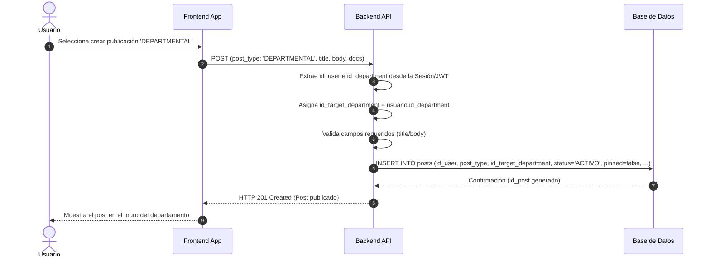
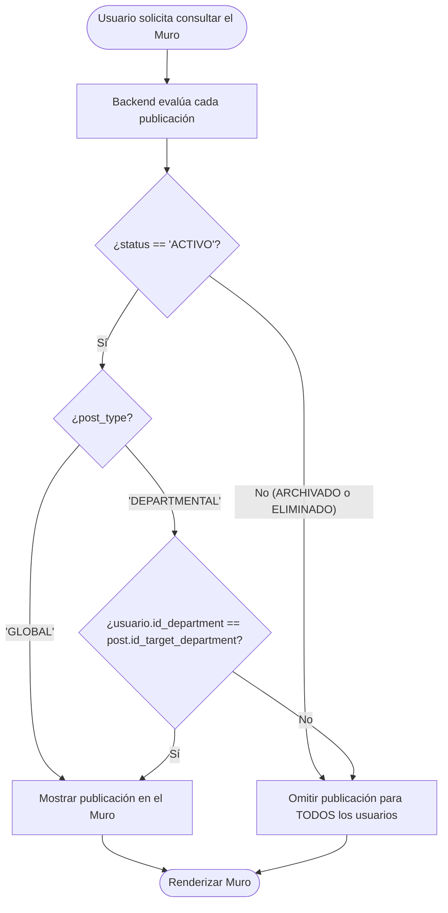
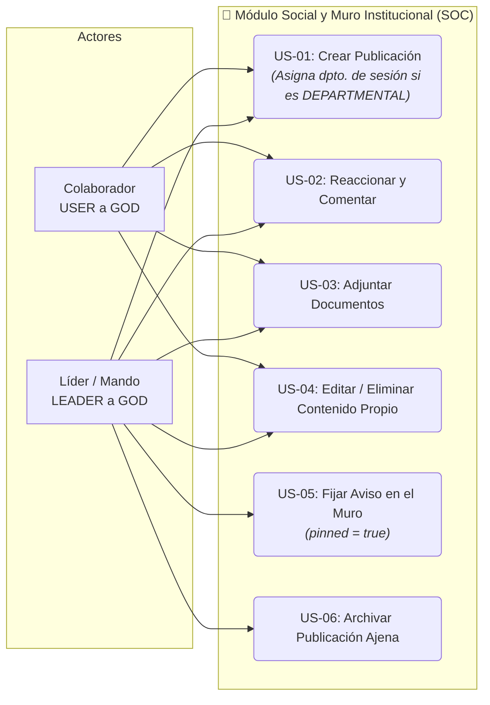

# 📢 Módulo: Social y Muro Institucional (Social - SOC)

El módulo **Social y Muro Institucional** provee un espacio centralizado de comunicación colaborativa, difusión de avisos institucionales y retroalimentación entre los colaboradores de la organización. Permite la publicación de contenidos globales o segmentados por departamento, la integración de documentos adjuntos, hilos de comentarios y un sistema de reacciones de interacción rápida, salvaguardando la moderación operativa mediante los roles de liderazgo del sistema.

---

---

## 💼 Reglas de Negocio (Business Rules)

### BR-SOC-01: Encapsulamiento y Alcance de Visibilidad (post_type)

- **Descripción:** Las publicaciones deben clasificarse explícitamente mediante el campo `post_type` como `'GLOBAL'` o `'DEPARTMENTAL'`.
- **Comportamiento Global:**
  - Si `post_type = 'GLOBAL'`, el contenido es visible para todos los usuarios activos del sistema.
  - Si `post_type = 'DEPARTMENTAL'`, el campo `id_target_department` es obligatorio. La publicación solo será visible en el muro para colaboradores pertenecientes a ese departamento.

### BR-SOC-02: Restricción de Fijación de Avisos (Pinning)

- **Descripción:** La capacidad de destacar o fijar publicaciones en la parte superior del muro (`pinned = true`) es facultad exclusiva de los roles con nivel de mando igual o superior a `LEADER` (Niveles 1 al 6).
- **Comportamiento Global:** El backend debe interceptar peticiones de creación/edición de posts y rechazar `pinned = true` con un error HTTP 403 (Forbidden) si el usuario ejecutor posee el rol `USER` (Nivel 0).

### BR-SOC-03: Facultad de Moderación y Estado de Archivo

- **Descripción:** Los autores de una publicación pueden editar o eliminar sus propios contenidos. Sin embargo, cambiar el estatus de un post ajeno a `'ARCHIVADO'` es una facultad de moderación reservada para roles de liderazgo (`LEADER` a `GOD`).
- **Comportamiento Global:** Una publicación con `status = 'ARCHIVADO'` se oculta del flujo regular del muro para todos los usuarios.

### BR-SOC-04: Unicidad y Concurrencia de Reacciones

- **Descripción:** Un usuario solo puede registrar una única reacción activa por publicación (`id_post`, `id_user`) y por comentario (`id_comment`, `id_user`).
- **Comportamiento Global:** Soportado por las restricciones de unicidad `idx_post_reactions_posts_user` e `idx_post_comment_reactions_comment_user`. Si un usuario reacciona con un tipo distinto (`reaction_type`), el sistema actualizará el registro existente; si envía la misma reacción, esta se eliminará (comportamiento toggle).

### BR-SOC-05: Validación de Archivos Adjuntos (docs JSONB)

- **Descripción:** Las publicaciones admiten la adjunción de documentos digitales almacenados de forma estructurada en la columna `docs` de tipo `jsonb`.
- **Comportamiento Global:** El backend validará que los archivos pertenezcan estrictamente a formatos permitidos: imágenes (PNG, JPG, WEBP), documentos PDF (PDF), Microsoft Word (DOC, DOCX), Microsoft Excel (XLS, XLSX) y Microsoft PowerPoint (PPT, PPTX), rechazando ejecutables o extensiones no autorizadas.

### BR-SOC-06: Estructura Anidada de Comentarios (Hilos de Respuesta)

- **Descripción:** El módulo admite comentarios directos al post y respuestas a comentarios específicos mediante autoreferencia en `id_parent_comment`.
- **Comportamiento Global:** Si `id_parent_comment IS NULL`, se trata de un comentario principal de primer nivel. Si contiene un UUID válido, la interfaz lo renderizará como una respuesta anidada en el hilo del comentario padre.

### BR-SOC-07: Inactivación Lógica (Soft Delete)

- **Descripción:** Queda prohibido el borrado físico (HARD DELETE) de publicaciones y comentarios.
- **Comportamiento Global:**
  - Al eliminar una publicación, se actualizará `status = 'ELIMINADO'` y se asentará la fecha en `deleted_at`.
  - Al eliminar un comentario, se registrará únicamente `deleted_at = NOW()`. Las consultas del muro omitirán registros con `deleted_at IS NOT NULL`.

---

---

## 👥 Historias de Usuario (User Stories)

### 📌 Apartado 1: Autoservicio y Muro Colaborador (Todos los Roles: USER a GOD)

#### US-SOC-01: Creación de Publicación

- **Como:** Colaborador del sistema,
- **Quiero:** Redactar una publicación con título, contenido y seleccionar su alcance (Global o Departamental),
- **Para:** Compartir información importante, avisos o hallazgos con mis compañeros de trabajo.
- **Criterios de Aceptación:**
  - **C.A. 1.1:** El formulario requiere `post_type` obligatorio (`'GLOBAL'` o `'DEPARTMENTAL'`) y al menos un valor en `title` o `body`.
  - **C.A. 1.2:** Si se selecciona `post_type = 'DEPARTMENTAL'`, la interfaz tomará el departamento del usuario activo en la sesión.
  - **C.A. 1.3:** La publicación se crea con `status = 'ACTIVO'`, `published_at = NOW()`, `pinned = false` y guarda trazabilidad con `id_user`.

#### US-SOC-02: Interacción mediante Reacciones y Comentarios

- **Como:** Colaborador del sistema,
- **Quiero:** Reaccionar y comentar publicaciones o responder comentarios de otros usuarios,
- **Para:** Proporcionar retroalimentación e interactuar con el contenido publicado.
- **Criterios de Aceptación:**
  - **C.A. 2.1:** El usuario puede seleccionar un `reaction_type` (`'LIKE'`, `'ME_ENCANTA'`, `'APLAUSO'`, `'GRACIAS'`) tanto en posts como en comentarios.
  - **C.A. 2.2:** Al hacer clic en una reacción activa, el sistema elimina el registro de `post_reactions` o `post_comment_reactions`.
  - **C.A. 2.3:** El usuario puede enviar un comentario en `post_comments`. Si responde a otro comentario, la petición debe enviar el UUID del comentario padre en `id_parent_comment`.

#### US-SOC-03: Carga de Documentos Adjuntos

- **Como:** Colaborador del sistema,
- **Quiero:** Adjuntar archivos (Imágenes, PDF, Word, Excel, PowerPoint) a mis publicaciones,
- **Para:** Complementar la información compartida con evidencia o documentación técnica.
- **Criterios de Aceptación:**
  - **C.A. 3.1:** El usuario puede subir uno o varios archivos durante la creación o edición de la publicación.
  - **C.A. 3.2:** El backend procesa el almacenamiento y guarda en `docs` (`JSONB`) una estructura conteniendo: `name`, `url`, `mime_type` y `size_bytes`.
  - **C.A. 3.3:** El backend rechaza peticiones con tipos de archivo no permitidos.

#### US-SOC-04: Edición y Borrado de Contenidos Propios

- **Como:** Autor de una publicación o comentario,
- **Quiero:** Editar el texto de mi publicación/comentario o eliminarlo cuando lo considere necesario,
- **Para:** Corregir errores de redacción o retirar contenido obsoleto.
- **Criterios de Aceptación:**
  - **C.A. 4.1:** El usuario solo puede editar publicaciones o comentarios donde `id_user` sea igual a su UUID de sesión.
  - **C.A. 4.2:** Al editar, el backend actualiza `updated_at = NOW()`.
  - **C.A. 4.3:** Al eliminar, en posts se actualiza `status = 'ELIMINADO'` y `deleted_at = NOW()`; en `post_comments` se actualiza `deleted_at = NOW()`.

### 📌 Apartado 2: Moderación y Avisos Institucionales (Exclusivo Roles de Mando: LEADER a GOD)

#### US-SOC-05: Fijación de Avisos Prioritarios (Pinning)

- **Como:** Usuario con rol de mando (`LEADER`, `SUPERVISOR`, `MANAGER`, `COMPANY_OWNER`, `ADMIN`, `GOD`),
- **Quiero:** Marcar una publicación relevante como fijada (`pinned = true`),
- **Para:** Garantizar que permanezca destacada en la parte superior del muro para todos los usuarios destino.
- **Criterios de Aceptación:**
  - **C.A. 5.1:** La interfaz habilita la opción "Fijar en el Muro" únicamente si el rol del usuario posee Nivel $\ge$ 1 (`LEADER`).
  - **C.A. 5.2:** El muro ordenará las publicaciones priorizando aquellas con `pinned = true` en orden descendente por `published_at`, seguidas de las publicaciones regulares.
  - **C.A. 5.3:** Un usuario de mando puede desfijar la publicación en cualquier momento actualizando `pinned = false`.

#### US-SOC-06: Moderación y Archivo de Publicaciones Ajenas

- **Como:** Usuario con rol de mando (`LEADER` a `GOD`),
- **Quiero:** Archivar publicaciones de otros usuarios que incumplan las normas o que hayan quedado obsoletas,
- **Para:** Mantener el orden y la pertinencia de la información en el muro institucional.
- **Criterios de Aceptación:**
  - **C.A. 6.1:** Los roles de mando visualizarán la opción "Archivar Publicación" en publicaciones creadas por cualquier usuario.
  - **C.A. 6.2:** Al ejecutar la acción, la base de datos actualiza `status = 'ARCHIVADO'` y asentará `updated_at = NOW()`.
  - **C.A. 6.3:** La publicación archivada deja de renderizarse inmediatamente en las vistas regulares del muro.

---

---

## 🔄 Diagramas de Flujo

### 1. Flujo de Creación de Publicación Departamental

```mermaid
sequenceDiagram
    autonumber
    actor U as Usuario
    participant FE as Frontend App
    participant BE as Backend API
    participant DB as Base de Datos

    U->>FE: Selecciona crear publicación 'DEPARTMENTAL'
    FE->>BE: POST (post_type: 'DEPARTMENTAL', title, body, docs)

    BE->>BE: Extrae id_user e id_department desde la Sesión/JWT
    BE->>BE: Asigna id_target_department = usuario.id_department
    BE->>BE: Valida campos requeridos (title/body)

    BE->>DB: INSERT INTO posts (id_user, post_type, id_target_department, status='ACTIVO', pinned=false, ...)
    DB-->>BE: Confirmación (id_post generado)

    BE-->>FE: HTTP 201 Created (Post publicado)
    FE-->>U: Muestra el post en el muro del departamento
```

#### Referencias:

- Reglas de Negocio (BR):
  - **[BR-SOC-01]:** Encapsulamiento y Alcance de Visibilidad (post_type)
  - **[BR-SOC-05]:** Validación de Archivos Adjuntos (docs JSONB)
- Historias de Usuario (US):
  - **[US-SOC-01]:** Creación de Publicación
  - **[US-SOC-03]:** Carga de Documentos Adjuntos
- Criterios de Aceptación (C.A):
  - **[C.A 1.1]:** Requerimiento obligatorio de post_type y al menos title o body
  - **[C.A 1.2]:** Asignación automática del departamento del usuario activo en publicaciones departamentales
  - **[C.A 1.3]:** Creación con status = 'ACTIVO', published_at = NOW(), pinned = false y trazabilidad con id_user
  - **[C.A 3.2]:** Almacenamiento estructurado de archivos adjuntos en el campo JSONB docs

### 2. Flujo de Control de Visibilidad y Filtros del Muro

```mermaid
flowchart TD
    Start([Usuario solicita consultar el Muro]) --> Fetch[Backend evalúa cada publicación]

    Fetch --> ChkStatus{¿status == 'ACTIVO'?}
    ChkStatus -- No (ARCHIVADO o ELIMINADO) --> Omit[Omitir publicación para TODOS los usuarios]

    ChkStatus -- Sí --> ChkType{¿post_type?}

    ChkType -- 'GLOBAL' --> Visible[Mostrar publicación en el Muro]

    ChkType -- 'DEPARTMENTAL' --> ChkDept{¿usuario.id_department == post.id_target_department?}
    ChkDept -- Sí --> Visible
    ChkDept -- No --> Omit

    Visible --> End([Renderizar Muro])
    Omit --> End
```

#### Referencias:

- Reglas de Negocio (BR):
  - **[BR-SOC-01]:** Encapsulamiento y Alcance de Visibilidad (post_type)
  - **[BR-SOC-03]:** Facultad de Moderación y Estado de Archivo
  - **[BR-SOC-07]:** Inactivación Lógica (Soft Delete)
- Historias de Usuario (US):
  - **[US-SOC-01]:** Creación de Publicación
  - **[US-SOC-04]:** Edición y Borrado de Contenidos Propios
  - **[US-SOC-06]:** Moderación y Archivo de Publicaciones Ajenas
- Criterios de Aceptación (C.A):
  - **[C.A 4.3]:** Ocultamiento de publicaciones con status = 'ELIMINADO' y deleted_at IS NOT NULL
  - **[C.A 6.3]:** Exclusión inmediata de publicaciones con status = 'ARCHIVADO' en las vistas del muro

### 3. Diagrama de Casos de Uso y Matriz de Permisos por Rol

```mermaid
graph LR
    subgraph Actores
        U[Colaborador<br/>USER a GOD]
        L[Líder / Mando<br/>LEADER a GOD]
    end

    subgraph SOC["📢 Módulo Social y Muro Institucional (SOC)"]
        UC1("US-01: Crear Publicación<br/><i>(Asigna dpto. de sesión si es DEPARTMENTAL)</i>")
        UC2("US-02: Reaccionar y Comentar")
        UC3("US-03: Adjuntar Documentos")
        UC4("US-04: Editar / Eliminar Contenido Propio")
        UC5("US-05: Fijar Aviso en el Muro<br/><i>(pinned = true)</i>")
        UC6("US-06: Archivar Publicación Ajena")
    end

    U --> UC1
    U --> UC2
    U --> UC3
    U --> UC4

    L --> UC1
    L --> UC2
    L --> UC3
    L --> UC4
    L --> UC5
    L --> UC6
```

#### Referencias:

- Reglas de Negocio (BR):
  - **[BR-SOC-01]:** Encapsulamiento y Alcance de Visibilidad (post_type)
  - **[BR-SOC-02]:** Restricción de Fijación de Avisos (Pinning)
  - **[BR-SOC-03]:** Facultad de Moderación y Estado de Archivo
  - **[BR-SOC-04]:** Unicidad y Concurrencia de Reacciones
  - **[BR-SOC-05]:** Validación de Archivos Adjuntos (docs JSONB)
  - **[BR-SOC-06]:** Estructura Anidada de Comentarios (Hilos de Respuesta)
  - **[BR-SOC-07]:** Inactivación Lógica (Soft Delete)
- Historias de Usuario (US):
  - **[US-SOC-01]:** Creación de Publicación
  - **[US-SOC-02]:** Interacción mediante Reacciones y Comentarios
  - **[US-SOC-03]:** Carga de Documentos Adjuntos
  - **[US-SOC-04]:** Edición y Borrado de Contenidos Propios
  - **[US-SOC-05]:** Fijación de Avisos Prioritarios (Pinning)
  - **[US-SOC-06]:** Moderación y Archivo de Publicaciones Ajenas
- Criterios de Aceptación (C.A):
  - **[C.A 1.1]:** Definición obligatoria de tipo y contenido en publicaciones
  - **[C.A 2.1]:** Registro de tipo de reacción en posts y comentarios
  - **[C.A 2.3]:** Soporte para hilos mediante id_parent_comment
  - **[C.A 4.1]:** Restricción de edición/eliminación únicamente para contenido propio
  - **[C.A 5.1]:** Restricción de pinning exclusiva para roles con Nivel >= 1 (LEADER)
  - **[C.A 6.1]:** Habilitación de moderación/archivo sobre contenidos ajenos para roles de mando

---

---

- ⬆️ [Volver arriba](#)
- 📖 [Ir al Índice](../README.md#-5-índice-de-módulos-funcionales)
