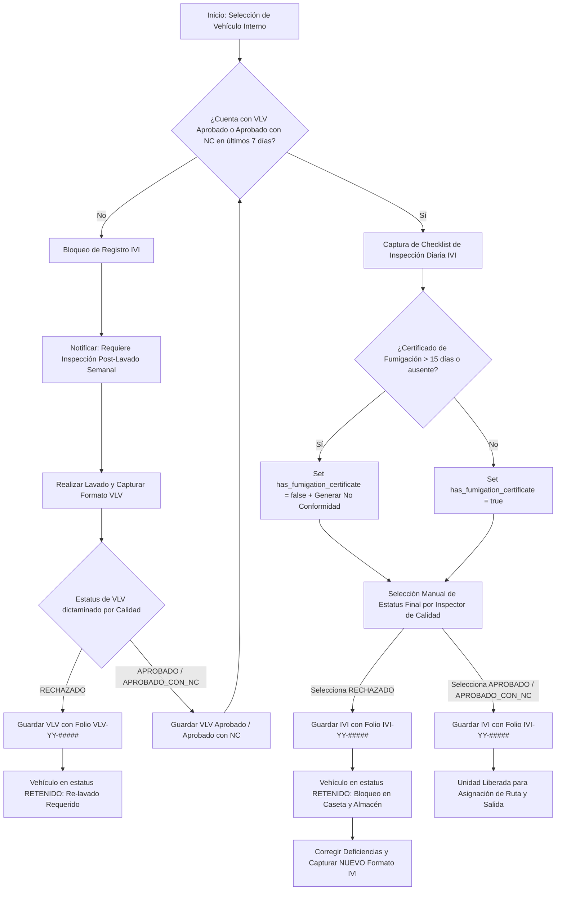
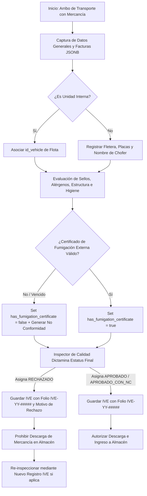

# 🔍 Módulo: Calidad - Inspección de Vehículos (Vehicle Inspection - VHI)

El módulo de **Inspección de Vehículos** digitaliza y estandariza las verificaciones operativas de inocuidad, higiene, control de plagas e integridad física aplicadas a la flota vehicular interna y unidades de transporte externas que ingresan a los complejos operativos de la empresa.

Comprende tres flujos de evaluación técnica:

- **Inspección Diaria (Pre-Carga)**
- **Inspección Post-Lavado Semanal**
- **Inspección de Recepción de Mercancía**

---

---

## 💼 Reglas de Negocio (Business Rules)

### BR-VHI-01: Determinación Manual del Estatus de Inspección

- **Descripción:** El estatus final de una inspección (`APROBADO`, `RECHAZADO` o `APROBADO_CON_NC`) es determinado y asignado de forma manual y explícita por el colaborador evaluador del Departamento de Calidad al finalizar el _checklist_. Las verificaciones booleanas de estructura, higiene y plagas sirven como evidencia técnica pero no disparan una conmutación automatizada por código para el estatus final.
- **Comportamiento Global:** El backend debe requerir obligatoriamente el envío de un estatus válido al momento del cierre. No existen reglas de rechazo automático en base de datos.

### BR-VHI-02: Inmutabilidad de Inspecciones y Procedimiento de Re-inspección

- **Descripción:** Una vez finalizada y guardada una inspección con estatus `RECHAZADO`, el registro se vuelve inmutable y no puede ser editado para cambiar su estatus a aprobado.
- **Comportamiento Global:** La habilitación operativa de una unidad rechazada exige la captura e inserción de un registro completamente nuevo con un nuevo folio único autogenerado.

### BR-VHI-03: Bloqueo Operativo de Salida y Asignación de Rutas

- **Descripción:** Un vehículo interno cuyo último registro de inspección (diaria **IVI** o post-lavado **VLV**) se encuentre en estado `RECHAZADO` o inexistente para la jornada/semana actual queda bloqueado operativamente (el vehículo cambia con estatus `RETENIDO`).
- **Comportamiento Global:** El sistema impide la asignación de rutas de distribución en el módulo de **Almacén/Logística** y el módulo de **Caseta** rechazará el registro de salida física de la unidad fuera del complejo.

### BR-VHI-04: Prerrequisito de Inspección Post-Lavado Semanal (VLV)

- **Descripción:** Para poder registrar una Inspección Diaria (**IVI**) a una unidad interna, el vehículo debe contar obligatoriamente con una Inspección Post-Lavado Semanal (**VLV**) registrada en estatus `APROBADO` dentro de la semana operativa en curso.
- **Comportamiento Global:** El backend valida la existencia de un registro en `vehicle_wash_inspections` asociado al `id_vehicle` con `status = 'APROBADO'` y `created_at` dentro de los últimos 7 días. De lo contrario, rechaza la transacción de creación de la IVI.

### BR-VHI-05: Validación de Vigencia del Certificado de Fumigación

- **Descripción:** La vigencia operativa de un certificado de fumigación es de **15 días naturales** calculados a partir de la fecha de servicio (`fumigation_service_date`).
- **Comportamiento Global:** Al capturar la inspección, si la diferencia entre la fecha actual y `fumigation_service_date` es mayor a 15 días o el certificado está ausente, el sistema establece `has_fumigation_certificate = false`, despliega una advertencia preventiva en pantalla y detona en segundo plano la creación de un registro de no conformidad. No obstante, no impide la asignación manual del estatus `APROBADO` o `APROBADO_CON_NC` si el inspector lo considera adecuado.

### BR-VHI-06: Estructura Estándar de Folios Autogenerados

- **Descripción:** Toda inspección generada en el módulo debe contar con un folio único e irrepetible asignado automáticamente por el servidor durante la inserción.
- **Comportamiento Global:** El formato debe seguir la nomenclatura `[PREFIJO]-[YY]-[NÚMERO_CONSECUTIVO_5_DÍGITOS]`:
  - `IVI-YY-#####` para `vehicle_daily_inspections` (Inspección Diaria).
  - `VLV-YY-#####` para `vehicle_wash_inspections` (Inspección Post-Lavado).
  - `IVE-YY-#####` para `vehicle_reception_inspections` (Inspección de Recepción).  
    _(Donde `YY` representa los últimos dos dígitos del año en curso)._

### BR-VHI-07: Restricción de Estados Lógicos Soportados

- **Descripción:** El ciclo de vida de los registros de inspección en la versión inicial del módulo admite únicamente tres valores de estado operativo.
- **Comportamiento Global:** La columna `status` en las tablas `vehicle_daily_inspections`, `vehicle_wash_inspections` y `vehicle_reception_inspections` acepta únicamente las cadenas en mayúsculas `APROBADO`, `RECHAZADO` y `APROBADO_CON_NC`.

---

---

## 👥 Historias de Usuario (User Stories)

### US-VHI-01: Captura de Inspección Diaria Pre-Carga (IVI)

- **Como:** Colaborador del departamento de Calidad (`USER`, `LEADER`, `SUPERVISOR`, `MANAGER`).
- **Quiero:** Registrar el checklist de condiciones físicas, higiene y plagas de una unidad interna antes de su carga.
- **Para:** Garantizar que el vehículo cumpla con los estándares de inocuidad e higiene exigidos para la distribución de producto.
- **Criterios de Aceptación:**
  - **C.A. 1.1:** El sistema debe verificar que la unidad tenga una inspección post-lavado VLV aprobada dentro de los últimos 7 días. En caso contrario, debe denegar el registro indicando la restricción (**BR-VHI-04**).
  - **C.A. 1.2:** Se debe autogenerar el folio con la estructura `IVI-YY-####` (**BR-VHI-06**).
  - **C.A. 1.3:** Si la fecha del certificado de fumigación excede los 15 días respecto a la fecha actual, la UI debe mostrar una alerta visual y registrar la marca `has_fumigation_certificate = false` (**BR-VHI-05**).
  - **C.A. 1.4:** El usuario debe seleccionar manualmente el estado final (`APROBADO`, `RECHAZADO`, `APROBADO_CON_NC`) (**BR-VHI-01**).
  - **C.A. 1.5:** Un estado `RECHAZADO` debe bloquear de inmediato la asignación de rutas y salida del vehículo en caseta (**BR-VHI-03**).

### US-VHI-02: Captura de Inspección Post-Lavado Semanal (VLV)

- **Como:** Colaborador del departamento de Calidad (`USER`, `LEADER`, `SUPERVISOR`, `MANAGER`).
- **Quiero:** Documentar la inspección de higiene, secado y estado de la cabina de un vehículo tras su lavado semanal.
- **Para:** Habilitar la unidad operativa para la realización de las inspecciones diarias de la semana.
- **Criterios de Aceptación:**
  - **C.A. 2.1:** El sistema debe autogenerar el folio único bajo el patrón `VLV-YY-####` (**BR-VHI-06**).
  - **C.A. 2.2:** La interfaz debe solicitar la selección del vehículo (`id_vehicle`), chofer asignado (`id_driver_user`) y almacenar el usuario autenticado como inspector (`id_inspector_user`).
  - **C.A. 2.3:** Al guardar con estatus `APROBADO`, el vehículo queda automáticamente habilitado para pasar inspecciones diarias IVI durante los siguientes 7 días naturales (**BR-VHI-04**).

### US-VHI-03: Captura de Inspección de Recepción de Mercancía (IVE)

- **Como:** Colaborador del departamento de Calidad (`USER`, `LEADER`, `SUPERVISOR`, `MANAGER`).
- **Quiero:** Registrar la inspección física, sellos y condiciones de transporte de las unidades que arriban con mercancía (internas o fleteras externas).
- **Para:** Mantener la trazabilidad, inocuidad e integridad de la carga entrante al almacén.
- **Criterios de Aceptación:**
  - **C.A. 3.1:** El usuario debe poder definir si la unidad es interna (`is_internal_vehicle = true`) o externa (`is_internal_vehicle = false`), requiriendo los datos de fletera (`id_hauler`), placas (`external_plates`) y chofer (`driver_name`) para unidades externas.
  - **C.A. 3.2:** Debe permitir almacenar el listado de facturas asociadas en formato `JSONB` (`invoices_included`), así como la verificación de sellos de seguridad (`correct_seals`, `seal_number_received`).
  - **C.A. 3.3:** La captura de alérgenos compartidos o carga no alimenticia se debe guardar como información estadística sin bloquear el formulario (**BR-VHI-01**).
  - **C.A. 3.4:** El sistema autogenerará el folio `IVE-YY-#####` y admitirá únicamente el envío de estados `APROBADO`, `RECHAZADO` o `APROBADO_CON_NC` (**BR-VHI-06**, **BR-VHI-07**).

---

---

## 🔄 Diagramas de Flujo

### 1. Flujo Operativo de Inspecciones Diarias y Lavado Semanal (Unidades Internas)

#### Referencias

- Reglas de Negocio (BR):
  - **[BR-VHI-01]:** Determinación manual del estatus final (APROBADO, RECHAZADO, APROBADO_CON_NC) por personal de Calidad.
  - **[BR-VHI-02]:** Inmutabilidad de rechazos y re-inspección mediante captura de un nuevo formato con folio independiente.
  - **[BR-VHI-03]:** Bloqueo operativo de salida en caseta y asignación de rutas (el vehículo pasa a estatus RETENIDO).
  - **[BR-VHI-04]:** Prerrequisito de inspección post-lavado semanal (VLV) aprobada para generar IVI.
  - **[BR-VHI-05]:** Validación de vigencia de fumigación (15 días) y generación de no conformidad.
  - **[BR-VHI-06]:** Estructura estándar de folios autogenerados de 5 dígitos (IVI-YY-#####, VLV-YY-#####).
  - **[BR-VHI-07]:** Restricción de estados lógicos soportados (APROBADO, RECHAZADO, APROBADO_CON_NC).
- Historias de Usuario (US):
  - **[US-VHI-01]:** Captura de Inspección Diaria Pre-Carga (IVI).
  - **[US-VHI-02]:** Captura de Inspección Post-Lavado Semanal (VLV).
- Criterios de Aceptación (C.A):
  - **[C.A. 1.1]:** Validación de prerrequisito de VLV semanal.
  - **[C.A. 1.3]:** Alerta visual y registro de vigencia de fumigación.
  - **[C.A. 1.4]:** Selección manual del estado final (APROBADO, RECHAZADO, APROBADO_CON_NC).
  - **[C.A. 1.5]:** Bloqueo en caseta y asignación de rutas ante estatus rechazado.
  - **[C.A. 2.3]:** Habilitación de unidad tras VLV aprobado o aprobado con NC.

### 2. Flujo Operativo de Recepción de Mercancía (IVE)

#### Referencias

- Reglas de Negocio (BR):
  - **[BR-VHI-01]:** Determinación manual del estatus final (APROBADO, RECHAZADO, APROBADO_CON_NC) por personal de Calidad.
  - **[BR-VHI-02]:** Inmutabilidad de registros y generación de nuevo folio para re-evaluaciones.
  - **[BR-VHI-05]:** Validación de vigencia de fumigación, alerta visual y detonación de no conformidad.
  - **[BR-VHI-06]:** Estructura estándar de folios autogenerados de 5 dígitos (IVE-YY-#####).
  - **[BR-VHI-07]:** Restricción de estados lógicos soportados (APROBADO, RECHAZADO, APROBADO_CON_NC).
- Historias de Usuario (US):
  - **[US-VHI-03]:** Captura de Inspección de Recepción de Mercancía (IVE).
- Criterios de Aceptación (C.A):
  - **[C.A. 3.1]:** Diferenciación entre transporte interno y externo.
  - **[C.A. 3.2]:** Captura de facturas invoices_included en JSONB y verificación de sellos.
  - **[C.A. 3.3]:** Registro informativo de alérgenos y logística compartida sin bloqueo de formulario.
  - **[C.A. 3.4]:** Generación de folio IVE de 5 dígitos y restricción a estados válidos.

---

---

- ⬆️ [Volver arriba](#)
- 📖 [Ir al Índice](../README.md#-5-índice-de-módulos-funcionales)
