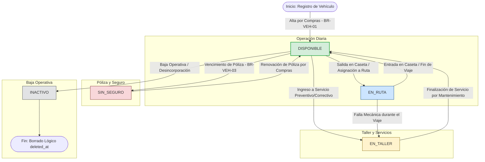
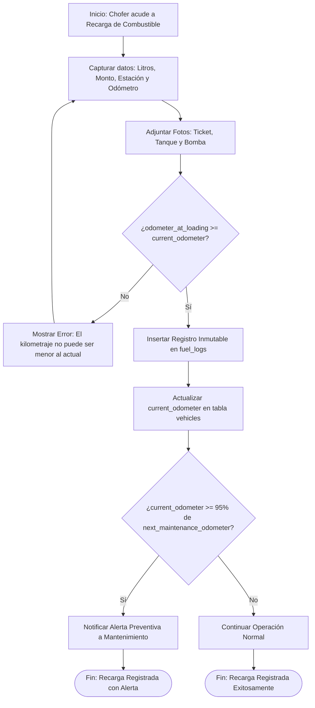
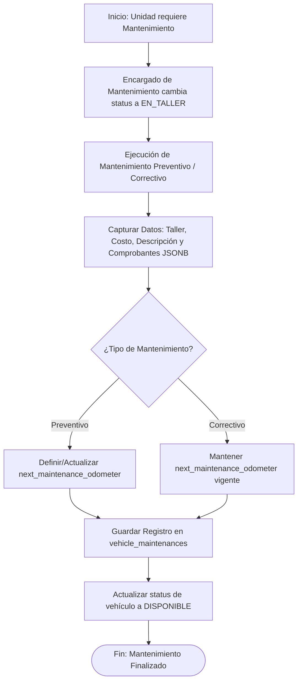

# 🚗 Módulo: Gestión de Flotilla y Control Vehicular (VEH)

El módulo de **Gestión de Flotilla y Control Vehicular (VEH)** digitaliza la administración integral de las unidades automotrices de la empresa. Centraliza el alta del activo y el control de pólizas de seguro (Compras), la asignación de choferes responsables por departamento, el registro inmutable de recargas de combustible mediante evidencias fotográficas (Choferes), y el control del ciclo de mantenimiento preventivo y correctivo con actualización de odómetro (Mantenimiento).

---

## 💼 Reglas de Negocio (Business Rules)

### BR-VEH-01: Alta y Control del Catálogo Vehicular

- **Descripción:** El registro de nuevas unidades automotrices y la gestión de sus pólizas de seguro es facultad exclusiva del departamento de Compras. Cada vehículo debe registrarse con sus datos identificadores (`plates`, `brand`, `model`, `year`, `color`, `vehicle_type`, `id_department`) e iniciar con el estado por defecto `DISPONIBLE`.
- **Comportamiento Global:** Las placas (`plates`) deben ser únicas en la base de datos. Se aplica borrado lógico mediante `deleted_at`. El campo `id_department` encapsula la visualización operativa de la unidad al departamento asignado.

### BR-VEH-02: Asignación de Conductor Titular

- **Descripción:** La asignación del conductor titular (`id_employee`) es facultad de la jefatura o gerencia (`SUPERVISOR` o superior) del departamento al cual está adscrita la unidad (`id_department`).
- **Comportamiento Global:** La columna `id_employee` en la tabla `vehicles` cuenta con una restricción de unicidad (`UNIQUE`), lo que garantiza que un colaborador solo puede ser conductor titular de un vehículo a la vez. Sin embargo, no restringe que operacionalmente otros choferes del mismo departamento puedan utilizar la unidad de manera eventual.

### BR-VEH-03: Control de Vigencia de Seguro y Estado Automático SIN_SEGURO

- **Descripción:** Las fechas de vigencia del seguro (`insurance_start_date` e `insurance_end_date`) son administradas por Compras. Si la fecha actual sobrepasa la fecha de vencimiento (`insurance_end_date`), la unidad pasará automáticamente al estado `SIN_SEGURO` y no podrá programarse para salidas ni asignarse a rutas operativas.
- **Comportamiento Global:** Al renovarse la póliza y actualizarse el rango de fechas por Compras, el estado del vehículo retornará dinámicamente a `DISPONIBLE` (siempre y cuando no se encuentre en `EN_TALLER` o `INACTIVO`).

### BR-VEH-04: Registro Inmutable de Carga de Combustible e Incremento de Odómetro

- **Descripción:** El registro de recargas de combustible (`fuel_logs`) es realizado por el chofer u operador del vehículo. Debe incluir obligatoriamente el kilometraje actual (`odometer_at_loading`), litros cargados, monto total, tipo de combustible, así como evidencias fotográficas del ticket, del nivel del tanque y de la bomba.
- **Comportamiento Global:** La tabla `fuel_logs` es una bitácora inmutable (solo admite inserción). El valor de `odometer_at_loading` debe ser estrictamente mayor o igual al `current_odometer` registrado en la tabla `vehicles`. Al confirmarse el registro, la base de datos actualiza automáticamente el `current_odometer` del vehículo con este nuevo valor.

### BR-VEH-05: Control de Mantenimiento y Transición de Estado EN_TALLER

- **Descripción:** La ejecución y registro de servicios preventivos y correctivos es competencia exclusiva del departamento de Mantenimiento. Al ingresar una unidad a servicio, el encargado cambiará su estado a `EN_TALLER`. Mientras el vehículo permanezca en este estado, no podrá ser utilizado para cargas de combustible ni asignado a rutas.
- **Comportamiento Global:** Al finalizar el mantenimiento, el encargado actualizará el registro especificando el kilometraje al momento del servicio (`odometer_at_service`), la descripción, costo total, nombre del taller y adjuntará la factura (`invoice_document`). Si el mantenimiento es de tipo `PREVENTIVO`, se recalculará automáticamente el objetivo para el próximo servicio (`next_maintenance_odometer`) y la unidad volverá al estado `DISPONIBLE`.

### BR-VEH-06: Programación y Alertas de Mantenimiento Preventivo

- **Descripción:** El mantenimiento preventivo se programa en función del kilometraje acumulado en la columna `next_maintenance_odometer`.
- **Comportamiento Global:** Cuando el `current_odometer` alcanza o supera el 95% del valor fijado en `next_maintenance_odometer`, el sistema generará alertas de advertencia visuales para el área de Mantenimiento y la jefatura del departamento del vehículo.

---

## 👥 Historias de Usuario (User Stories)

### US-VEH-01: Registro y Alta del Activo Vehicular

- **Como:** Colaborador del departamento de Compras,
- **Quiero:** Registrar nuevas unidades vehiculares y mantener actualizadas las pólizas de seguro,
- **Para:** Garantizar la disponibilidad legal y operativa de la flotilla de la empresa.

**Criterios de Aceptación:**

- **C.A. 1.1:** Interfaz de alta restringida a usuarios de Compras.
- **C.A. 1.2:** Captura obligatoria de `plates`, `brand`, `model`, `vehicle_type` e `id_department`.
- **C.A. 1.3:** Las placas ingresadas se validan contra la restricción de unicidad en `vehicles`.
- **C.A. 1.4:** Permitir la captura y actualización de `insurance_start_date` e `insurance_end_date`. Si la fecha de fin es menor a la fecha actual, el sistema asigna automáticamente el `status = 'SIN_SEGURO'`.

### US-VEH-02: Asignación de Conductor Titular

- **Como:** Encargado/Supervisor de un departamento operativo (Logística, Ventas, CxC),
- **Quiero:** Asignar o cambiar el chofer titular asignado a un vehículo de mi departamento,
- **Para:** Definir la responsabilidad formal sobre el cuidado y custodia de la unidad.

**Criterios de Aceptación:**

- **C.A. 2.1:** El usuario solo puede visualizar y asignar vehículos cuyo `id_department` coincida con su área.
- **C.A. 2.2:** Al seleccionar un empleado (`id_employee`), el sistema verifica que no sea titular actual de otro vehículo activo.
- **C.A. 2.3:** El cambio de chofer actualiza la columna `id_employee` y asienta auditoría (`updated_at`, `id_updated_by`).

### US-VEH-03: Registro de Carga de Combustible

- **Como:** Chofer / Conductor del vehículo,
- **Quiero:** Registrar las recargas de combustible capturando kilometraje, litros, costo y fotografías del ticket, bomba y tanque,
- **Para:** Justificar el gasto de combustible y mantener actualizado el kilometraje del vehículo.

**Criterios de Aceptación:**

- **C.A. 3.1:** Formulario accesible para el operador. Debe seleccionar el vehículo de su departamento.
- **C.A. 3.2:** Validación de kilometraje: `odometer_at_loading` no puede ser menor al `current_odometer` registrado actualmente en el vehículo.
- **C.A. 3.3:** Carga obligatoria de archivos/fotografías: `ticket_picture`, `fuel_level_picture` y `gas_pump_picture`.
- **C.A. 3.4:** Al guardar exitosamente, se inserta el registro inmutable en `fuel_logs` y se actualiza `current_odometer` en la tabla `vehicles`.

### US-VEH-04: Bitácora de Mantenimiento Vehicular

- **Como:** Encargado del departamento de Mantenimiento,
- **Quiero:** Registrar los mantenimientos preventivos y correctivos ejecutados en las unidades y cambiar su estado operativo,
- **Para:** Llevar un histórico de gastos por unidad y controlar la disponibilidad de la flotilla.

**Criterios de Aceptación:**

- **C.A. 4.1:** Permitir cambiar el estado de la unidad a `EN_TALLER` al iniciar los trabajos.
- **C.A. 4.2:** Formulario de cierre de servicio en `vehicle_maintenances`: captura de `maintenance_type` (`PREVENTIVO` / `CORRECTIVO`), `odometer_at_service`, `description`, `workshop_name`, `total_cost` y adjunto de comprobantes digitales en `invoice_document` (`JSONB`).
- **C.A. 4.3:** Si el mantenimiento es `PREVENTIVO`, el usuario debe ingresar o confirmar el valor objetivo para el siguiente servicio (`next_maintenance_odometer`).
- **C.A. 4.4:** Al guardar la finalización del mantenimiento, el vehículo pasa automáticamente a estado `DISPONIBLE`.

### US-VEH-05: Panel de Monitoreo y Alertas de Flotilla

- **Como:** Gerente o Supervisor de Área / Administración,
- **Quiero:** Consultar el catálogo general de vehículos con sus kilometrajes, estatus actuales y alertas de mantenimiento/seguro,
- **Para:** Tomar decisiones oportunas sobre la operación y el reemplazo de activos.

**Criterios de Aceptación:**

- **C.A. 5.1:** Vista en formato tabla/tarjetas filtrable por departamento, estatus (`DISPONIBLE`, `EN_RUTA`, `EN_TALLER`, `INACTIVO`, `SIN_SEGURO`) y tipo de vehículo.
- **C.A. 5.2:** Indicadores visuales de alerta (color amarillo/rojo) para vehículos próximos o pasados de su kilometraje de servicio (`next_maintenance_odometer`) o con pólizas de seguro próximas a vencer (30 días).

---

---

## 🔄 Diagramas de Flujo

### 1. Ciclo de Vida y Transición de Estados del Vehículo

#### Referencias

- Reglas de Negocio (BR):
  - **[BR-VEH-01]**: Alta y Control del Catálogo Vehicular.
  - **[BR-VEH-03]**: Control de Vigencia de Seguro y Estado Automático SIN_SEGURO.
  - **[BR-VEH-05]**: Control de Mantenimiento y Transición de Estado EN_TALLER.
- Historias de Usuario (US):
  - **[US-VEH-01]**: Registro y Alta del Activo Vehicular.
  - **[US-VEH-04]**: Bitácora de Mantenimiento Vehicular.
  - **[US-VEH-05]**: Panel de Monitoreo y Alertas de Flotilla.
- Criterios de Aceptación (C.A):
  - **[C.A. 1.4]**: Transición a SIN_SEGURO por fecha de fin de seguro.
  - **[C.A. 4.1, 4.4]**: Cambio a EN_TALLER y retorno a DISPONIBLE.

### 2.Flujo Operativo: Registro de Recarga de Combustible

#### Referencias

- Reglas de Negocio (BR):
  - **[BR-VEH-04]**: Registro Inmutable de Carga de Combustible e Incremento de Odómetro.
  - **[BR-VEH-06]**: Programación y Alertas de Mantenimiento Preventivo.
- Historias de Usuario (US):
  - **[US-VEH-03]**: Registro de Carga de Combustible.
- Criterios de Aceptación (C.A):
  - **[C.A. 3.2]**: Validación de kilometraje mínimo.
  - **[C.A. 3.3]**: Evidencias fotográficas obligatorias.
  - **[C.A. 3.4]**: Inserción inmutable y actualización de odómetro vehicular.

### 3.Flujo Operativo: Gestión de Mantenimiento Vehicular

#### Referencias

- Reglas de Negocio (BR):
  - **[BR-VEH-05]**: Control de Mantenimiento y Transición de Estado EN_TALLER.
  - **[BR-VEH-06]**: Programación y Cálculo del Próximo Servicio Preventivo.
- Historias de Usuario (US):
  - **[US-VEH-04]**: Bitácora de Mantenimiento Vehicular.
- Criterios de Aceptación (C.A):
  - **[C.A. 4.1]**: Cambio a EN_TALLER.
  - **[C.A. 4.2]**: Captura de detalle de mantenimiento y facturas en formato JSONB.
  - **[C.A. 4.3, 4.4]**: Recálculo del próximo mantenimiento y retorno a DISPONIBLE.

---

---

- ⬆️ [Volver arriba](#)
- 📖 [Ir al Índice](../README.md#-5-índice-de-módulos-funcionales)
