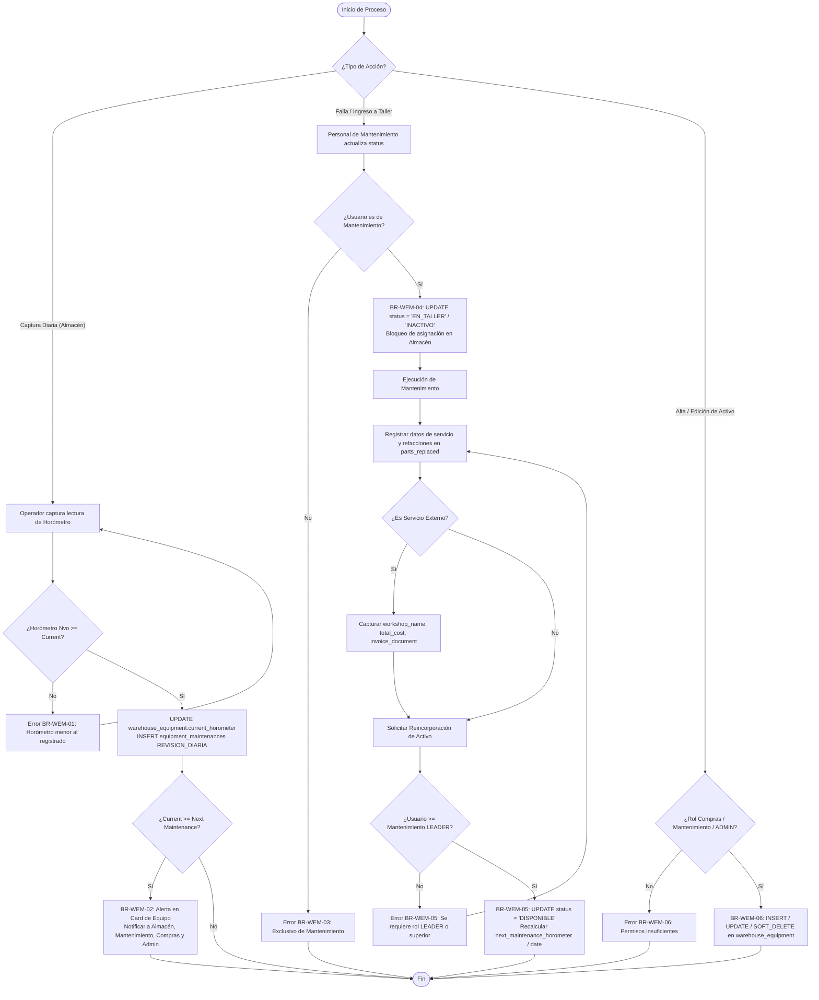

# 🔧 Módulo: Mantenimiento Maquinaria y Equipo de Almacén (Warehouse Equipment Maintenance - WEM)

El módulo de **Maquinaria y Equipo de Almacén** administra el ciclo de vida, estado operativo, desglose de uso por horómetro y mantenimiento (preventivo, correctivo y revisiones diarias) de los activos móviles del almacén (montacargas eléctricos/gas y patines hidráulicos/eléctricos).

Este módulo vincula la responsabilidad operativa de Almacén, la ejecución técnica de Mantenimiento, y la gestión de adquisiciones de Compras y Administración Global.

---

---

## 💼 Reglas de Negocio (Business Rules)

### BR-WEM-01: Monotonicidad y Registro Diario de Horómetro (REVISION_DIARIA)

- **Descripción:** La captura diaria de uso por parte de los operadores de Almacén actualiza de forma directa la entidad `warehouse_equipment.current_hour_meter` e inserta un historial en `equipment_maintenances` con `maintenance_type = 'REVISION_DIARIA'`.
- **Comportamiento Global:** El backend debe validar estrictamente que la nueva lectura del horómetro sea mayor o igual al valor acumulado actual (`current_horometer`). Si el valor ingresado es menor, la transacción se rechaza. En las revisiones diarias, los campos `total_cost`, `workshop_name` e `invoice_document` se registran con valores nulos.

### BR-WEM-02: Generación Automatizada de Alertas y Notificaciones de Servicio

- **Descripción:** Cuando un equipo alcanza o supera el umbral de mantenimiento, el sistema notifica proactivamente a las áreas involucradas.
- **Comportamiento Global:** Si `uses_horometer = true` y `current_horometer >= next_maintenance_horometer`, o si `uses_horometer = false` y `CURRENT_DATE >= next_maintenance_date`:
  - La interfaz resalta visualmente una insignia/alerta crítica en la Card del equipo.
  - Se despacha una notificación push/correo a los departamentos de Almacén, Mantenimiento, Compras y Administradores Globales.

### BR-WEM-03: Exclusividad en la Transición a EN_TALLER o INACTIVO

- **Descripción:** El cambio de estatus de un equipo a `EN_TALLER` o `INACTIVO` es potestad exclusiva del personal adscrito al departamento de Mantenimiento.
- **Comportamiento Global:** Los usuarios de Almacén solo pueden reportar incidencias; la actualización del atributo `warehouse_equipment.status` a `EN_TALLER` o `INACTIVO` está protegida por políticas de autorización a nivel API/Middleware.

### BR-WEM-04: Bloqueo Operativo por Estatus No Disponible

- **Descripción:** Los equipos que se encuentren en estatus `EN_TALLER` o `INACTIVO` quedan inhabilitados para cualquier proceso operativo en el almacén.
- **Comportamiento Global:** Las APIs de selección de equipo y las vistas operativas de Almacén filtran y excluyen automáticamente todo activo que no posea `status = 'DISPONIBLE'`.

### BR-WEM-05: Exclusividad de Reincorporación Operativa (LEADER o Superior)

- **Descripción:** La liberación técnica de un equipo para regresar de `EN_TALLER` a `DISPONIBLE` requiere la validación de un perfil con autoridad técnica.
- **Comportamiento Global:** El endpoint de reincorporación valida que el usuario ejecutor pertenezca a Mantenimiento y posea un rol igual o superior a `LEADER` (ej. `LEADER`, `SUPERVISOR`, `MANAGER`). Al liberar el equipo, se recalculan los objetivos de próximo servicio (`next_maintenance_horometer` o `next_maintenance_date`).

### BR-WEM-06: Facultades de Administración del Catálogo de Equipos

- **Descripción:** La creación de registros, edición de especificaciones técnicas (marca, modelo, capacidad) y la baja lógica (`deleted_at`) en `warehouse_equipment` están restringidas.
- **Comportamiento Global:** Únicamente los usuarios pertenecientes a los departamentos de Compras, Mantenimiento o con rol de `ADMIN` Global tienen permisos de escritura sobre el catálogo principal de maquinaria.

### BR-WEM-07: Flexibilidad en el Registro de Mantenimientos e Insumos

- **Descripción:** Toda intervención de mantenimiento (preventiva o correctiva) registra las refacciones utilizadas en el campo de texto libre `parts_replaced`.
- **Comportamiento Global:** En mantenimientos externos, se capturan el taller (`workshop_name`), el costo total (`total_cost`) y el comprobante en `JSONB` (`invoice_document`). En mantenimientos internos, los campos `total_cost` e `invoice_document` son opcionales.

---

---

## 👥 Historias de Usuario (User Stories)

### 📦 APARTADO 1: OPERACIÓN DE ALMACÉN (Captura Diario de Uso)

#### US-WEM-01: Captura Diaria de Horómetro y Revisión de Unidad

- **Como:** Montacarguista / Operador de Almacén (`USER` de Almacén),
- **Quiero:** Registrar el horómetro final y las observaciones operativas al terminar la jornada laboral,
- **Para:** Mantener actualizado el uso real del activo y notificar preventivamente el desgaste acumulado.
- **Criterios de Aceptación:**
  - **C.A. 1.1:** El usuario selecciona el equipo asignado del catálogo de activos disponibles.
  - **C.A. 1.2:** En equipos con `uses_horometer = true`, el sistema exige la captura del horómetro actual y valida la regla **BR-WEM-01** (el valor ingresado no puede ser menor a `warehouse_equipment.current_horometer`).
  - **C.A. 1.3:** Al confirmar el registro, el sistema actualiza `warehouse_equipment.current_horometer` y genera una entrada en `equipment_maintenances` con `maintenance_type = 'REVISION_DIARIA'`, registrando los campos de costos y taller como nulos.
  - **C.A. 1.4:** Si el nuevo valor supera el umbral `next_maintenance_horometer`, se activa la regla **BR-WEM-02**.

### 🛠️ APARTADO 2: GESTIÓN DE MANTENIMIENTO (Taller y Liberación)

#### US-WEM-02: Ingrese de Equipo a Taller y Programación de Servicio

- **Como:** Técnico o Encargado de Mantenimiento (`USER` / `LEADER` de Mantenimiento),
- **Quiero:** Cambiar el estado de un activo a `EN_TALLER` o `INACTIVO` al detectar o recibir reporte de una falla,
- **Para:** Bloquear el equipo y evitar su uso operativo en el almacén mientras se realiza la reparación.
- **Criterios de Aceptación:**
  - **C.A. 2.1:** Solo personal de Mantenimiento puede cambiar el estado a `EN_TALLER` o `INACTIVO` en cumplimiento con **BR-WEM-03**.
  - **C.A. 2.2:** Al cambiar el estado, el activo aplica inmediatamente la regla **BR-WEM-04**, ocultándose de las listas de asignación operativa de Almacén.

#### US-WEM-03: Cierre Técnico y Liberación de Equipo

- **Como:** Líder o Supervisor de Mantenimiento (`LEADER+` de Mantenimiento),
- **Quiero:** Registrar las actividades realizadas, refacciones utilizadas y cambiar el estado del equipo a `DISPONIBLE`,
- **Para:** Reincorporar el activo a la operación diaria y reprogramar los umbrales del siguiente mantenimiento.
- **Criterios de Aceptación:**
  - **C.A. 3.1:** El usuario registra la intervención en `equipment_maintenances` especificando `maintenance_type` (`PREVENTIVO` o `CORRECTIVO`), `horometer_at_service`, la descripción del trabajo y las refacciones en el campo de texto libre `parts_replaced`.
  - **C.A. 3.2:** Si el mantenimiento es externo, se captura `workshop_name`, `total_cost` y el archivo en `invoice_document`. Si es interno, estos campos son opcionales según **BR-WEM-07**.
  - **C.A. 3.3:** El sistema valida que el usuario posea nivel `LEADER` o superior en Mantenimiento conforme a **BR-WEM-05**.
  - **C.A. 3.4:** Al guardar, se actualiza `warehouse_equipment.status = 'DISPONIBLE'` y se recalculan `next_maintenance_horometer` (sumando las horas de intervalo objetivo al `horometer_at_service`) o `next_maintenance_date`.

### 🛍️ APARTADO 3: ADMINISTRACIÓN Y CONTROL DE ACTIVOS

#### US-WEM-04: Gestión de Catálogo de Equipos y Maquinaria

- **Como:** Personal de Compras, Mantenimiento o Administrador Global (`COMPRAS`, `MANTENIMIENTO`, `ADMIN`),
- **Quiero:** Dar de alta nuevos activos, actualizar sus características o aplicar baja lógica,
- **Para:** Mantener el inventario de maquinaria actualizado con información precisa de serie, capacidad y fabricante.
- **Criterios de Aceptación:**
  - **C.A. 4.1:** El formulario permite capturar el código interno (`internal_code`), número de serie, marca, modelo, capacidad de carga (`load_capacity_kg`) y tipo de equipo.
  - **C.A. 4.2:** Se define la parametrización inicial de mantenimiento: `uses_horometer` (booleano), `next_maintenance_horometer` o `next_maintenance_date`.
  - **C.A. 4.3:** Al aplicar una baja, el sistema realiza un borrado lógico estableciendo la fecha actual en `deleted_at` según **BR-WEM-06**.

#### US-WEM-05: Monitoreo de Alertas Preventivas de Maquinaria

- **Como:** Usuario de Almacén, Mantenimiento, Compras o Administrador,
- **Quiero:** Visualizar los indicadores de alerta en los equipos próximos o vencidos para mantenimiento,
- **Para:** Coordinar oportunamente las intervenciones mecánicas sin afectar la productividad del almacén.
- **Criterios de Aceptación:**
  - **C.A. 5.1:** Las tarjetas del listado de equipos despliegan una insignia visible cuando el horómetro actual alcanza el objetivo de mantenimiento o cuando la fecha de revisión programada expiró.
  - **C.A. 5.2:** El sistema envía notificaciones a los cuatro departamentos involucrados (Almacén, Mantenimiento, Compras, Admin) al detectarse un vencimiento de servicio.

---

---

## 🔄 Diagramas de Flujo

### 1. Ciclo Operativo de Captura, Alertas y Mantenimiento de Maquinaria

#### Referencias

- Reglas de Negocio (BR):
  - **[BR-WEM-01]**: Monotonicidad y Registro Diario de Horómetro (REVISION_DIARIA)
  - **[BR-WEM-02]**: Generación Automatizada de Alertas y Notificaciones de Servicio
  - **[BR-WEM-03]**: Exclusividad en la Transición a EN_TALLER o INACTIVO
  - **[BR-WEM-04]**: Bloqueo Operativo por Estatus No Disponible
  - **[BR-WEM-05]**: Exclusividad de Reincorporación Operativa (LEADER o Superior)
  - **[BR-WEM-06]**: Facultades de Administración del Catálogo de Equipos
  - **[BR-WEM-07]**: Flexibilidad en el Registro de Mantenimientos e Insumos
- Historias de Usuario (US):
  - **[US-WEM-01]**: Captura Diaria de Horómetro y Revisión de Unidad
  - **[US-WEM-02]**: Ingrese de Equipo a Taller y Programación de Servicio
  - **[US-WEM-03]**: Cierre Técnico y Liberación de Equipo
  - **[US-WEM-04]**: Gestión de Catálogo de Equipos y Maquinaria
  - **[US-WEM-05]**: Monitoreo de Alertas Preventivas de Maquinaria
- Criterios de Aceptación (C.A):
  - **[C.A. 1.1 - 1.4]**: Proceso de validación e inserción de revisión diaria de horómetro
  - **[C.A. 2.1 - 2.2]**: Control de acceso para cambio de estatus y bloqueo de asignación
  - **[C.A. 3.1 - 3.4]**: Registro de intervenciones, costeo, verificación de nivel Leader+ y reincorporación
  - **[C.A. 4.1 - 4.3]**: Permisos para altas, cambios y baja lógica del inventario de maquinaria
  - **[C.A. 5.1 - 5.2]**: Despliegue de insignias de alerta y distribución de notificaciones a las 4 áreas

---

---

- ⬆️ [Volver arriba](#)
- 📖 [Ir al Índice](../README.md#-5-índice-de-módulos-funcionales)
